# 🚗 자율주행 스마트카 프로젝트 기반 교육

> **교육 기간**: 2일 (총 12시간)  
> **교육 방식**: 프로젝트 기반 학습 (PBL) + PRIMM  
> **핵심 원칙**: 코드 수정 & 테스트 중심 (코드 작성 최소화)  
> **교구재**: [에듀이노 4휠 스마트카 키트](https://www.eduino.kr/product/detail.html?product_no=80&cate_no=181&display_group=1)

---

## 🎯 교육 목표

| 역할 | 목표 |
|------|------|
| **실행자** | 기존 코드를 수정하여 원하는 동작을 구현하고 테스트할 수 있다 |
| **기획자** | 자율주행 기술을 이해하고 테스트 시나리오를 설계할 수 있다 |

---

## 📊 프로젝트 난이도 구성

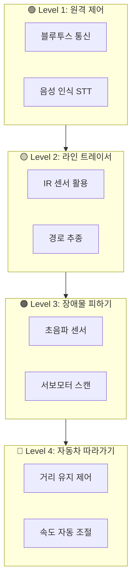

### 🚙 실제 자율주행차 기술 연계

| 프로젝트 | 실제 자율주행 기술 | 적용 사례 |
|----------|-------------------|-----------|
| 원격 제어 | V2X 통신, 텔레오퍼레이션 | 원격 주차, 긴급 제어 |
| 라인 트레이서 | 차선 유지 보조 (LKAS) | 테슬라 오토파일럿, 현대 HDA |
| 장애물 피하기 | 자동 긴급 제동 (AEB) | 볼보 City Safety |
| 자동차 따라가기 | 적응형 순항 제어 (ACC) | 현대 스마트 크루즈 |

---

## 🗓️ Day 1 (6시간)

### ⏰ 시간 배분

| 시간 | 내용 | 형태 |
|------|------|------|
| 1시간 | 교구재 조립 + 환경 설정 | 실습 |
| 2시간 | **Project 1**: 원격 제어 (음성 STT) | 프로젝트 |
| 3시간 | **Project 2**: 라인 트레이서 | 프로젝트 |

---

## 🔧 교구재 조립 및 환경 설정 (1시간)

### 조립 타임라인

```mermaid
gantt
    title 조립 및 환경 설정 (60분)
    dateFormat mm
    axisFormat %M분
    
    section 하드웨어
    키트 확인 및 섀시 조립: 00, 20m
    모터/센서 연결: 20, 20m
    
    section 소프트웨어
    IDE 설치 및 드라이버: 40, 10m
    테스트 코드 업로드: 50, 10m
```

### 완료 체크리스트

- [ ] 4개 DC 모터 장착 완료
- [ ] 초음파 센서 + 서보모터 장착
- [ ] 라인센서 3개 장착
- [ ] 블루투스 모듈 연결
- [ ] 배터리 연결 및 전원 테스트
- [ ] Arduino IDE에서 Blink 업로드 성공

---

## 🟢 Project 1: 원격 제어 시스템 (2시간)

### 📡 실제 자율주행 연계: 텔레오퍼레이션 (Teleoperation)

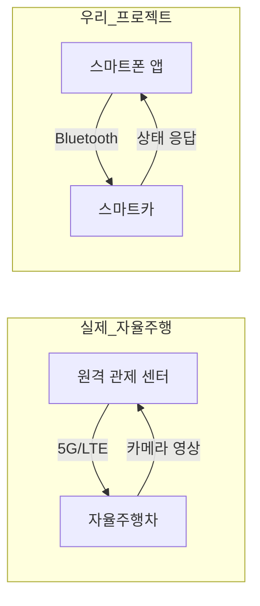

> **🚙 실제 적용 사례**: 
> - 웨이모(Waymo): 원격 지원 시스템으로 복잡한 상황에서 원격 조종
> - 현대 모비스: 5G 기반 원격 자율주행 실증

---

### 1단계: 기본 블루투스 RC 제어 (40분)

#### 학습 목표
- 블루투스 시리얼 통신 원리 이해
- 명령어 프로토콜 분석 및 수정

#### 🔍 코드 분석 (Investigate)

**제공 코드**: `rc_car_ultra_sensor.ino`

```arduino
// 핵심 부분만 분석
if (inputBTString.equals("UP")) {
    Up();  // 전진
} else if (inputBTString.equals("DOWN")) {
    Down();  // 후진
} else if (inputBTString.equals("LEFT")) {
    Left();  // 좌회전
} else if (inputBTString.equals("RIGHT")) {
    Right();  // 우회전
}
```

#### ✏️ 수정 과제 (Modify)

| 과제 | 현재 코드 | 수정 목표 | 테스트 방법 |
|------|-----------|-----------|-------------|
| 속도 변경 | `long_speed = 40` | 80으로 변경 | 체감 속도 비교 |
| 새 명령 추가 | - | "HORN" 추가 → 경적 | 앱에서 "HORN_" 전송 |
| 응답 수정 | "OK" 응답 | "DONE" 으로 변경 | 시리얼 모니터 확인 |

#### 테스트 체크리스트

| 테스트 항목 | 전송 명령 | 예상 동작 | Pass/Fail |
|-------------|-----------|-----------|:---------:|
| 전진 | UP_ | 앞으로 이동 | ☐ |
| 후진 | DOWN_ | 뒤로 이동 | ☐ |
| 좌회전 | LEFT_ | 왼쪽 회전 | ☐ |
| 우회전 | RIGHT_ | 오른쪽 회전 | ☐ |
| 정지 | STOP_ | 즉시 정지 | ☐ |
| 경적 (추가) | HORN_ | 부저 소리 | ☐ |

---

### 2단계: 음성 인식 (STT) 제어 (1시간 20분)

#### 📱 App Inventor STT 구현

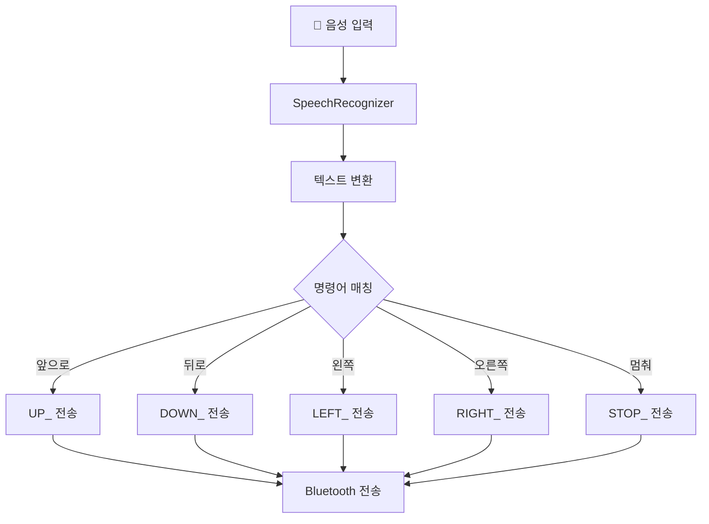

#### App Inventor 화면 구성

```
┌─────────────────────────────┐
│  [🔗 블루투스 연결]          │
├─────────────────────────────┤
│                             │
│     🎤 [음성 인식 버튼]      │
│                             │
│   인식된 텍스트: "앞으로"    │
│                             │
├─────────────────────────────┤
│  ▲ UP   │ 🛑 STOP │        │
│  ◄ LEFT │         │ RIGHT ► │
│         │ ▼ DOWN  │        │
├─────────────────────────────┤
│  상태: 연결됨 | 속도: 150   │
└─────────────────────────────┘
```

#### App Inventor 블록 설계

**SpeechRecognizer 활용**:

```
[Button_Voice.Click]
    └── SpeechRecognizer.GetText()

[SpeechRecognizer.AfterGettingText]
    └── result = SpeechRecognizer.Result
    └── Label_Recognized.Text = result
    └── call ProcessVoiceCommand(result)

[Procedure: ProcessVoiceCommand(text)]
    └── if text contains "앞" or "전진" or "가"
        └── BluetoothClient.SendText("UP_")
    └── else if text contains "뒤" or "후진" or "백"
        └── BluetoothClient.SendText("DOWN_")
    └── else if text contains "왼" or "좌"
        └── BluetoothClient.SendText("LEFT_")
    └── else if text contains "오른" or "우"
        └── BluetoothClient.SendText("RIGHT_")
    └── else if text contains "멈" or "정지" or "스톱"
        └── BluetoothClient.SendText("STOP_")
```

#### ✏️ 수정 과제: 음성 명령 확장

| 음성 입력 | 변환 명령 | 동작 |
|-----------|-----------|------|
| "빨리 가" | FAST_ | 속도 200으로 증가 |
| "천천히" | SLOW_ | 속도 100으로 감소 |
| "유턴" | UTURN_ | 180도 회전 |
| "경적" | HORN_ | 부저 울림 |

#### 아두이노 코드 수정

```arduino
// 추가할 명령어 처리
else if (inputBTString.equals("FAST")) {
    long_speed = 80;  // 빠른 속도
    BTSerial.print("SPEED:FAST");
}
else if (inputBTString.equals("SLOW")) {
    long_speed = 20;  // 느린 속도
    BTSerial.print("SPEED:SLOW");
}
else if (inputBTString.equals("UTURN")) {
    Left();
    delay(1000);  // 180도 회전 시간
    Stop();
    BTSerial.print("UTURN:DONE");
}
else if (inputBTString.equals("HORN")) {
    tone(PIEZO, 1000, 500);
    BTSerial.print("HORN:OK");
}
```

#### 테스트 시나리오

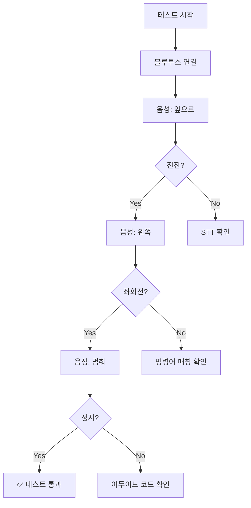

---

## 🟡 Project 2: 라인 트레이서 (3시간)

### 🛣️ 실제 자율주행 연계: 차선 유지 보조 시스템 (LKAS)

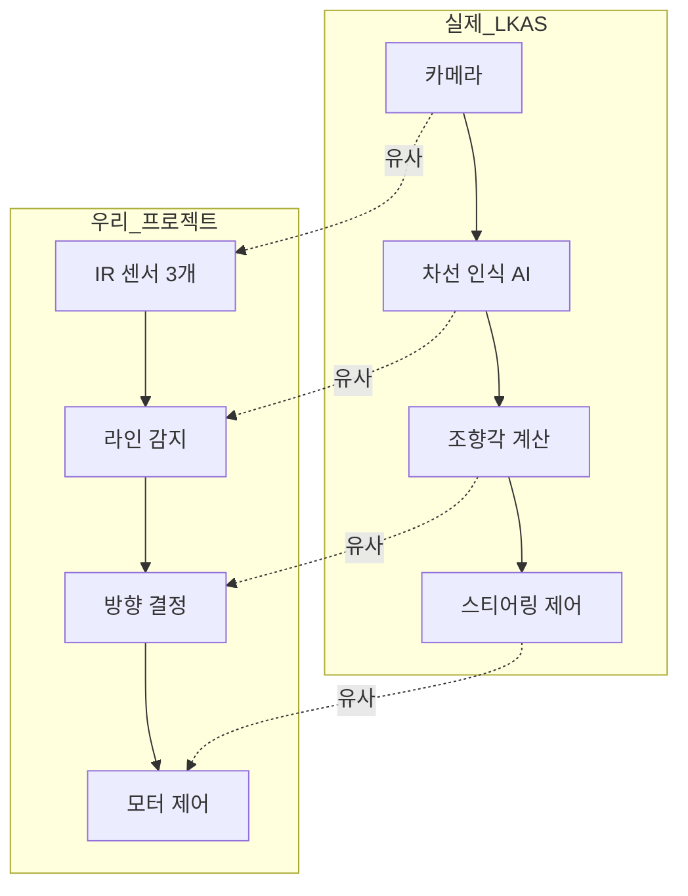

> **🚙 실제 적용 사례**:
> - 테슬라 오토파일럿: 카메라 기반 차선 인식
> - 현대 HDA (Highway Driving Assist): 차선 중앙 유지
> - 차선 이탈 경고 (LDW): 차선 벗어날 시 경고

---

### 1단계: 센서 캘리브레이션 (30분)

#### 센서 동작 원리

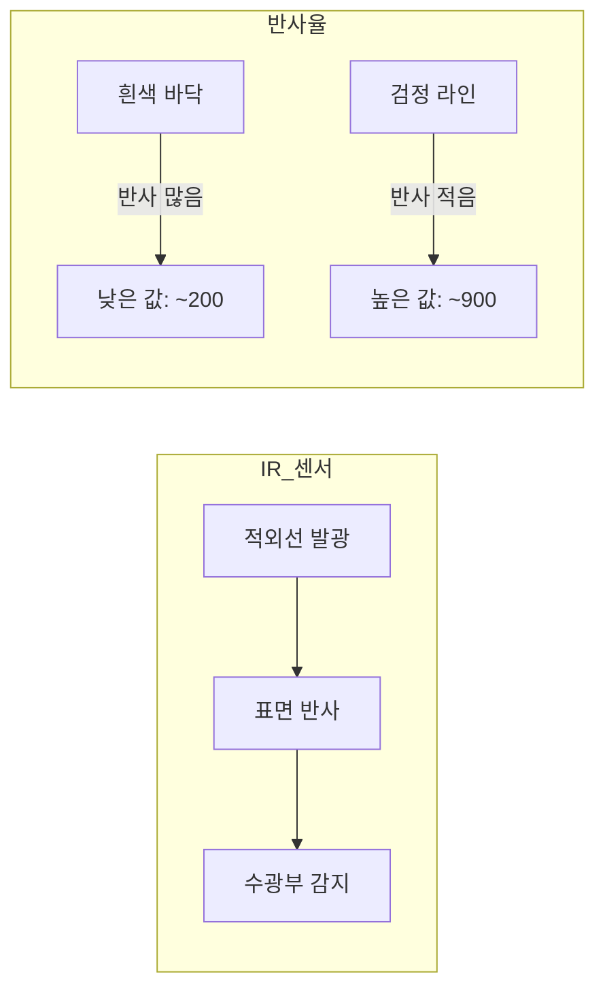

#### 캘리브레이션 실습

**제공 코드로 센서값 확인**:

```arduino
void loop() {
    Serial.print("LEFT: ");
    Serial.print(analogRead(A0));
    Serial.print(" | CENTER: ");
    Serial.print(analogRead(A1));
    Serial.print(" | RIGHT: ");
    Serial.println(analogRead(A2));
    delay(200);
}
```

#### 📝 캘리브레이션 기록표

| 센서 | 흰색 바닥 값 | 검정 라인 값 | 임계값 설정 |
|------|-------------|-------------|-------------|
| 왼쪽 (A0) | | | |
| 중앙 (A1) | | | |
| 오른쪽 (A2) | | | |

**임계값 계산**: `(흰색값 + 검정값) / 2`

---

### 2단계: 기본 라인 트레이싱 (1시간)

#### 🔍 코드 분석: `car_line_track.ino`

```arduino
#define LINE_SENSOR 850  // 이 값을 캘리브레이션 결과로 수정!

void loop() {
    // 센서 조합별 동작
    if (analogRead(CENTER) > LINE_SENSOR) {
        Forward();  // 중앙 감지 → 직진
    }
    else if (analogRead(LEFT) > LINE_SENSOR) {
        Leftward();  // 왼쪽 감지 → 좌회전
    }
    else if (analogRead(RIGHT) > LINE_SENSOR) {
        Rightward();  // 오른쪽 감지 → 우회전
    }
}
```

#### ✏️ 수정 과제

| 과제 | 수정 위치 | 목표 |
|------|-----------|------|
| 임계값 조정 | `LINE_SENSOR` | 캘리브레이션 값 적용 |
| 속도 조정 | `SPEED` 값 | 안정적인 주행 속도 찾기 |
| 회전 속도 | `LEFT_SPEED` | 코너링 최적화 |

#### 센서 조합별 동작 테이블

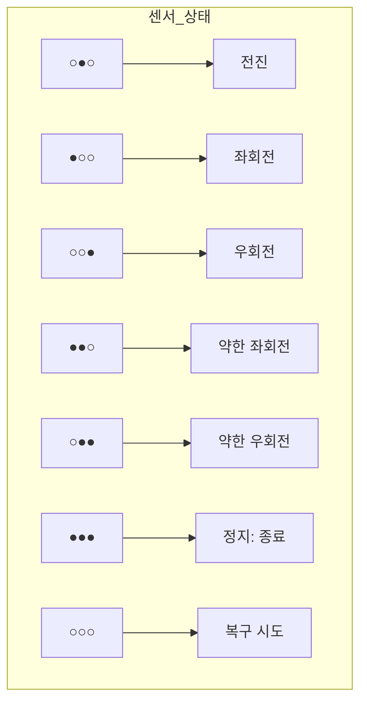

> ● = 라인 감지 (검정), ○ = 미감지 (흰색)

---

### 3단계: 고급 라인 트레이싱 (1시간 30분)

#### 🚙 실제 LKAS와 비교

| 기능 | 실제 LKAS | 우리 프로젝트 |
|------|-----------|---------------|
| 차선 이탈 복구 | 자동 조향 복귀 | 마지막 방향 기억 후 복구 |
| 곡선 주행 | 곡률 계산 | 센서 조합으로 판단 |
| 속도 조절 | 곡률에 따른 감속 | 회전 시 감속 |

#### ✏️ 수정 과제: 라인 이탈 복구 기능

```arduino
// 추가할 전역 변수
int lastDirection = 0;  // 0: 직진, -1: 좌회전, 1: 우회전

void loop() {
    bool leftDetect = analogRead(LEFT) > LINE_SENSOR;
    bool centerDetect = analogRead(CENTER) > LINE_SENSOR;
    bool rightDetect = analogRead(RIGHT) > LINE_SENSOR;
    
    // 모두 미감지 = 라인 이탈
    if (!leftDetect && !centerDetect && !rightDetect) {
        // TODO: lastDirection 기반 복구 로직 구현
        // 힌트: lastDirection이 -1이면 계속 좌회전
    }
    
    // 정상 주행 시 방향 기록
    if (leftDetect) lastDirection = -1;
    if (rightDetect) lastDirection = 1;
    if (centerDetect) lastDirection = 0;
}
```

#### 테스트 트랙

```
기본 트랙 (직선 + 완만한 곡선)
┌─────────────────────┐
│     ╭─────────╮     │
│     │         │     │
│  S──┘         └──G  │
│                     │
└─────────────────────┘

심화 트랙 (급커브 + 교차점)
┌─────────────────────┐
│   ╭──╮     ╭──╮     │
│   │  │     │  │     │
│ S─┴──┼─────┼──┴─G   │
│      │     │        │
│      ╰─────╯        │
└─────────────────────┘
```

#### 테스트 체크리스트

| 테스트 항목 | 성공 기준 | Pass/Fail |
|-------------|-----------|:---------:|
| 직선 구간 | 중앙 유지 | ☐ |
| 완만한 커브 | 이탈 없이 통과 | ☐ |
| 급커브 | 속도 줄이며 통과 | ☐ |
| 라인 이탈 복구 | 3초 내 복귀 | ☐ |
| 종료 라인 (●●●) | 자동 정지 | ☐ |

---

## 🗓️ Day 2 (6시간)

### ⏰ 시간 배분

| 시간 | 내용 | 형태 |
|------|------|------|
| 3시간 | **Project 3**: 장애물 피하기 | 프로젝트 |
| 2시간 | **Project 4**: 자동차 따라가기 | 프로젝트 |
| 1시간 | 통합 테스트 및 발표 | 평가 |

---

## 🟠 Project 3: 장애물 피하기 (3시간)

### 🚧 실제 자율주행 연계: 자동 긴급 제동 (AEB)

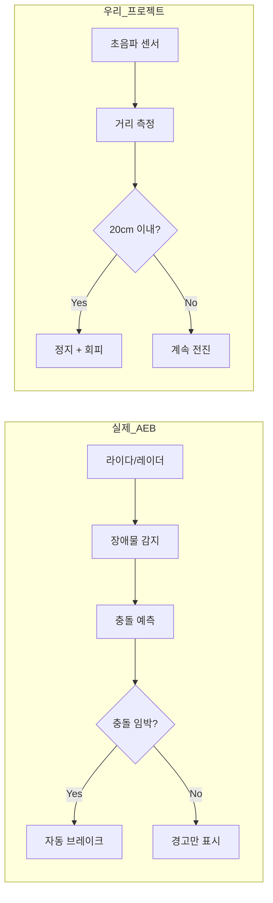

> **🚙 실제 적용 사례**:
> - 볼보 City Safety: 보행자/차량 감지 자동 제동
> - 현대 FCA (전방 충돌 방지): 충돌 위험 시 자동 감속/정지
> - Euro NCAP: AEB 필수 안전 평가 항목

---

### 1단계: 초음파 센서 이해 (30분)

#### 초음파 센서 동작 원리

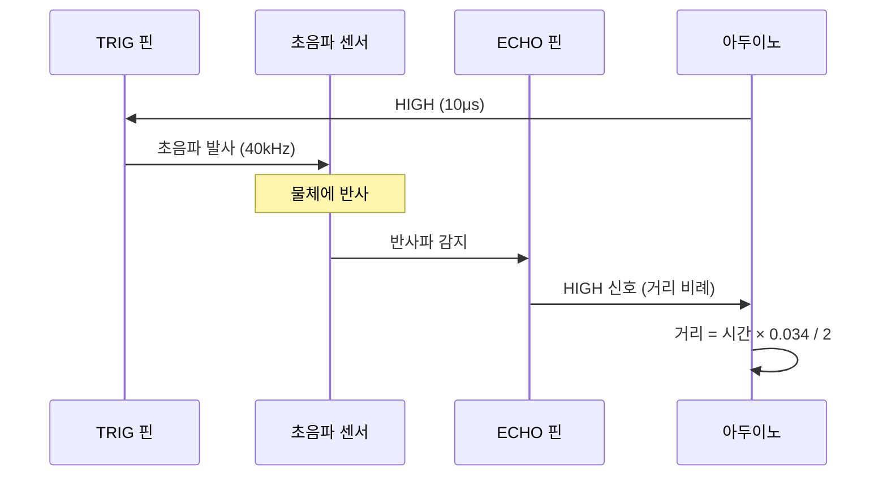

#### 🔍 코드 분석

```arduino
long distance() {
    digitalWrite(TRIG, LOW);
    delayMicroseconds(2);
    digitalWrite(TRIG, HIGH);
    delayMicroseconds(10);
    digitalWrite(TRIG, LOW);
    
    long dist = pulseIn(ECHO, HIGH, 4800) / 58;  // cm 변환
    return dist;
}
```

#### 실습: 거리 측정 테스트

| 실제 거리 | 측정값 | 오차 |
|-----------|--------|------|
| 10cm | | |
| 20cm | | |
| 30cm | | |
| 50cm | | |

---

### 2단계: 서보모터로 센서 방향 제어 (1시간)

#### 🚙 실제 자율주행과 비교

| 실제 자율주행 | 우리 프로젝트 |
|---------------|---------------|
| 360° 라이다 스캔 | 서보모터 3방향 스캔 |
| 실시간 포인트 클라우드 | 3개 거리값 배열 |
| AI 기반 경로 계획 | 최대 거리 방향 선택 |

#### 서보모터 스캔 알고리즘

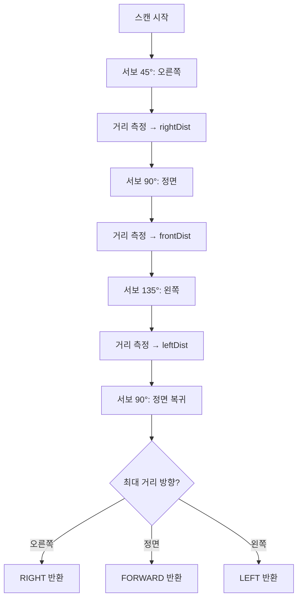

#### ✏️ 수정 과제: 스캔 함수 완성

```arduino
// 제공된 템플릿 - 빈칸 채우기
int scanAndDecide() {
    int distances[3];
    int angles[] = {45, 90, 135};  // 오른쪽, 정면, 왼쪽
    
    for (int i = 0; i < 3; i++) {
        myservo.write(angles[i]);
        delay(300);  // 서보 이동 대기
        distances[i] = __________;  // TODO: 거리 측정 함수 호출
    }
    
    myservo.write(90);  // 정면 복귀
    
    // 최대 거리 방향 반환
    if (distances[0] > distances[1] && distances[0] > distances[2]) {
        return ___;  // TODO: 오른쪽 반환값
    } else if (distances[2] > distances[1]) {
        return ___;  // TODO: 왼쪽 반환값
    } else {
        return ___;  // TODO: 정면 반환값
    }
}
```

---

### 3단계: 장애물 회피 알고리즘 (1시간 30분)

#### 회피 알고리즘 순서도

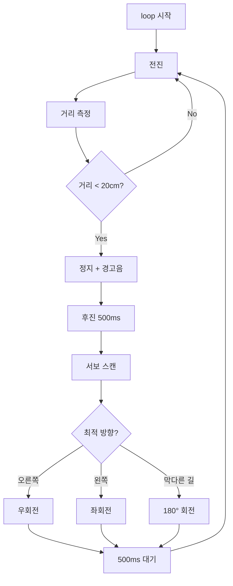

#### 🔍 코드 분석: `rc_car_ultra_sensor.ino`

```arduino
void loop() {
    // 블루투스 처리 부분 생략...
    
    int check1 = distance();
    
    if (check1 > 0 && check1 < 10) {
        tone(PIEZO, 1000, 100);
        Stop();
        Down();  // 후진
        delay(500);
        
        int toggle = random(2, 4);  // 현재: 랜덤 방향
        if (toggle == 2) {
            Left(); delay(500);
        } else {
            Right(); delay(500);
        }
        Stop();
    }
}
```

#### ✏️ 수정 과제: 랜덤 → 스마트 회피

| 현재 코드 | 문제점 | 수정 목표 |
|-----------|--------|-----------|
| `random(2,4)` | 무작위 방향 | 서보 스캔 후 최적 방향 |
| `check1 < 10` | 10cm에서 감지 | 20cm로 여유 확보 |
| 후진 500ms | 고정 시간 | 거리 기반 동적 조절 |

```arduino
// 수정된 회피 로직
if (frontDist > 0 && frontDist < 20) {  // 20cm로 변경
    Stop();
    tone(PIEZO, 1000, 200);
    
    Down();
    delay(300);
    Stop();
    
    // 서보 스캔으로 최적 방향 결정
    int direction = scanAndDecide();
    
    if (direction == 0) {  // 오른쪽
        Right();
        delay(500);
    } else if (direction == 2) {  // 왼쪽
        Left();
        delay(500);
    } else {  // 막다른 길
        Left();
        delay(1000);  // 180도 회전
    }
    Stop();
}
```

#### 테스트 코스

```
┌─────────────────────────────┐
│  S                          │
│  │                          │
│  └──┐    ┌───┐              │
│     │    │ 1 │  장애물      │
│     └────┤   │              │
│          │   │              │
│  ┌───┐   └───┘   ┌───┐     │
│  │ 2 │           │ 3 │      │
│  └───┘           └───┘      │
│                        G    │
└─────────────────────────────┘
```

#### 테스트 체크리스트

| 테스트 항목 | 성공 기준 | Pass/Fail |
|-------------|-----------|:---------:|
| 장애물 감지 | 20cm에서 정지 | ☐ |
| 서보 스캔 | 3방향 측정 완료 | ☐ |
| 방향 결정 | 빈 공간으로 이동 | ☐ |
| 막다른 길 | 180도 회전 | ☐ |
| 연속 회피 | 3개 장애물 통과 | ☐ |

---

## 🔴 Project 4: 자동차 따라가기 (2시간)

### 🚗 실제 자율주행 연계: 적응형 순항 제어 (ACC)

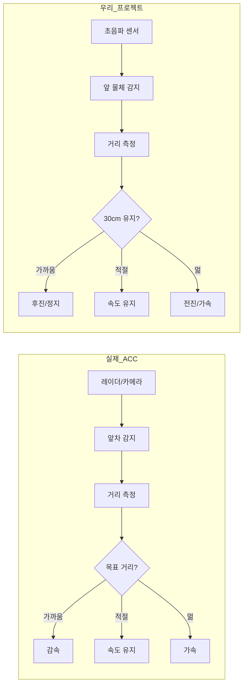

> **🚙 실제 적용 사례**:
> - 현대 스마트 크루즈 컨트롤: 앞차와 설정 거리 유지
> - 테슬라 TACC: 트래픽 인식 적응형 순항
> - 군집 주행 (Platooning): 트럭 자동 군집 주행

---

### 1단계: 목표 거리 유지 기본 (1시간)

#### 거리 기반 속도 제어 원리

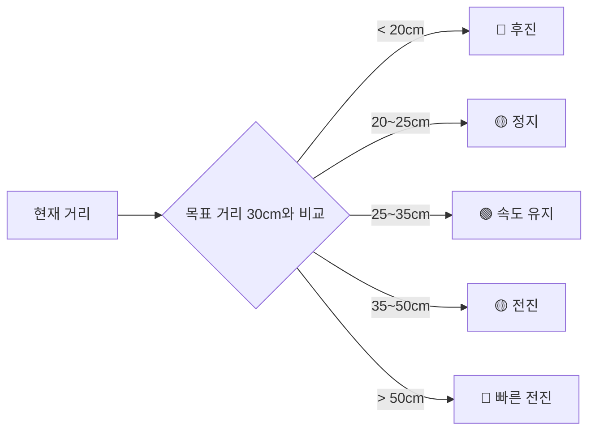

#### ✏️ 수정 과제: 따라가기 로직 구현

```arduino
#define TARGET_DISTANCE 30  // 목표 거리 (cm)
#define TOLERANCE 5         // 허용 오차 (cm)

void followCar() {
    int currentDist = distance();
    
    if (currentDist <= 0 || currentDist > 100) {
        // 측정 실패 또는 앞차 없음
        Stop();
        return;
    }
    
    int error = currentDist - TARGET_DISTANCE;
    
    if (error < -TOLERANCE) {
        // TODO: 너무 가까움 → 후진
    }
    else if (error > TOLERANCE * 2) {
        // TODO: 너무 멂 → 빠른 전진
    }
    else if (error > TOLERANCE) {
        // TODO: 조금 멂 → 느린 전진
    }
    else {
        // TODO: 적정 거리 → 정지 또는 저속 유지
    }
}
```

#### 거리-속도 매핑 테이블

| 현재 거리 (cm) | 오차 | 동작 | 속도 |
|----------------|------|------|------|
| < 20 | -10 이하 | 후진 | 100 |
| 20 ~ 25 | -5 ~ 0 | 정지 | 0 |
| 25 ~ 35 | 0 ~ +5 | 저속 전진 | 80 |
| 35 ~ 50 | +5 ~ +20 | 전진 | 120 |
| > 50 | +20 이상 | 빠른 전진 | 150 |

---

### 2단계: 부드러운 추종 (비례 제어) (1시간)

#### 🚙 실제 ACC와 비교: PID 제어 개념

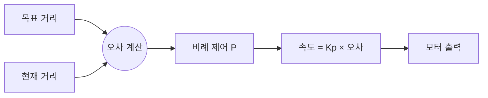

#### ✏️ 수정 과제: 비례 제어 적용

```arduino
#define Kp 5  // 비례 상수 (조절 필요)

void followCarSmooth() {
    int currentDist = distance();
    
    if (currentDist <= 0 || currentDist > 100) {
        Stop();
        return;
    }
    
    int error = currentDist - TARGET_DISTANCE;
    int speed = Kp * error;  // 비례 제어
    
    // 속도 제한
    speed = constrain(speed, -150, 150);
    
    if (speed > 0) {
        // 전진 (앞차가 멂)
        analogWrite(MOTOR_1, speed);
        analogWrite(MOTOR_2, 0);
        analogWrite(MOTOR_3, speed);
        analogWrite(MOTOR_4, 0);
    }
    else if (speed < 0) {
        // 후진 (앞차가 가까움)
        analogWrite(MOTOR_1, 0);
        analogWrite(MOTOR_2, -speed);
        analogWrite(MOTOR_3, 0);
        analogWrite(MOTOR_4, -speed);
    }
    else {
        Stop();
    }
}
```

#### Kp 값 튜닝 가이드

| Kp 값 | 특성 | 적용 상황 |
|-------|------|-----------|
| 1~3 | 느린 반응, 안정적 | 초보자 권장 |
| 4~6 | 보통 반응 | 일반적 사용 |
| 7~10 | 빠른 반응, 불안정 가능 | 고급자 |

#### 테스트 시나리오

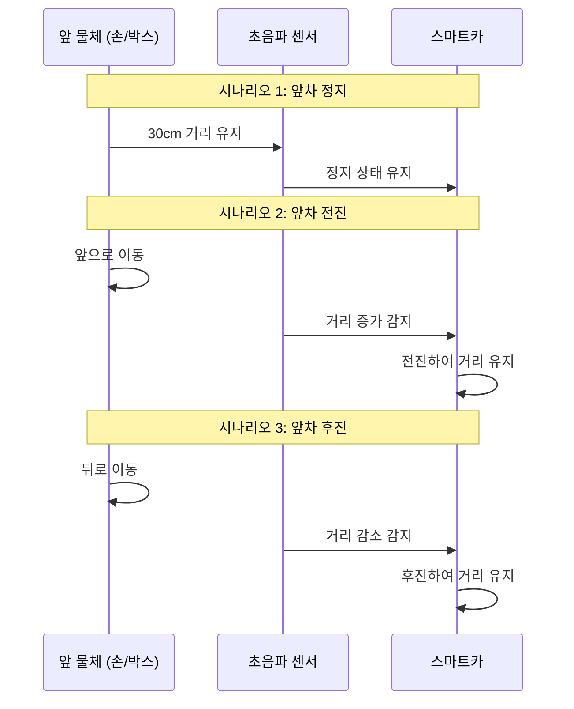

#### 테스트 체크리스트

| 테스트 항목 | 성공 기준 | Pass/Fail |
|-------------|-----------|:---------:|
| 정지 상태 유지 | 앞차 정지 시 30cm 유지 | ☐ |
| 전진 추종 | 앞차 이동 시 따라감 | ☐ |
| 후진 반응 | 앞차 접근 시 후진 | ☐ |
| 부드러운 제어 | 급정지/급출발 없음 | ☐ |
| 앞차 사라짐 | 정지 후 대기 | ☐ |

---

## 📊 통합 테스트 및 발표 (1시간)

### 최종 프로젝트: 모드 통합 시스템

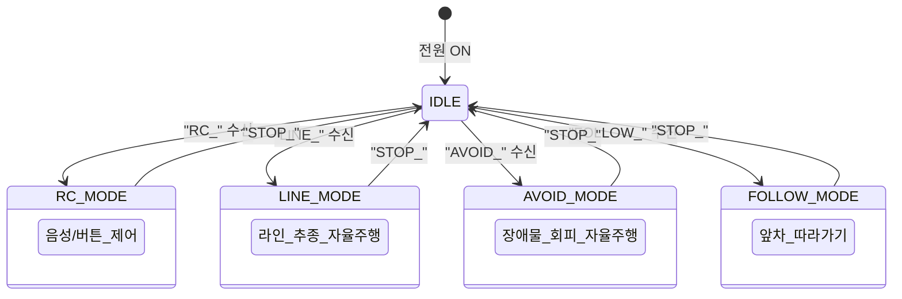

### 평가 루브릭

| 프로젝트 | 평가 항목 | 배점 |
|----------|-----------|------|
| **Project 1** | 음성 인식 명령 5개 이상 동작 | 20 |
| **Project 2** | 라인 트랙 완주 | 25 |
| **Project 3** | 3개 장애물 회피 성공 | 25 |
| **Project 4** | 30cm 거리 유지 (오차 ±5cm) | 20 |
| **발표** | 코드 수정 내용 설명 | 10 |
| **총점** | | **100** |

### 발표 형식

```
1. 프로젝트 선택 및 목표 (1분)
2. 코드 수정 내용 설명 (2분)
3. 실제 동작 시연 (3분)
4. 어려웠던 점 / 해결 방법 (2분)
5. Q&A (2분)
```

---

## 📚 부록: 자율주행 기술 용어

| 용어 | 설명 | 우리 프로젝트 |
|------|------|---------------|
| LKAS | 차선 유지 보조 | 라인 트레이서 |
| AEB | 자동 긴급 제동 | 장애물 감지 정지 |
| ACC | 적응형 순항 제어 | 따라가기 |
| V2X | 차량-사물 통신 | 블루투스 통신 |
| Teleoperation | 원격 조종 | 앱 원격 제어 |
| LiDAR | 레이저 거리 측정 | 초음파 센서 |
| Platooning | 군집 주행 | 따라가기 |

---

*© 2025 자율주행 스마트카 프로젝트 기반 교육*
