# 📊 프로젝트별 알고리즘 & 실제 자율주행 연계

> **목적**: 각 프로젝트의 알고리즘을 실제 자율주행 기술과 연계하여 이해

---

## 🚗 실제 자율주행차 기술 체계

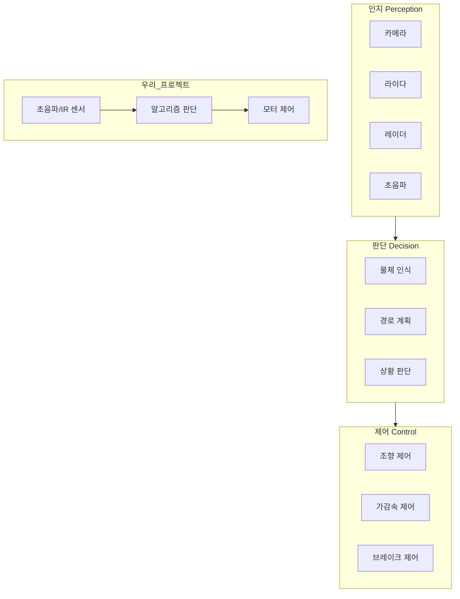
```mermaid
flowchart TB
    subgraph 인지[인지 Perception]
        A1[카메라]
        A2[라이다]
        A3[레이더]
        A4[초음파]
    end
    
    subgraph 판단[판단 Decision]
        B1[물체 인식]
        B2[경로 계획]
        B3[상황 판단]
    end
    
    subgraph 제어[제어 Control]
        C1[조향 제어]
        C2[가감속 제어]
        C3[브레이크 제어]
    end
    
    인지 --> 판단 --> 제어
    
    subgraph 우리_프로젝트
        D1[초음파/IR 센서] --> D2[알고리즘 판단]
        D2 --> D3[모터 제어]
    end
```

---

## 🟢 Project 1: 원격 제어 (STT)

### 실제 자율주행 연계: V2X 통신 & 텔레오퍼레이션

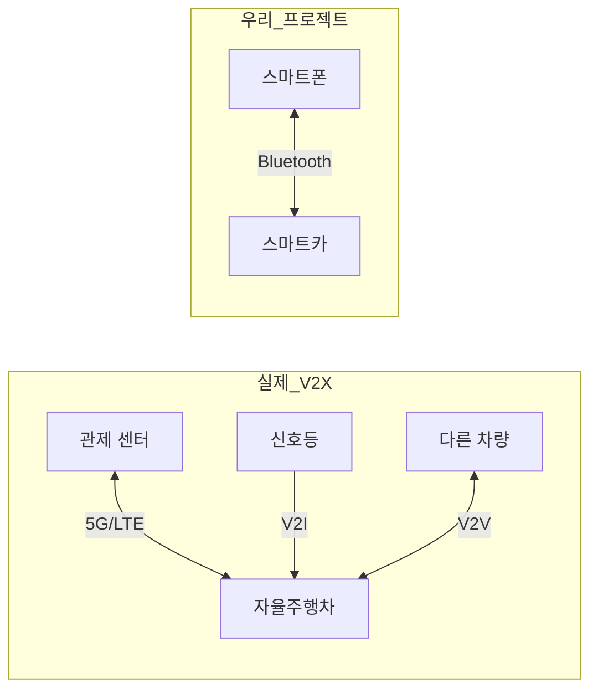
```mermaid
flowchart LR
    subgraph 실제_V2X
        V1[관제 센터] <-->|5G/LTE| V2[자율주행차]
        V3[신호등] -->|V2I| V2
        V4[다른 차량] <-->|V2V| V2
    end
    
    subgraph 우리_프로젝트
        P1[스마트폰] <-->|Bluetooth| P2[스마트카]
    end
```

### 음성 인식 처리 알고리즘

```mermaid
flowchart TD
    A[🎤 음성 입력] --> B[Google STT API]
    B --> C[텍스트 변환]
    C --> D{키워드 매칭}
    
    D -->|"앞"/"전진"/"가"| E1["UP_"]
    D -->|"뒤"/"후진"/"백"| E2["DOWN_"]
    D -->|"왼"/"좌회전"| E3["LEFT_"]
    D -->|"오른"/"우회전"| E4["RIGHT_"]
    D -->|"멈"/"정지"/"스톱"| E5["STOP_"]
    D -->|"빨리"| E6["FAST_"]
    D -->|"천천히"| E7["SLOW_"]
    D -->|인식 실패| E8[재시도 요청]
    
    E1 --> F[Bluetooth 전송]
    E2 --> F
    E3 --> F
    E4 --> F
    E5 --> F
    E6 --> F
    E7 --> F
```

### 블루투스 명령 처리 알고리즘

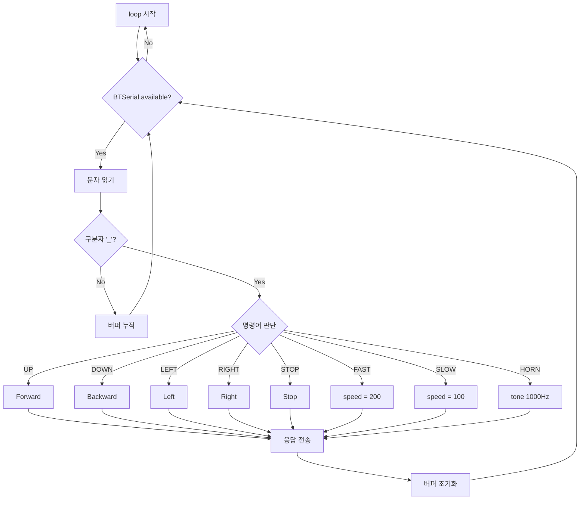
```mermaid
flowchart TD
    A[loop 시작] --> B{BTSerial.available?}
    B -->|No| A
    B -->|Yes| C[문자 읽기]
    C --> D{구분자 '_'?}
    
    D -->|No| E[버퍼 누적]
    E --> B
    
    D -->|Yes| F{명령어 판단}
    F -->|UP| G[Forward]
    F -->|DOWN| H[Backward]
    F -->|LEFT| I[Left]
    F -->|RIGHT| J[Right]
    F -->|STOP| K[Stop]
    F -->|FAST| L[speed = 200]
    F -->|SLOW| M[speed = 100]
    F -->|HORN| N[tone 1000Hz]
    
    G --> O[응답 전송]
    H --> O
    I --> O
    J --> O
    K --> O
    L --> O
    M --> O
    N --> O
    O --> P[버퍼 초기화]
    P --> B
```

### 테스트 케이스

| TC-ID | 음성 입력 | 예상 명령 | 예상 동작 | Pass/Fail |
|-------|-----------|-----------|-----------|:---------:|
| TC-01 | "앞으로 가" | UP_ | 전진 | ☐ |
| TC-02 | "뒤로" | DOWN_ | 후진 | ☐ |
| TC-03 | "왼쪽으로" | LEFT_ | 좌회전 | ☐ |
| TC-04 | "오른쪽" | RIGHT_ | 우회전 | ☐ |
| TC-05 | "멈춰" | STOP_ | 정지 | ☐ |
| TC-06 | "빨리 가" | FAST_ | 고속 전진 | ☐ |
| TC-07 | "천천히" | SLOW_ | 저속 모드 | ☐ |

---

## 🟡 Project 2: 라인 트레이서

### 실제 자율주행 연계: 차선 유지 보조 (LKAS)

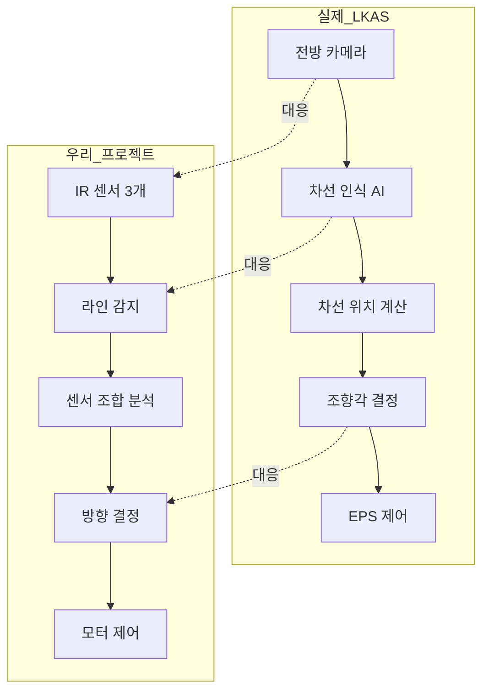
```mermaid
flowchart TB
    subgraph 실제_LKAS
        LA[전방 카메라] --> LB[차선 인식 AI]
        LB --> LC[차선 위치 계산]
        LC --> LD[조향각 결정]
        LD --> LE[EPS 제어]
    end
    
    subgraph 우리_프로젝트
        PA[IR 센서 3개] --> PB[라인 감지]
        PB --> PC[센서 조합 분석]
        PC --> PD[방향 결정]
        PD --> PE[모터 제어]
    end
    
    LA -.->|대응| PA
    LB -.->|대응| PB
    LD -.->|대응| PD
```

### 센서 조합별 의사결정 알고리즘

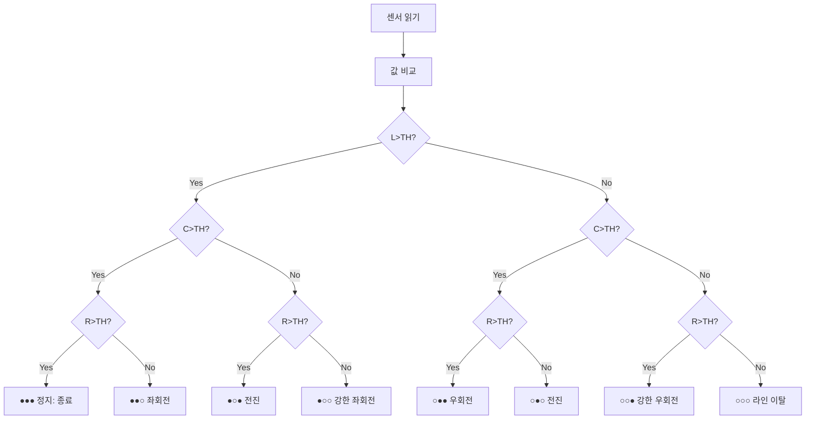
```mermaid
flowchart TD
    A[센서 읽기] --> B[값 비교]
    B --> C{L>TH?}
    C -->|Yes| D{C>TH?}
    C -->|No| E{C>TH?}
    
    D -->|Yes| F{R>TH?}
    D -->|No| G{R>TH?}
    
    E -->|Yes| H{R>TH?}
    E -->|No| I{R>TH?}
    
    F -->|Yes| J[●●● 정지: 종료]
    F -->|No| K[●●○ 좌회전]
    
    G -->|Yes| L[●○● 전진]
    G -->|No| M[●○○ 강한 좌회전]
    
    H -->|Yes| N[○●● 우회전]
    H -->|No| O[○●○ 전진]
    
    I -->|Yes| P[○○● 강한 우회전]
    I -->|No| Q[○○○ 라인 이탈]
```

### 라인 트레이싱 메인 알고리즘

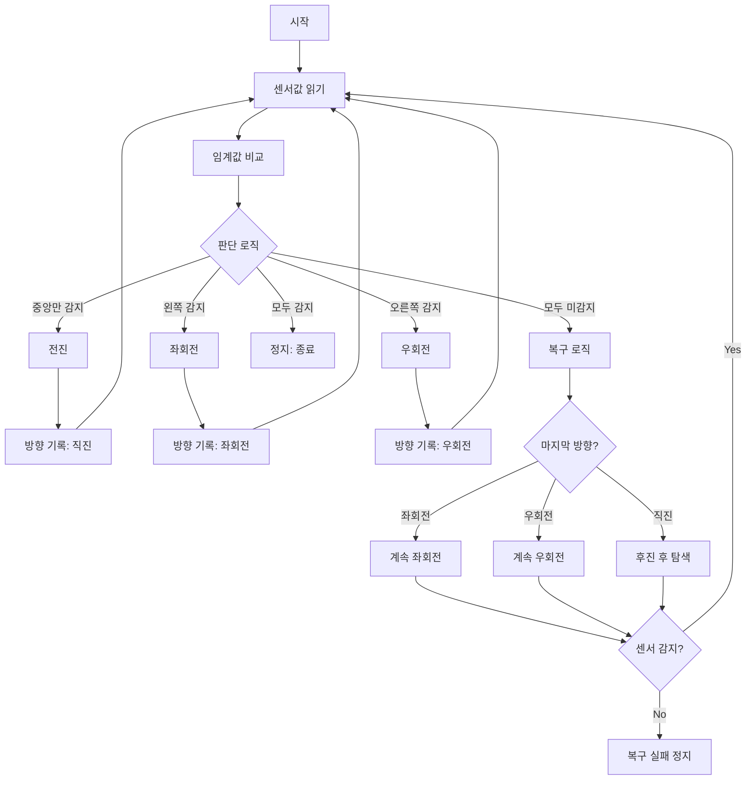
```mermaid
flowchart TD
    A[시작] --> B[센서값 읽기]
    B --> C[임계값 비교]
    C --> D{판단 로직}
    
    D -->|중앙만 감지| E[전진]
    D -->|왼쪽 감지| F[좌회전]
    D -->|오른쪽 감지| G[우회전]
    D -->|모두 감지| H[정지: 종료]
    D -->|모두 미감지| I[복구 로직]
    
    E --> J[방향 기록: 직진]
    F --> K[방향 기록: 좌회전]
    G --> L[방향 기록: 우회전]
    
    J --> B
    K --> B
    L --> B
    
    I --> M{마지막 방향?}
    M -->|좌회전| N[계속 좌회전]
    M -->|우회전| O[계속 우회전]
    M -->|직진| P[후진 후 탐색]
    
    N --> Q{센서 감지?}
    O --> Q
    P --> Q
    Q -->|Yes| B
    Q -->|No| R[복구 실패 정지]
```

### 라인 이탈 복구 알고리즘

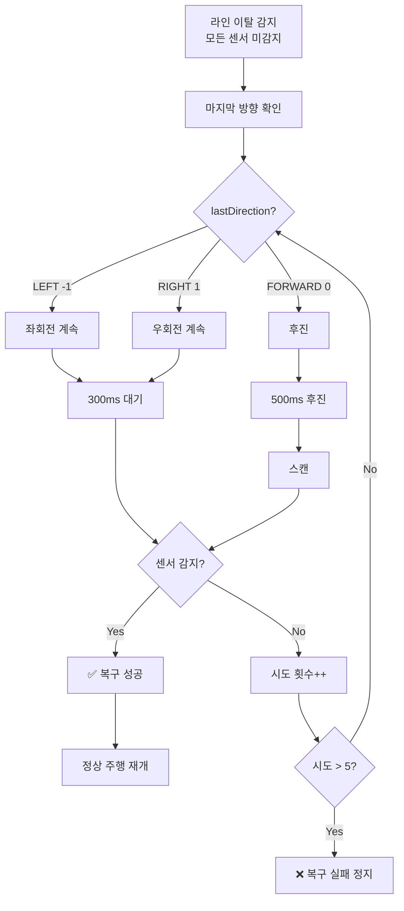
```mermaid
flowchart TD
    A[라인 이탈 감지<br>모든 센서 미감지] --> B[마지막 방향 확인]
    B --> C{lastDirection?}
    
    C -->|LEFT -1| D[좌회전 계속]
    C -->|RIGHT 1| E[우회전 계속]
    C -->|FORWARD 0| F[후진]
    
    D --> G[300ms 대기]
    E --> G
    F --> H[500ms 후진]
    H --> I[스캔]
    
    G --> J{센서 감지?}
    I --> J
    
    J -->|Yes| K[✅ 복구 성공]
    J -->|No| L[시도 횟수++]
    
    L --> M{시도 > 5?}
    M -->|Yes| N[❌ 복구 실패 정지]
    M -->|No| C
    
    K --> O[정상 주행 재개]
```

### 테스트 케이스

| TC-ID | 테스트 상황 | 센서 상태 | 예상 동작 | Pass/Fail |
|-------|-------------|-----------|-----------|:---------:|
| TC-01 | 직선 구간 | ○●○ | 직진 | ☐ |
| TC-02 | 왼쪽 커브 | ●○○ | 좌회전 | ☐ |
| TC-03 | 오른쪽 커브 | ○○● | 우회전 | ☐ |
| TC-04 | 완만한 좌커브 | ●●○ | 약한 좌회전 | ☐ |
| TC-05 | 완만한 우커브 | ○●● | 약한 우회전 | ☐ |
| TC-06 | 종료 라인 | ●●● | 정지 | ☐ |
| TC-07 | 라인 이탈 | ○○○ | 복구 시도 | ☐ |

---

## 🟠 Project 3: 장애물 피하기

### 실제 자율주행 연계: AEB & 장애물 회피

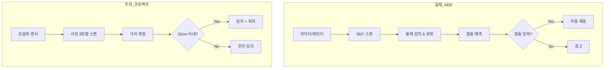
```mermaid
flowchart TB
    subgraph 실제_AEB
        AA[라이다/레이더] --> AB[360° 스캔]
        AB --> AC[물체 감지 & 분류]
        AC --> AD[충돌 예측]
        AD --> AE{충돌 임박?}
        AE -->|Yes| AF[자동 제동]
        AE -->|No| AG[경고]
    end
    
    subgraph 우리_프로젝트
        PA[초음파 센서] --> PB[서보 3방향 스캔]
        PB --> PC[거리 측정]
        PC --> PD{20cm 이내?}
        PD -->|Yes| PE[정지 + 회피]
        PD -->|No| PF[전진 유지]
    end
```

### 초음파 거리 측정 알고리즘

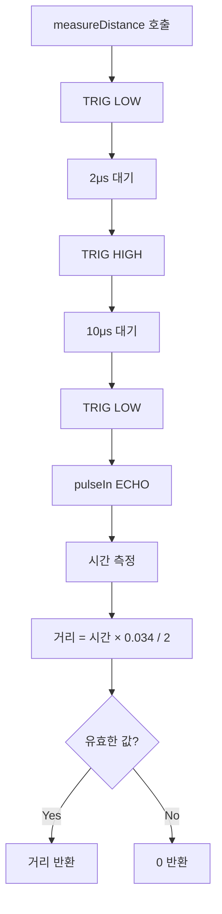
```mermaid
flowchart TD
    A[measureDistance 호출] --> B[TRIG LOW]
    B --> C[2μs 대기]
    C --> D[TRIG HIGH]
    D --> E[10μs 대기]
    E --> F[TRIG LOW]
    F --> G[pulseIn ECHO]
    G --> H[시간 측정]
    H --> I[거리 = 시간 × 0.034 / 2]
    I --> J{유효한 값?}
    J -->|Yes| K[거리 반환]
    J -->|No| L[0 반환]
```

### 서보모터 스캔 알고리즘

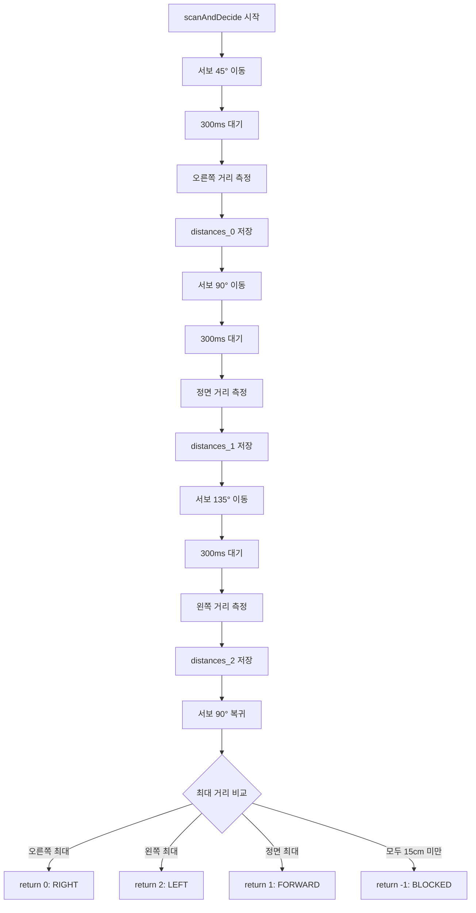
```mermaid
flowchart TD
    A[scanAndDecide 시작] --> B[서보 45° 이동]
    B --> C[300ms 대기]
    C --> D[오른쪽 거리 측정]
    D --> E[distances_0 저장]
    
    E --> F[서보 90° 이동]
    F --> G[300ms 대기]
    G --> H[정면 거리 측정]
    H --> I[distances_1 저장]
    
    I --> J[서보 135° 이동]
    J --> K[300ms 대기]
    K --> L[왼쪽 거리 측정]
    L --> M[distances_2 저장]
    
    M --> N[서보 90° 복귀]
    N --> O{최대 거리 비교}
    
    O -->|오른쪽 최대| P[return 0: RIGHT]
    O -->|왼쪽 최대| Q[return 2: LEFT]
    O -->|정면 최대| R[return 1: FORWARD]
    O -->|모두 15cm 미만| S[return -1: BLOCKED]
```

### 장애물 회피 메인 알고리즘

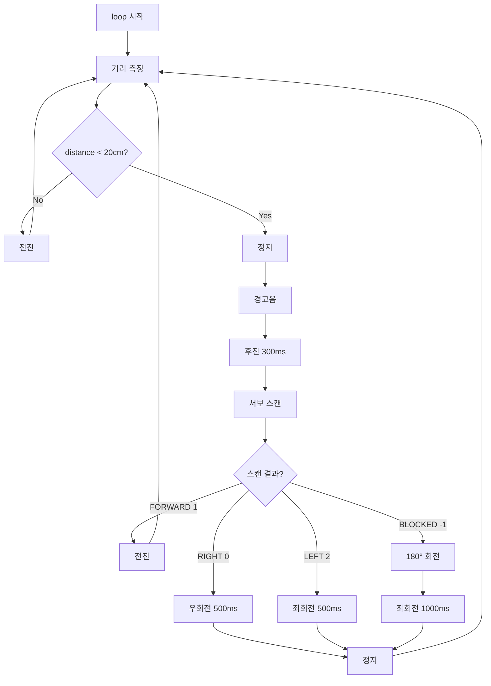
```mermaid
flowchart TD
    A[loop 시작] --> B[거리 측정]
    B --> C{distance < 20cm?}
    
    C -->|No| D[전진]
    D --> B
    
    C -->|Yes| E[정지]
    E --> F[경고음]
    F --> G[후진 300ms]
    G --> H[서보 스캔]
    H --> I{스캔 결과?}
    
    I -->|RIGHT 0| J[우회전 500ms]
    I -->|LEFT 2| K[좌회전 500ms]
    I -->|FORWARD 1| L[전진]
    I -->|BLOCKED -1| M[180° 회전]
    
    J --> N[정지]
    K --> N
    L --> B
    M --> O[좌회전 1000ms]
    O --> N
    N --> B
```

### 막다른 길 처리 알고리즘

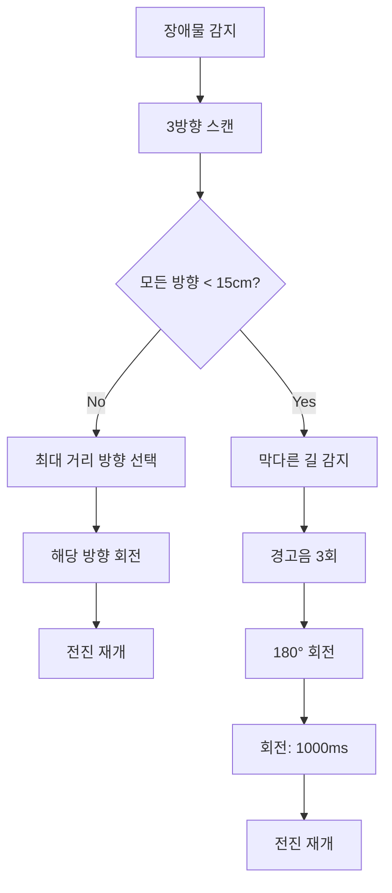
```mermaid
flowchart TD
    A[장애물 감지] --> B[3방향 스캔]
    B --> C{모든 방향 < 15cm?}
    
    C -->|No| D[최대 거리 방향 선택]
    D --> E[해당 방향 회전]
    E --> F[전진 재개]
    
    C -->|Yes| G[막다른 길 감지]
    G --> H[경고음 3회]
    H --> I[180° 회전]
    I --> J[회전: 1000ms]
    J --> K[전진 재개]
```

### 테스트 케이스

| TC-ID | 테스트 상황 | 조건 | 예상 동작 | Pass/Fail |
|-------|-------------|------|-----------|:---------:|
| TC-01 | 정면 장애물 | 거리 < 20cm | 정지 | ☐ |
| TC-02 | 오른쪽 여유 | R > L | 우회전 | ☐ |
| TC-03 | 왼쪽 여유 | L > R | 좌회전 | ☐ |
| TC-04 | 막다른 길 | 모두 < 15cm | 180° 회전 | ☐ |
| TC-05 | 연속 장애물 | 3개 연속 | 모두 회피 | ☐ |
| TC-06 | 경고음 | 장애물 감지 시 | 부저 울림 | ☐ |

---

## 🔴 Project 4: 자동차 따라가기

### 실제 자율주행 연계: ACC (적응형 순항 제어)

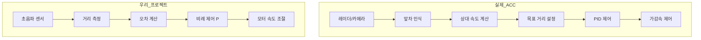
```mermaid
flowchart TB
    subgraph 실제_ACC
        AA[레이더/카메라] --> AB[앞차 인식]
        AB --> AC[상대 속도 계산]
        AC --> AD[목표 거리 설정]
        AD --> AE[PID 제어]
        AE --> AF[가감속 제어]
    end
    
    subgraph 우리_프로젝트
        PA[초음파 센서] --> PB[거리 측정]
        PB --> PC[오차 계산]
        PC --> PD[비례 제어 P]
        PD --> PE[모터 속도 조절]
    end
```

### 거리 유지 알고리즘

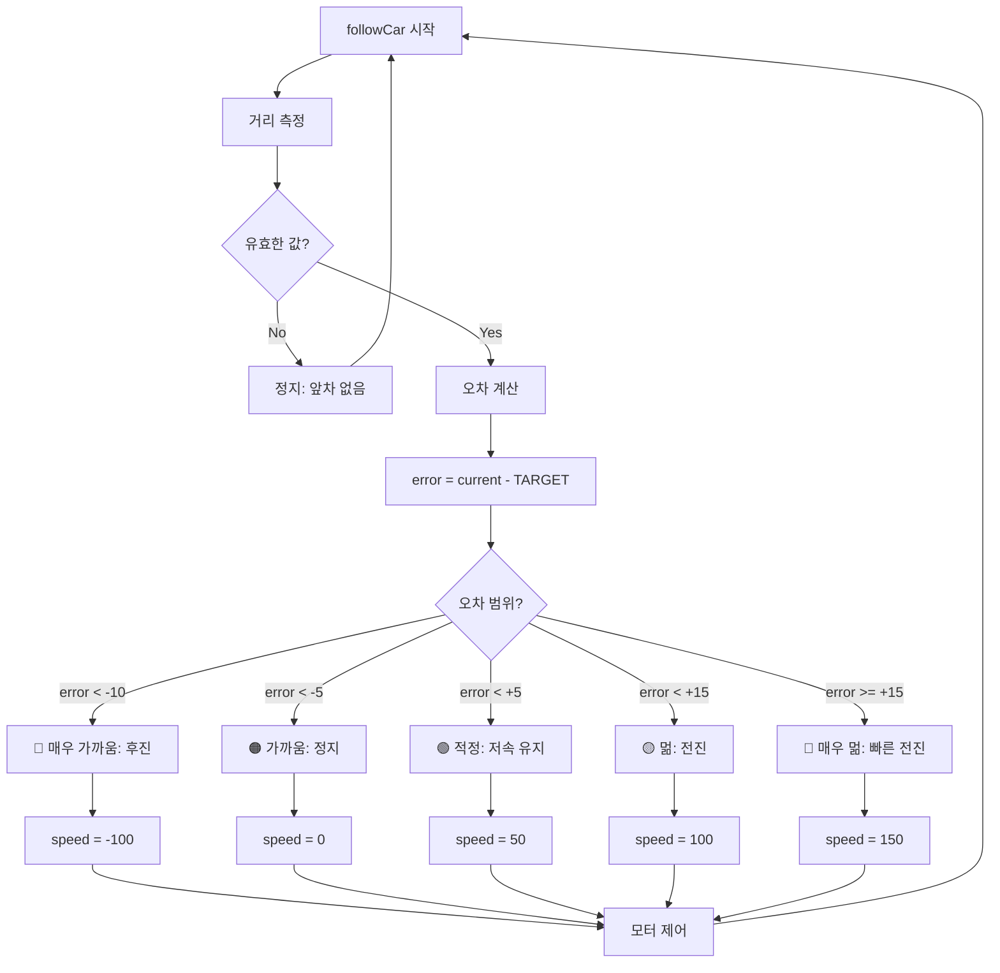
```mermaid
flowchart TD
    A[followCar 시작] --> B[거리 측정]
    B --> C{유효한 값?}
    
    C -->|No| D[정지: 앞차 없음]
    D --> A
    
    C -->|Yes| E[오차 계산]
    E --> F["error = current - TARGET"]
    F --> G{오차 범위?}
    
    G -->|error < -10| H[🔴 매우 가까움: 후진]
    G -->|error < -5| I[🟠 가까움: 정지]
    G -->|error < +5| J[🟢 적정: 저속 유지]
    G -->|error < +15| K[🟡 멂: 전진]
    G -->|error >= +15| L[🔴 매우 멂: 빠른 전진]
    
    H --> M[speed = -100]
    I --> N[speed = 0]
    J --> O[speed = 50]
    K --> P[speed = 100]
    L --> Q[speed = 150]
    
    M --> R[모터 제어]
    N --> R
    O --> R
    P --> R
    Q --> R
    R --> A
```

### 비례 제어 (P 제어) 알고리즘

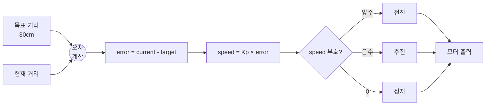
```mermaid
flowchart LR
    A[목표 거리<br>30cm] --> B((오차<br>계산))
    C[현재 거리] --> B
    B --> D["error = current - target"]
    D --> E["speed = Kp × error"]
    E --> F{speed 부호?}
    F -->|양수| G[전진]
    F -->|음수| H[후진]
    F -->|0| I[정지]
    G --> J[모터 출력]
    H --> J
    I --> J
```

### Kp 튜닝 가이드

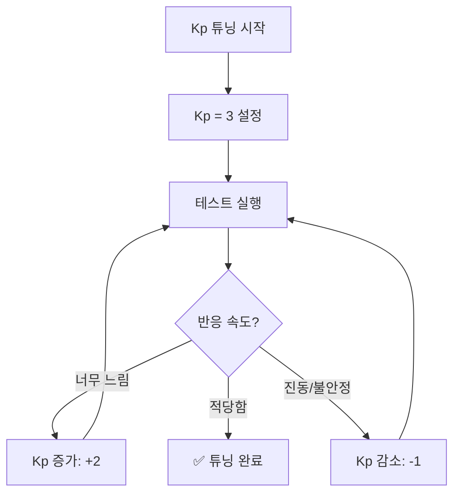
```mermaid
flowchart TD
    A[Kp 튜닝 시작] --> B[Kp = 3 설정]
    B --> C[테스트 실행]
    C --> D{반응 속도?}
    
    D -->|너무 느림| E[Kp 증가: +2]
    D -->|적당함| F[✅ 튜닝 완료]
    D -->|진동/불안정| G[Kp 감소: -1]
    
    E --> C
    G --> C
```

### 상태 전이 다이어그램

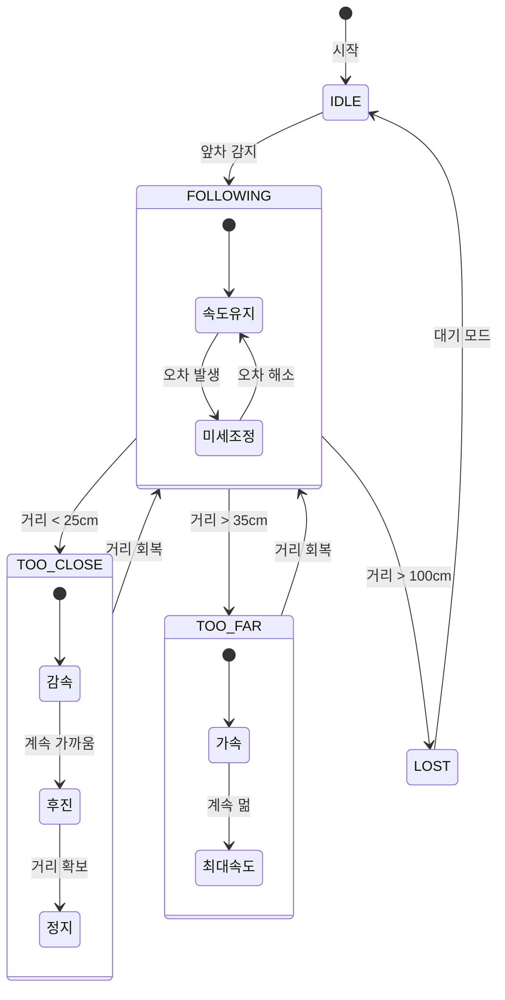
```mermaid
stateDiagram-v2
    [*] --> IDLE: 시작
    
    IDLE --> FOLLOWING: 앞차 감지
    FOLLOWING --> TOO_CLOSE: 거리 < 25cm
    FOLLOWING --> TOO_FAR: 거리 > 35cm
    FOLLOWING --> LOST: 거리 > 100cm
    
    TOO_CLOSE --> FOLLOWING: 거리 회복
    TOO_FAR --> FOLLOWING: 거리 회복
    LOST --> IDLE: 대기 모드
    
    state FOLLOWING {
        [*] --> 속도유지
        속도유지 --> 미세조정: 오차 발생
        미세조정 --> 속도유지: 오차 해소
    }
    
    state TOO_CLOSE {
        [*] --> 감속
        감속 --> 후진: 계속 가까움
        후진 --> 정지: 거리 확보
    }
    
    state TOO_FAR {
        [*] --> 가속
        가속 --> 최대속도: 계속 멂
    }
```

### 테스트 시나리오

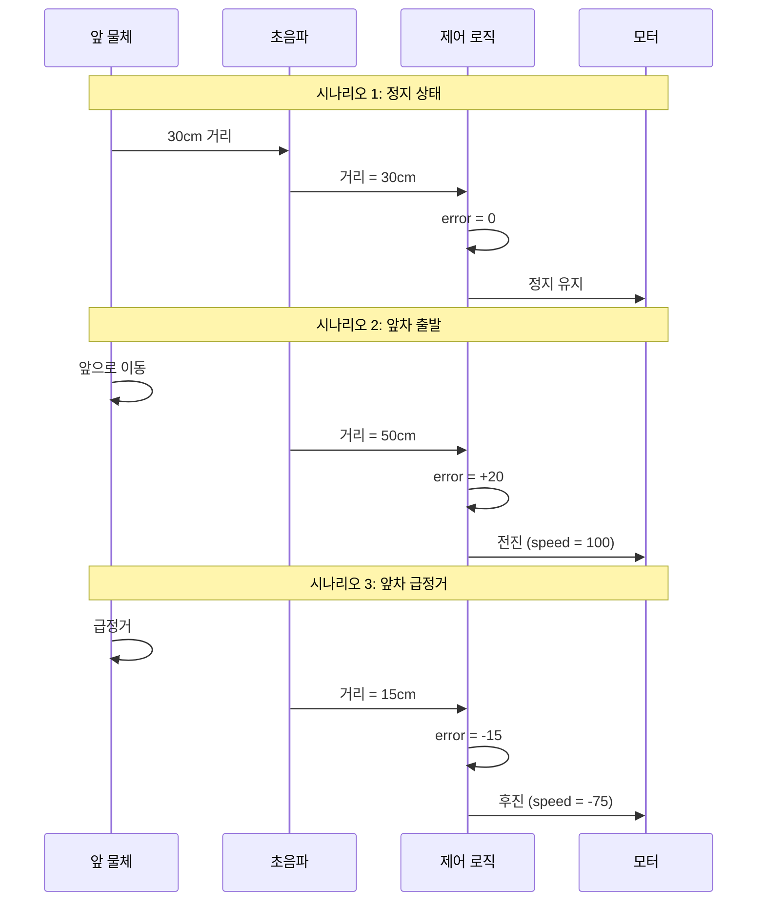
```mermaid
sequenceDiagram
    participant 앞차 as 앞 물체
    participant 센서 as 초음파
    participant 제어 as 제어 로직
    participant 모터 as 모터
    
    Note over 앞차,모터: 시나리오 1: 정지 상태
    앞차->>센서: 30cm 거리
    센서->>제어: 거리 = 30cm
    제어->>제어: error = 0
    제어->>모터: 정지 유지
    
    Note over 앞차,모터: 시나리오 2: 앞차 출발
    앞차->>앞차: 앞으로 이동
    센서->>제어: 거리 = 50cm
    제어->>제어: error = +20
    제어->>모터: 전진 (speed = 100)
    
    Note over 앞차,모터: 시나리오 3: 앞차 급정거
    앞차->>앞차: 급정거
    센서->>제어: 거리 = 15cm
    제어->>제어: error = -15
    제어->>모터: 후진 (speed = -75)
```

### 테스트 케이스

| TC-ID | 테스트 상황 | 현재 거리 | 예상 동작 | Pass/Fail |
|-------|-------------|-----------|-----------|:---------:|
| TC-01 | 적정 거리 | 30cm | 정지/저속 유지 | ☐ |
| TC-02 | 앞차 전진 | 50cm | 전진 추종 | ☐ |
| TC-03 | 앞차 후진 | 15cm | 후진 회피 | ☐ |
| TC-04 | 앞차 사라짐 | >100cm | 정지 대기 | ☐ |
| TC-05 | 부드러운 추종 | 변동 | 급작스런 변화 없음 | ☐ |
| TC-06 | Kp 튜닝 | - | 안정적 제어 | ☐ |

---

## 📊 프로젝트 간 기술 연계

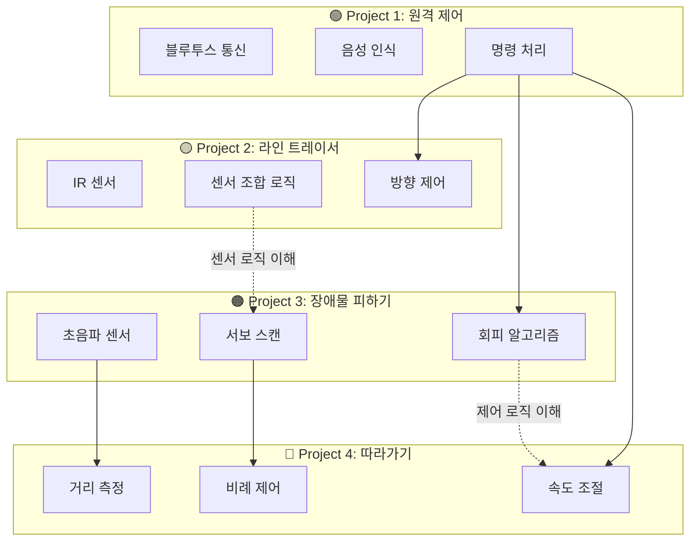
```mermaid
flowchart TB
    subgraph Project1[🟢 Project 1: 원격 제어]
        P1A[블루투스 통신]
        P1B[음성 인식]
        P1C[명령 처리]
    end
    
    subgraph Project2[🟡 Project 2: 라인 트레이서]
        P2A[IR 센서]
        P2B[센서 조합 로직]
        P2C[방향 제어]
    end
    
    subgraph Project3[🟠 Project 3: 장애물 피하기]
        P3A[초음파 센서]
        P3B[서보 스캔]
        P3C[회피 알고리즘]
    end
    
    subgraph Project4[🔴 Project 4: 따라가기]
        P4A[거리 측정]
        P4B[비례 제어]
        P4C[속도 조절]
    end
    
    P1C --> P2C
    P1C --> P3C
    P1C --> P4C
    
    P3A --> P4A
    P3B --> P4B
    
    P2B -.->|센서 로직 이해| P3B
    P3C -.->|제어 로직 이해| P4C
```

---

## 📋 전체 테스트 체크리스트

| 프로젝트 | 테스트 항목 | 성공 기준 | Pass |
|----------|-------------|-----------|:----:|
| **P1** | 음성 "앞으로" | 전진 | ☐ |
| **P1** | 음성 "멈춰" | 정지 | ☐ |
| **P1** | 음성 "빨리" | 고속 | ☐ |
| **P2** | 직선 구간 | 이탈 없음 | ☐ |
| **P2** | 커브 구간 | 안정적 통과 | ☐ |
| **P2** | 라인 이탈 복구 | 3초 내 복귀 | ☐ |
| **P3** | 장애물 감지 | 20cm에서 정지 | ☐ |
| **P3** | 방향 결정 | 빈 공간으로 이동 | ☐ |
| **P3** | 막다른 길 | 180° 회전 | ☐ |
| **P4** | 거리 유지 | 30cm ± 5cm | ☐ |
| **P4** | 앞차 추종 | 부드러운 가감속 | ☐ |
| **P4** | 앞차 사라짐 | 정지 대기 | ☐ |

---

*이 문서는 프로젝트별 알고리즘을 실제 자율주행 기술과 연계하여 학습자가 이해하도록 구성되었습니다.*
