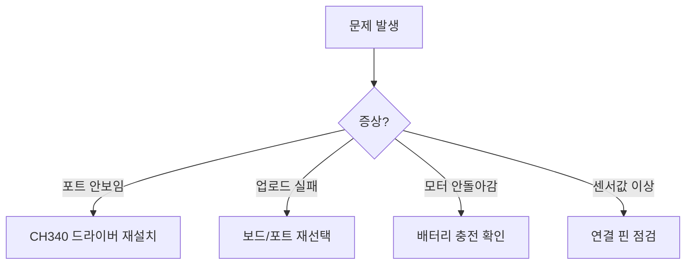

# 👨‍🏫 강사용 프로젝트 기반 수업 가이드

> **교육 방식**: 프로젝트 기반 학습 (PBL) + 코드 수정 & 테스트 중심  
> **교육 시간**: 2일 (총 12시간)  
> **핵심 원칙**: 코드 작성 최소화, 기존 코드 분석 및 수정

---

## 📅 전체 타임라인

### Day 1 (6시간)

```mermaid
gantt
    title Day 1 타임라인
    dateFormat HH:mm
    axisFormat %H:%M
    
    section 준비
    교구재 조립 + 환경설정: 09:00, 60m
    
    section Project 1
    원격 제어 - 기본 RC: 10:00, 40m
    원격 제어 - 음성 STT: 10:40, 80m
    
    section 휴식
    점심: 12:00, 60m
    
    section Project 2
    라인 트레이서 - 캘리브레이션: 13:00, 30m
    라인 트레이서 - 기본: 13:30, 60m
    라인 트레이서 - 고급: 14:30, 90m
```



### Day 2 (6시간)

```mermaid
gantt
    title Day 2 타임라인
    dateFormat HH:mm
    axisFormat %H:%M
    
    section Project 3
    장애물 피하기 - 센서 이해: 09:00, 30m
    장애물 피하기 - 서보 스캔: 09:30, 60m
    장애물 피하기 - 회피 알고리즘: 10:30, 90m
    
    section 휴식
    점심: 12:00, 60m
    
    section Project 4
    따라가기 - 기본: 13:00, 60m
    따라가기 - 비례 제어: 14:00, 60m
    
    section 마무리
    통합 테스트 및 발표: 15:00, 60m
```



---

## 🔧 준비 시간: 교구재 조립 (1시간)

### 진행 스크립트

```
강사: "오늘은 실제 자율주행차에 사용되는 기술들을 직접 체험해 봅니다.
       테슬라, 현대차가 사용하는 기술을 축소한 버전이라고 생각하세요."

[조립 시작]
강사: "먼저 키트를 조립합니다. 완성된 차량이 여러분의 자율주행 실험 대상입니다."
```

### 조립 체크포인트

| 시점 | 확인 사항 | 대응 |
|------|-----------|------|
| 10분 | 섀시 조립 완료? | 나사 조임 확인 |
| 25분 | 모터 4개 장착? | 방향 표시 확인 |
| 35분 | 센서 연결 완료? | 핀 연결 점검 |
| 50분 | 전원 테스트? | LED 점등 확인 |
| 55분 | Blink 업로드? | 포트/보드 설정 |

### 트러블슈팅



---

## 🟢 Project 1: 원격 제어 (2시간)

### 🎯 학습 목표
- 블루투스 시리얼 통신 원리 이해
- App Inventor STT 활용
- **실제 연계**: V2X 통신, 텔레오퍼레이션

### Part 1: 기본 RC 제어 (40분)

#### 진행 스크립트

```
강사: "먼저 기존 코드를 분석해 봅시다. 
       rc_car_ultra_sensor.ino 파일을 열어주세요.
       
       이 코드는 블루투스로 명령을 받아 모터를 제어합니다.
       실제 자율주행차의 '텔레오퍼레이션' 기술과 같습니다.
       웨이모는 복잡한 상황에서 원격으로 차량을 조종합니다."

[PRIMM - Predict]
강사: "inputBTString.equals('UP')이 true면 뭐가 실행될까요?"
학생: "Up() 함수요"
강사: "맞습니다. Up()은 어떤 동작을 할까요? 코드에서 찾아보세요."
```

#### 코드 분석 포인트

```arduino
// 학생들에게 설명할 핵심 부분
while (BTSerial.available()) {
    inBTChar = (char)BTSerial.read();  // ← "한 글자씩 읽는 이유는?"
    
    if (inBTChar == '_') {  // ← "왜 '_'를 구분자로 사용할까?"
        if (inputBTString.equals("UP")) {
            Up();  // ← "이 함수는 어디에 정의되어 있을까?"
        }
        inputBTString = "";  // ← "왜 초기화가 필요할까?"
    }
}
```

#### 수정 과제 안내

```
강사: "이제 코드를 수정해 봅시다. 
       새로운 명령어 'HORN'을 추가해서 경적 소리가 나게 해보세요.
       힌트: tone(PIEZO, 1000, 500) 함수를 사용합니다."

[학생 작업 시간: 10분]

강사: "완성된 분은 시리얼 모니터에서 'HORN_'을 입력해 테스트해보세요."
```

### Part 2: 음성 인식 (STT) 제어 (80분)

#### App Inventor 설명

```
강사: "이제 스마트폰 앱을 만들어 음성으로 제어해봅시다.
       이건 실제 자동차의 '음성 비서'와 같습니다.
       '빅스비 자동차에서 히터 켜줘'와 같은 거죠."
```

#### 화면 설계 가이드

```
┌─────────────────────────────┐
│  [🔗 블루투스 연결]          │
├─────────────────────────────┤
│                             │
│     🎤 [음성 인식 버튼]      │
│     (크게 배치)              │
│                             │
│   인식 결과: "앞으로 가"     │
│                             │
├─────────────────────────────┤
│  ▲UP  ◄LEFT  STOP  RIGHT►  │
│        ▼DOWN               │
│  (백업용 수동 버튼)         │
├─────────────────────────────┤
│  상태: 연결됨               │
└─────────────────────────────┘
```

#### 블록 코딩 단계별 안내

**1단계: 블루투스 연결 (15분)**

```
강사: "ListPicker를 추가하고, BeforePicking에서 
       AddressesAndNames를 가져옵니다."

[시연 후 학생 따라하기]
```

**2단계: 음성 인식 (20분)**

```
강사: "SpeechRecognizer 컴포넌트를 추가합니다.
       버튼을 누르면 GetText()를 호출합니다.
       AfterGettingText에서 결과를 처리합니다."

[핵심 블록]
- SpeechRecognizer.GetText
- SpeechRecognizer.Result
- text contains "앞"
```

**3단계: 명령어 매칭 (25분)**

```
강사: "'앞으로 가', '앞으로', '전진' 모두 UP_ 명령이 되어야 합니다.
       어떻게 처리할까요?"

[학생 토론]

강사: "text contains를 사용합니다. '앞'이 포함되면 UP_을 보내는 거죠."
```

#### 테스트 체크리스트

| 음성 입력 | 예상 명령 | 동작 확인 | Pass |
|-----------|-----------|-----------|:----:|
| "앞으로" | UP_ | 전진 | ☐ |
| "뒤로 가" | DOWN_ | 후진 | ☐ |
| "왼쪽" | LEFT_ | 좌회전 | ☐ |
| "오른쪽으로" | RIGHT_ | 우회전 | ☐ |
| "멈춰" | STOP_ | 정지 | ☐ |

---

## 🟡 Project 2: 라인 트레이서 (3시간)

### 🎯 학습 목표
- IR 센서 원리 및 캘리브레이션
- 센서 조합 기반 의사결정
- **실제 연계**: 차선 유지 보조 시스템 (LKAS)

### 실제 자율주행 연계 설명

```
강사: "테슬라, 현대차의 차선 유지 기능을 아시나요?
       카메라로 차선을 인식하고 중앙을 유지합니다.
       
       우리는 IR 센서로 검정 라인을 인식합니다.
       원리는 같습니다: 센서로 인식 → 판단 → 조향 제어"
```

### Part 1: 센서 캘리브레이션 (30분)

#### 진행 스크립트

```
강사: "먼저 센서가 제대로 동작하는지 확인해야 합니다.
       테스트 코드를 업로드하고 시리얼 모니터를 열어주세요."

[테스트 코드 업로드]

강사: "흰색 바닥에서 값을 확인하세요. 얼마가 나오나요?"
학생: "200 정도요"
강사: "좋아요. 이제 검정 라인에 센서를 올려보세요."
학생: "900이요"
강사: "완벽합니다. 임계값은 중간인 550으로 설정하면 됩니다."
```

#### 캘리브레이션 기록표 (학생용)

| 센서 | 흰색 값 | 검정 값 | 임계값 |
|------|---------|---------|--------|
| 왼쪽 (A0) | | | |
| 중앙 (A1) | | | |
| 오른쪽 (A2) | | | |

### Part 2: 기본 라인 트레이싱 (1시간)

#### 코드 분석 (car_line_track.ino)

```
강사: "이제 라인 트레이싱 코드를 분석합니다.
       LINE_SENSOR 값을 아까 측정한 임계값으로 수정하세요."

[PRIMM - Investigate]
강사: "중앙 센서만 라인을 감지하면 어떻게 될까요?"
학생: "Forward() 호출이요"
강사: "맞습니다. 왼쪽만 감지하면요?"
학생: "Leftward() 호출이요"
강사: "왜 왼쪽 센서가 라인을 감지하면 왼쪽으로 회전할까요?"
학생: "라인이 왼쪽에 있으니까... 왼쪽으로 가야 다시 중앙에 오니까요!"
```

#### 수정 과제

```
강사: "LINE_SENSOR 값을 캘리브레이션 결과로 수정하세요.
       그리고 SPEED 값을 조절해서 안정적인 속도를 찾아보세요."

[수정 항목]
1. LINE_SENSOR: 850 → (캘리브레이션 값)
2. SPEED: 130 → (테스트로 찾기)
3. LEFT_SPEED: 150 → (코너링 최적화)
```

### Part 3: 고급 기능 - 라인 이탈 복구 (1시간 30분)

#### 문제 상황 설명

```
강사: "급커브에서 라인을 이탈하면 어떻게 될까요?"
학생: "멈춰요"
강사: "실제 LKAS도 차선 이탈 시 자동 복귀 기능이 있습니다.
       우리도 이 기능을 추가해봅시다."
```

#### 코드 수정 가이드

```arduino
// 학생에게 제공할 템플릿
int lastDirection = 0;  // 추가: 마지막 방향 기록

void loop() {
    // 기존 코드에 추가
    
    // 모두 미감지 시 복구 로직
    if (!leftDetect && !centerDetect && !rightDetect) {
        // TODO: lastDirection 기반 복구
        // 힌트: lastDirection이 -1이면 계속 좌회전
        
        // 학생 작성 영역
        
    }
    
    // 방향 기록 (정상 주행 시)
    if (leftDetect) lastDirection = -1;
    if (rightDetect) lastDirection = 1;
    if (centerDetect) lastDirection = 0;
}
```

#### 테스트 트랙 설계

```
강사: "검정 테이프로 트랙을 만들어 테스트합니다."

기본 트랙:
┌───────────────┐
│  ╭─────────╮  │
│  │         │  │
│ S┘         └G │
└───────────────┘

심화 트랙 (급커브):
┌───────────────┐
│   ╭──╮   ╭╮   │
│   │  │   ││   │
│ S─┘  └───┘└─G │
└───────────────┘
```

---

## 🟠 Project 3: 장애물 피하기 (3시간)

### 🎯 학습 목표
- 초음파 센서 원리 이해
- 서보모터로 스캔 구현
- **실제 연계**: 자동 긴급 제동 (AEB)

### 실제 자율주행 연계 설명

```
강사: "볼보의 City Safety 기능을 아시나요?
       보행자나 차량을 감지하면 자동으로 브레이크를 밟습니다.
       
       우리도 초음파 센서로 장애물을 감지하고
       자동으로 멈추고 피하는 기능을 구현합니다."
```

### Part 1: 초음파 센서 이해 (30분)

#### 동작 원리 설명

```
강사: "초음파 센서는 박쥐처럼 소리를 보내고 반사파를 감지합니다.
       거리 = 시간 × 340m/s ÷ 2
       
       340m/s는 소리의 속도이고, 2로 나누는 이유는?"
학생: "왕복이니까요?"
강사: "정확합니다!"
```

#### 실습: 거리 측정 테스트

```
강사: "distance() 함수를 호출해서 값을 확인해봅시다.
       손을 10cm, 20cm, 30cm에 두고 측정해보세요."

[학생 측정 및 기록]
```

### Part 2: 서보모터 스캔 (1시간)

#### 진행 스크립트

```
강사: "실제 자율주행차는 라이다로 360도를 스캔합니다.
       우리는 서보모터로 초음파 센서를 돌려서
       45도, 90도, 135도 세 방향을 측정합니다."

[서보모터 동작 시연]
```

#### 수정 과제: 스캔 함수 완성

```
강사: "scanAndDecide() 함수의 빈칸을 채워보세요.
       힌트: distance() 함수와 각도 배열을 사용합니다."

[학생 작업 시간: 20분]
```

### Part 3: 회피 알고리즘 (1시간 30분)

#### 코드 분석

```
강사: "현재 코드는 랜덤으로 방향을 결정합니다.
       random(2,4)를 찾아보세요. 이건 비효율적이죠?
       
       스캔 결과를 사용해서 최적 방향을 선택하도록 수정합니다."
```

#### 수정 과제

```arduino
// 현재 코드 (비효율적)
int toggle = random(2, 4);

// 수정 목표 (스마트)
int direction = scanAndDecide();
if (direction == 0) Right();
else if (direction == 2) Left();
else /* 막다른 길 */ Left(); delay(1000); // 180도
```

#### 테스트 코스 설계

```
강사: "장애물 3개를 배치하고 테스트합니다."

┌─────────────────────────────┐
│  S                          │
│  │      ┌───┐              │
│  └──┐   │ 1 │              │
│     │   └───┘   ┌───┐      │
│     └────┐      │ 2 │      │
│          │      └───┘      │
│   ┌───┐  └──────────┐      │
│   │ 3 │             └─ G   │
│   └───┘                    │
└─────────────────────────────┘
```

---

## 🔴 Project 4: 자동차 따라가기 (2시간)

### 🎯 학습 목표
- 거리 기반 속도 제어
- 비례 제어 (P 제어) 개념
- **실제 연계**: 적응형 순항 제어 (ACC)

### 실제 자율주행 연계 설명

```
강사: "고속도로에서 스마트 크루즈 컨트롤을 사용해 보셨나요?
       앞차와 일정 거리를 유지하며 자동으로 가감속합니다.
       
       우리도 초음파 센서로 앞 물체와의 거리를 유지하는
       '따라가기' 기능을 구현합니다."
```

### Part 1: 기본 거리 유지 (1시간)

#### 개념 설명

```
강사: "목표 거리는 30cm입니다.
       현재 거리가 30cm보다 가까우면? → 후진
       현재 거리가 30cm보다 멀면? → 전진
       
       이게 기본 원리입니다."
```

#### 수정 과제

```arduino
// 학생이 완성할 코드
void followCar() {
    int currentDist = distance();
    int error = currentDist - 30;  // 목표: 30cm
    
    if (error < -5) {
        // TODO: 후진 코드 작성
    }
    else if (error > 10) {
        // TODO: 전진 코드 작성
    }
    else {
        // TODO: 정지 또는 저속 유지
    }
}
```

### Part 2: 비례 제어 (1시간)

#### 진행 스크립트

```
강사: "지금은 '거리 멀면 전진, 가까우면 후진' 단순 로직입니다.
       하지만 이러면 움직임이 뚝뚝 끊깁니다.
       
       실제 ACC는 'PID 제어'를 사용합니다.
       우리는 그 중 P (비례) 제어를 적용해봅시다.
       
       speed = Kp × error
       
       오차가 크면 속도도 크게, 오차가 작으면 속도도 작게!"
```

#### Kp 튜닝 실습

```
강사: "Kp 값을 바꿔가며 테스트해보세요.
       - Kp = 3: 느리지만 안정적
       - Kp = 5: 적당
       - Kp = 10: 빠르지만 불안정할 수 있음"

[학생 튜닝 시간: 20분]
```

---

## 📊 통합 테스트 및 발표 (1시간)

### 발표 형식

```
1. 프로젝트 소개 (1분)
   - 어떤 프로젝트를 선택했는지
   - 실제 자율주행과의 연계점
   
2. 코드 수정 내용 (2분)
   - 어떤 부분을 수정했는지
   - 왜 그렇게 수정했는지
   
3. 동작 시연 (3분)
   - 실제 동작 보여주기
   - 성공/실패 케이스
   
4. 어려웠던 점 (2분)
   - 문제 상황
   - 해결 방법
   
5. Q&A (2분)
```

### 평가 루브릭

| 항목 | 배점 | 상 (100%) | 중 (70%) | 하 (40%) |
|------|------|-----------|----------|----------|
| P1: 음성 제어 | 20 | 5개 이상 명령 | 3-4개 명령 | 1-2개 명령 |
| P2: 라인 트레이서 | 25 | 완주 + 복구 | 완주 | 일부 구간 |
| P3: 장애물 피하기 | 25 | 3개 회피 | 2개 회피 | 1개 회피 |
| P4: 따라가기 | 20 | 부드러운 추종 | 추종 성공 | 일부 동작 |
| 발표 | 10 | 명확한 설명 | 이해 가능 | 설명 부족 |

---

## 📦 준비물 체크리스트

### 강사 준비물

- [ ] 시연용 완성 키트 1대
- [ ] 여분 부품 (모터, 센서, 서보)
- [ ] 검정 테이프 (라인 트랙용)
- [ ] 장애물 박스 3개 이상
- [ ] 멀티탭
- [ ] 빔프로젝터/대형 모니터

### 학생 준비물

- [ ] 노트북 (Arduino IDE 설치)
- [ ] 안드로이드 스마트폰
- [ ] USB 케이블 (A to B)
- [ ] 필기도구

### 소프트웨어 사전 설치

- [ ] Arduino IDE 2.x
- [ ] CH340 드라이버
- [ ] MIT App Inventor (웹 접속 확인)
- [ ] Servo 라이브러리

---

## ⚠️ 안전 수칙

1. **배터리**: 쇼트 방지, 과충전 금지
2. **테스트 시**: 바퀴 근처 손가락 주의
3. **서보모터**: 과도한 힘 가하지 않기
4. **초음파 센서**: 귀에 가까이 대지 않기

---

## 🔧 트러블슈팅 가이드

### 자주 발생하는 문제

| 증상 | 원인 | 해결 |
|------|------|------|
| 블루투스 연결 안됨 | 페어링 문제 | 핀코드 1234 확인 |
| 한쪽 모터만 동작 | 배선 오류 | 핀 연결 점검 |
| 라인 인식 불안정 | 임계값 문제 | 캘리브레이션 재실행 |
| 초음파 값 이상 | 측정 한계 | 2cm~4m 범위 확인 |
| 서보 떨림 | 전류 부족 | 외부 전원 검토 |

---

## 📞 기술 지원

- 기술 문의: lab@robodyne.co.kr
- 제품 문의: 1670-9626

---

*본 가이드는 프로젝트 기반 학습(PBL)과 PRIMM 교수법 기반으로 작성되었습니다.*
