# 🚗 AutoPlot: 자율주행 스마트카 프로젝트 기반 교육

> **"완성된 코드를 먼저 보여주고, 왜 그렇게 동작하는지 탐구하게 하라"**

아두이노 기반 4휠 스마트카를 활용하여 **실제 자율주행 기술(LKAS, AEB, ACC, V2X)**을 체험하고 학습하는 **프로젝트 기반 교육 자료**입니다.

---

## 📋 목차

- [프로젝트 소개](#-프로젝트-소개)
- [교육 목표](#-교육-목표)
- [교육 방식: PRIMM 방법론](#-교육-방식-primm-방법론)
- [대상 및 유저 시나리오](#-대상-및-유저-시나리오)
- [커리큘럼 개요 (2일 12시간)](#-커리큘럼-개요-2일-12시간)
- [프로젝트 구성](#-프로젝트-구성)
- [폴더 구조](#-폴더-구조)
- [시작하기](#-시작하기)
- [교구재 정보](#-교구재-정보)

---

## 🎯 프로젝트 소개

이 교육 프로젝트는 **아두이노 스마트카 키트**를 활용하여 실제 자율주행차에 사용되는 핵심 기술들을 **직접 체험하고 이해**할 수 있도록 설계되었습니다.

### 실제 자율주행 기술과 우리 프로젝트 연계

### 기술 연계 대응표

| 실제 자율주행 | 우리 프로젝트 | 센서/모듈 | 적용 사례 |
|:-------------:|:-------------:|:---------:|-----------|
| 카메라 기반 차선 인식 | IR 센서 라인 감지 | IR 센서 3채널 | 테슬라 오토파일럿 |
| 라이다/레이더 거리 측정 | 초음파 거리 측정 | HC-SR04 | 볼보 City Safety |
| V2X 무선 통신 | 블루투스 통신 | HC-06 | 웨이모 원격지원 |
| 360° 센서 스캔 | 서보모터 3방향 스캔 | SG90 | 자율주행 택시 |

---

## 🎓 교육 목표

### 핵심 역량 배양

### 역할별 학습 목표

| 역할 | 목표 | 핵심 활동 |
|:----:|------|----------|
| **🔧 실행자** | 기존 코드를 수정하여 원하는 동작을 구현하고 테스트할 수 있다 | 코드 분석 → 값 수정 → 업로드 → 테스트 → 디버깅 |
| **📋 기획자** | 자율주행 기술을 이해하고 테스트 시나리오를 설계할 수 있다 | 문제 정의 → 해결책 설계 → 테스트 케이스 작성 → 평가 |

### AI 시대 필수 역량

---

## 📚 교육 방식: PRIMM 방법론

> **PRIMM**: Predict → Run → Investigate → Modify → Make

이 교육은 **코드를 처음부터 작성하지 않습니다.** 대신, **완성된 코드를 먼저 실행**해보고 **분석하며 수정**하는 **역방향 학습** 방식을 채택합니다.

### PRIMM 5단계 프로세스

### PRIMM 단계별 상세

| 단계 | 이름 | 활동 | 핵심 질문 |
|:----:|:----:|------|----------|
| 1️⃣ | **Predict** | 코드 실행 전 결과 예측 | "이 코드는 무엇을 할 것 같아?" |
| 2️⃣ | **Run** | 실제 코드 실행 및 관찰 | "예상과 같았어? 달랐어?" |
| 3️⃣ | **Investigate** | 코드 분석 및 역할 파악 | "왜 이렇게 동작할까?" |
| 4️⃣ | **Modify** | 값/로직 일부 수정 | "이 값을 바꾸면 어떻게 될까?" |
| 5️⃣ | **Make** | 새로운 기능 추가/창작 | "내가 원하는 기능을 추가해보자!" |

### 전통 교육 vs PRIMM 비교

| 구분 | ❌ 전통 교육 | ✅ PRIMM 교육 |
|:----:|-------------|--------------|
| **학습 순서** | 이론 → 기초 → 응용 → 완성 | 완성품 → 분석 → 이해 → 발전 |
| **동기 유발** | "언젠가 이게 필요할 거야" | "이걸 만들고 싶어!" |
| **시작점** | 빈 화면에서 시작 | 동작하는 코드에서 시작 |
| **실패 인식** | 오류 = 실패 | 오류 = 학습 기회 |
| **AI 활용** | 맥락 부족으로 어려움 | 구체적 질문 가능 |

---

## 👥 대상 및 유저 시나리오

### 교육 대상

| 대상 | 권장 연령 | 사전 지식 | 비고 |
|:----:|:---------:|:---------:|------|
| 고등학생/성인 | 16세+ | 없음 | 심화 프로젝트 권장 |

### 유저 시나리오

### 강사용 진행 가이드

| 단계 | 활동 | 참고 자료 |
|:----:|------|----------|
| 1️⃣ | 전체 커리큘럼 파악 | `Docs/2단계_교육_커리큘럼_autoplot_2day.md` |
| 2️⃣ | 프로젝트별 강의안 준비 | `Docs/상세_ppt_project*.md` |
| 3️⃣ | 완성 코드 제공 후 PRIMM 진행 | `3_arduino_source/` |
| 4️⃣ | 테스트 체크리스트로 평가 | 각 프로젝트 문서 내 체크리스트 |

### 학습자용 자기주도 가이드

| 단계 | 활동 | 참고 자료 |
|:----:|------|----------|
| 1️⃣ | 자율주행 영상으로 동기부여 | `0_movies/` |
| 2️⃣ | 키트 조립 및 환경 설정 | `1_Installation.../` |
| 3️⃣ | 프로젝트 순서대로 실습 | P1 → P2 → P3 → P4 |
| 4️⃣ | 알고리즘 순서도로 이해 심화 | `Docs/3단계_algorithms_flowchart.md` |

---

## 📅 커리큘럼 개요 (2일 12시간)

### 전체 일정 흐름

```mermaid
gantt
    title 2일 12시간 커리큘럼
    dateFormat HH:mm
    axisFormat %H:%M
    
    section Day 1
    교구재 조립 + 환경설정     :d1-1, 09:00, 1h
    Project 1: 원격 제어       :d1-2, after d1-1, 2h
    점심 휴식                  :d1-lunch, after d1-2, 1h
    Project 2: 라인 트레이서   :d1-3, after d1-lunch, 3h
    
    section Day 2
    Project 3: 장애물 피하기   :d2-1, 09:00, 3h
    점심 휴식                  :d2-lunch, after d2-1, 1h
    Project 4: 따라가기        :d2-2, after d2-lunch, 2h
    통합 테스트 및 발표        :d2-3, after d2-2, 1h
```

### Day 1 상세 (6시간)

| 시간 | 내용 | 형태 | 산출물 |
|:----:|------|:----:|--------|
| 1시간 | 🔧 교구재 조립 + 환경 설정 | 실습 | 조립 완료, IDE 설치 |
| 2시간 | 🟢 **Project 1**: 원격 제어 (블루투스 + 음성 STT) | 프로젝트 | 앱으로 차량 제어 |
| 3시간 | 🟡 **Project 2**: 라인 트레이서 (IR 센서) | 프로젝트 | 라인 추종 주행 |

### Day 2 상세 (6시간)

| 시간 | 내용 | 형태 | 산출물 |
|:----:|------|:----:|--------|
| 3시간 | 🟠 **Project 3**: 장애물 피하기 (초음파 + 서보) | 프로젝트 | 장애물 회피 주행 |
| 2시간 | 🔴 **Project 4**: 자동차 따라가기 (거리 유지) | 프로젝트 | 앞차 추종 주행 |
| 1시간 | 📊 통합 테스트 및 발표 | 평가 | 시연 및 발표 |

---

## 🚀 프로젝트 구성

### 프로젝트 난이도 흐름

### 프로젝트 상세 정보

| 프로젝트 | 난이도 | 소요시간 | 센서/모듈 | 연계 기술 | 실제 적용 사례 |
|:--------:|:------:|:--------:|-----------|-----------|----------------|
| 🟢 **P1** | ★☆☆☆☆ | 2시간 | 블루투스(HC-06), App Inventor | V2X, 텔레오퍼레이션 | 웨이모 원격지원, 현대모비스 5G |
| 🟡 **P2** | ★★☆☆☆ | 3시간 | IR 센서 3채널 | LKAS (차선 유지) | 테슬라 오토파일럿, 현대 HDA |
| 🟠 **P3** | ★★★☆☆ | 3시간 | 초음파(HC-SR04), 서보(SG90) | AEB (긴급 제동) | 볼보 City Safety, 현대 FCA |
| 🔴 **P4** | ★★★★☆ | 2시간 | 초음파(HC-SR04) | ACC (적응형 순항) | 현대 스마트 크루즈, 테슬라 TACC |

### 프로젝트별 학습 내용

---

## 📁 폴더 구조

### 전체 구조

| 폴더 | 설명 | 주요 파일 |
|------|------|----------|
| `📂 0_movies/` | 자율주행 참고 영상 | 테슬라 FSD, 웨이모 등 |
| `📂 1_Installation.../` | 설치 가이드 및 드라이버 | CH340 드라이버, Servo 라이브러리 |
| `📂 2_esp32_source/` | ESP32-CAM 기반 소스 | 웹/앱 카메라 제어 |
| `📂 3_arduino_source/` | **아두이노 예제 코드** | 프로젝트별 .ino 파일 |
| `📂 4_App_inventor/` | 앱 인벤터 프로젝트 | .aia 파일 |
| `📂 5_S4A_source/` | Scratch for Arduino | .sb 파일 |
| `📂 Docs/` | **📚 교육 문서 (핵심)** | 커리큘럼, 강의안 |

### Docs 폴더 상세

| 파일명 | 용도 | 대상 |
|--------|------|:----:|
| `1단계_ai_literacy_maker_education.md` | AI 리터러시 교육 철학 | 강사 |
| `2단계_교육_커리큘럼_autoplot_2day.md` | 2일 완성 커리큘럼 | 강사/학습자 |
| `3단계_algorithms_flowchart.md` | 알고리즘 순서도 | 학습자 |
| `상세_ppt_project1_remote_control.md` | P1 강의 자료 | 강사 |
| `상세_ppt_project2_line_tracer.md` | P2 강의 자료 | 강사 |
| `상세_ppt_project3_obstacle_avoidance.md` | P3 강의 자료 | 강사 |
| `상세_ppt_project4_car_following.md` | P4 강의 자료 | 강사 |

---

## 🛠 시작하기

### 설치 흐름

### 단계별 설치 가이드

| 단계 | 작업 | 명령어/경로 |
|:----:|------|------------|
| 1️⃣ | 저장소 클론 | `git clone https://github.com/your-username/Arduino_AutoPlot.git` |
| 2️⃣ | Arduino IDE 설치 | [공식 다운로드](https://www.arduino.cc/en/software) |
| 3️⃣ | CH340 드라이버 | `1_Installation.../CH340 Serial Driver/` |
| 4️⃣ | Servo 라이브러리 | `스케치 → 라이브러리 포함 → .ZIP 추가` |
| 5️⃣ | 키트 조립 | `1_Installation.../Assembly Guide.pdf` |
| 6️⃣ | 첫 업로드 테스트 | `파일 → 예제 → 01.Basics → Blink` |

---

## 🎁 교구재 정보

### 필요 키트

**에듀이노 4휠 스마트카 키트** (권장)
- 🔗 [에듀이노 공식 사이트](https://www.eduino.kr/product/detail.html?product_no=80&cate_no=181&display_group=1)

### 키트 구성품

| 구성품 | 수량 | 용도 | 프로젝트 |
|--------|:----:|------|:--------:|
| Arduino UNO | 1 | 메인 제어보드 | 전체 |
| Motor Driver (L298N) | 1 | DC 모터 제어 | 전체 |
| DC 모터 + 바퀴 | 4 | 구동부 | 전체 |
| 초음파 센서 (HC-SR04) | 1 | 거리 측정 | P3, P4 |
| 서보모터 (SG90) | 1 | 센서 방향 제어 | P3 |
| IR 센서 | 3 | 라인 감지 | P2 |
| 블루투스 모듈 (HC-06) | 1 | 무선 통신 | P1 |
| 피에조 부저 | 1 | 경고음 | 전체 |
| 배터리 홀더 + 배터리 | 1 | 전원 공급 | 전체 |

---

## 📊 평가 기준

### 프로젝트별 평가표

| 프로젝트 | 평가 항목 | 배점 | 성공 기준 |
|:--------:|----------|:----:|----------|
| 🟢 **P1** | 음성 인식 명령 동작 | 20점 | 5개 이상 명령 성공 |
| 🟡 **P2** | 라인 트랙 완주 | 25점 | 이탈 없이 완주 |
| 🟠 **P3** | 장애물 회피 성공 | 25점 | 3개 장애물 통과 |
| 🔴 **P4** | 거리 유지 정확도 | 20점 | 30cm ± 5cm 유지 |
| 📊 **발표** | 코드 수정 내용 설명 | 10점 | 논리적 설명 |
| | **총점** | **100점** | |

### 테스트 체크리스트 예시

---

## 📖 자율주행 용어 정리

| 약어 | 영문 | 한글 | 우리 프로젝트 |
|:----:|------|------|:-------------:|
| **LKAS** | Lane Keeping Assist System | 차선 유지 보조 | P2 라인 트레이서 |
| **AEB** | Autonomous Emergency Braking | 자동 긴급 제동 | P3 장애물 감지 |
| **ACC** | Adaptive Cruise Control | 적응형 순항 제어 | P4 따라가기 |
| **V2X** | Vehicle to Everything | 차량-사물 통신 | P1 블루투스 통신 |
| **LiDAR** | Light Detection and Ranging | 라이다 | 초음파 센서 |
| **STT** | Speech to Text | 음성 인식 | P1 음성 제어 |

---

## 🤝 기여하기

| 단계 | 명령어 |
|:----:|--------|
| Fork | GitHub에서 Fork 버튼 클릭 |
| Branch | `git checkout -b feature/새기능` |
| Commit | `git commit -m '새 기능 추가'` |
| Push | `git push origin feature/새기능` |
| PR | GitHub에서 Pull Request 생성 |

---

## 📜 라이선스

이 프로젝트는 **교육 목적**으로 자유롭게 사용할 수 있습니다.

---

  <b>© 2025 AutoPlot - 자율주행 스마트카 프로젝트 기반 교육</b> 
  <i>"코드를 외우지 말고, 이해하고 수정하라"</i>

