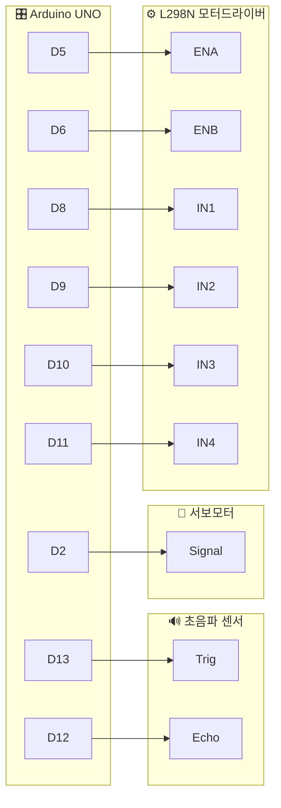
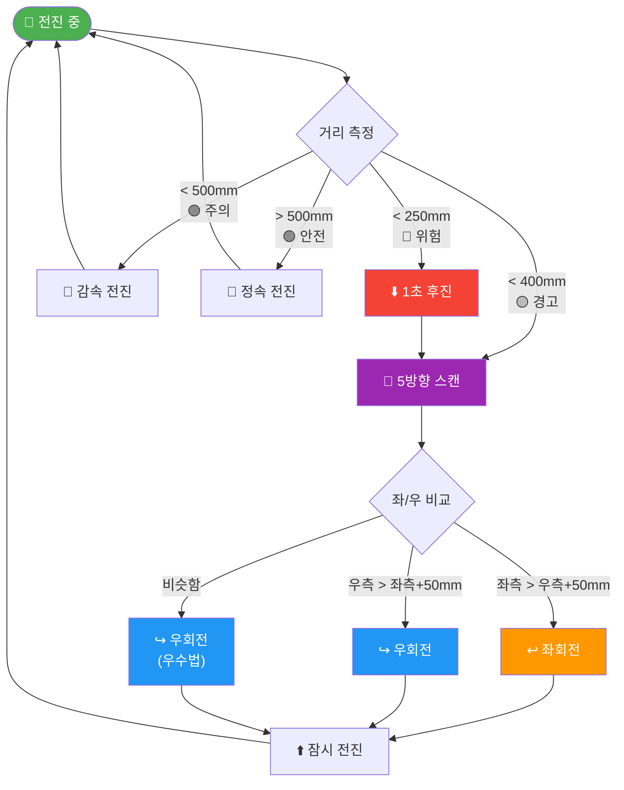
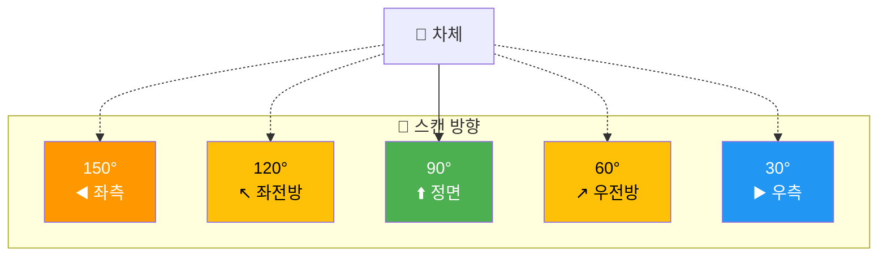
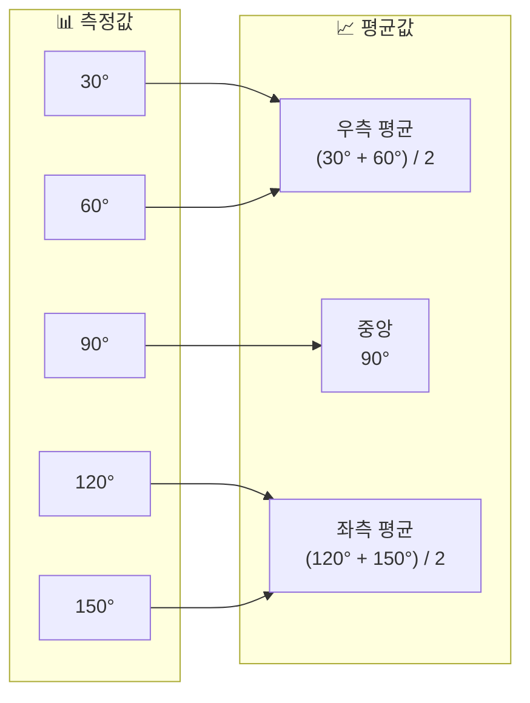
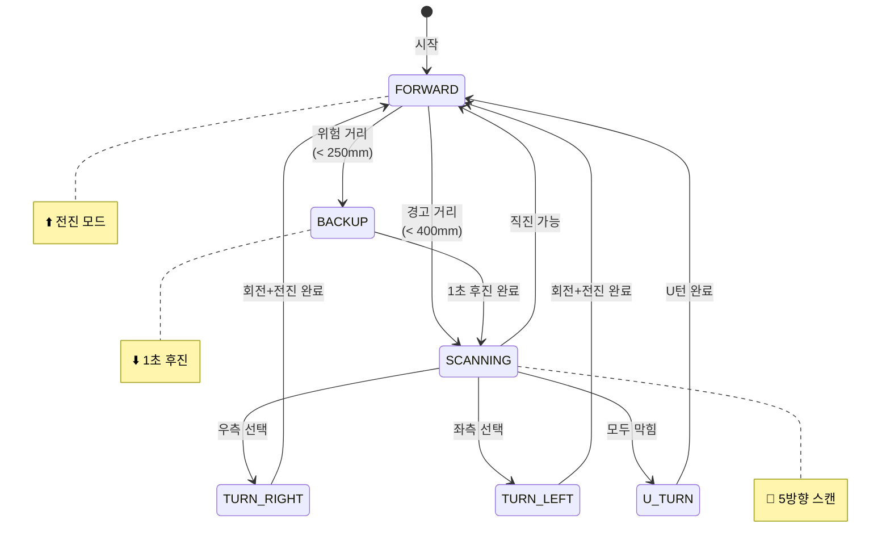
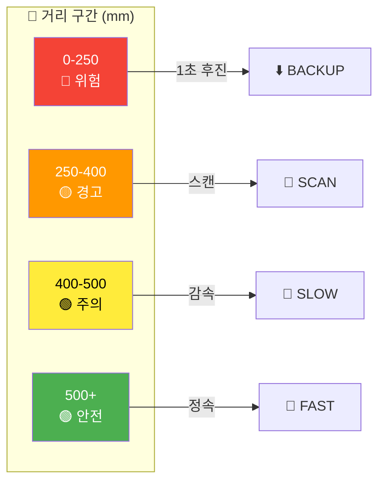
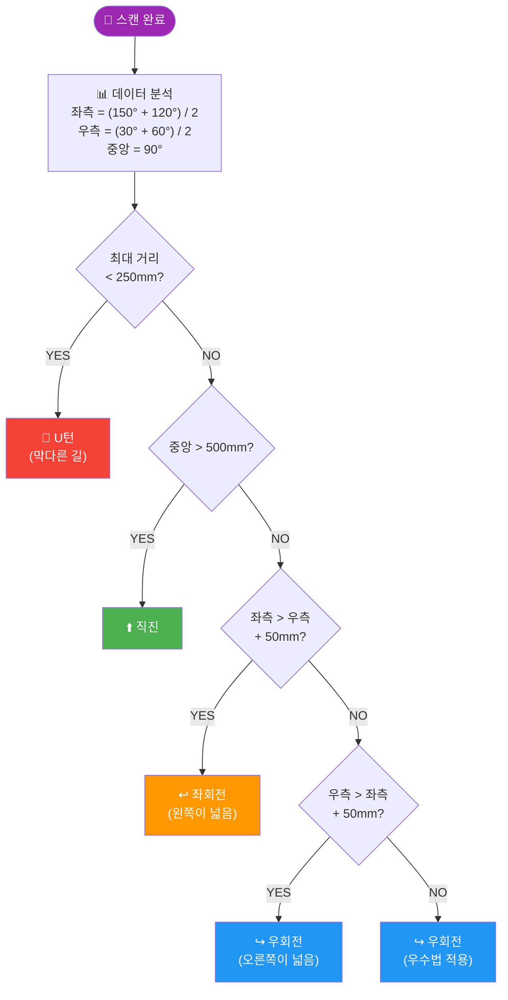
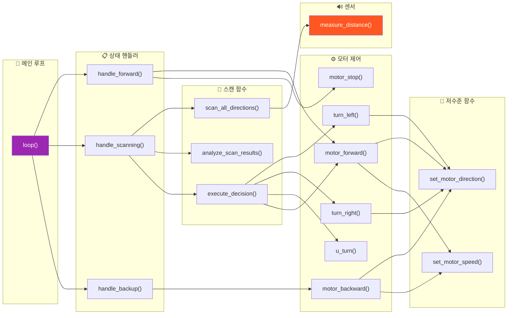
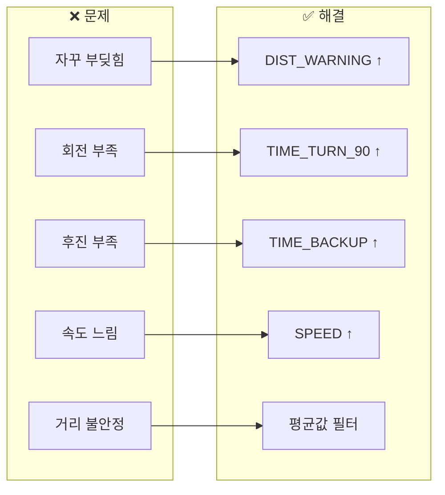
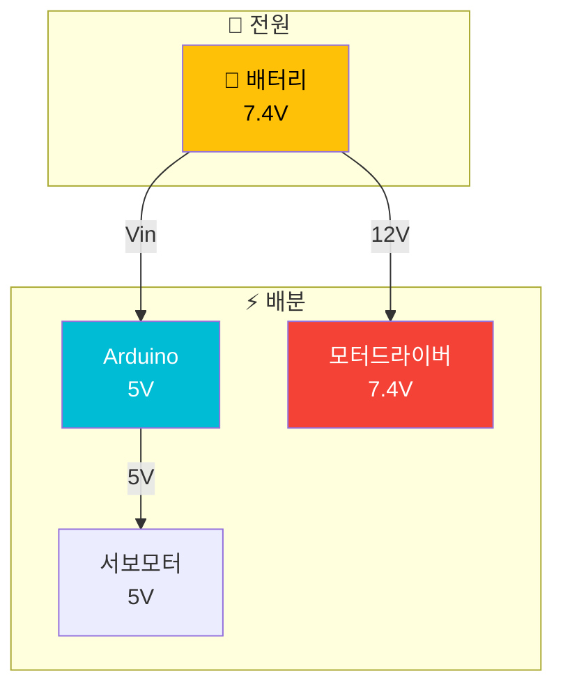

# 🚗 미로 탈출 스마트카 알고리즘

## 📋 개요

아두이노 기반 4휠 스마트카가 **초음파 센서**와 **서보모터**를 활용하여 미로를 자율적으로 탈출하는 알고리즘입니다.

---

## 🔧 하드웨어 구성

### 핀 연결표

| 부품 | 핀 번호 | 기능 | 비고 |
|:----:|:-------:|:----:|:----:|
| 🔊 초음파 Trig | D13 | 초음파 발사 | OUTPUT |
| 🔊 초음파 Echo | D12 | 초음파 수신 | INPUT |
| 🔄 서보모터 | D2 | 센서 방향 제어 | PWM |
| ⚡ 오른쪽 모터 EN | D5 | 속도 제어 | PWM |
| ⚡ 왼쪽 모터 EN | D6 | 속도 제어 | PWM |
| ➡️ 오른쪽 IN1 | D8 | 방향 제어 | HIGH/LOW |
| ➡️ 오른쪽 IN2 | D9 | 방향 제어 | HIGH/LOW |
| ⬅️ 왼쪽 IN3 | D10 | 방향 제어 | HIGH/LOW |
| ⬅️ 왼쪽 IN4 | D11 | 방향 제어 | HIGH/LOW |

### 회로 연결도



---

## 🧭 미로 탈출 알고리즘

### 1. 장애물 회피 흐름

> **핵심**: 가까우면 **1초 후진** → **스캔** → **넓은 쪽으로 크게 회전**



### 2. 우수법 (Right-Hand Rule)

> **원리**: 비슷하면 오른쪽 우선 (오른손을 벽에 대고 걷는 원리)

| 순위 | 조건 | 동작 | 이유 |
|:----:|:----:|:----:|:----:|
| 1️⃣ | 모두 막힘 | **U턴** | 막다른 길 탈출 |
| 2️⃣ | 중앙 열림 | **직진** | 효율적 이동 |
| 3️⃣ | 좌측 > 우측+50mm | **좌회전** | 넓은 쪽 선택 |
| 4️⃣ | 우측 > 좌측+50mm | **우회전** | 넓은 쪽 선택 |
| 5️⃣ | 비슷함 | **우회전** | 우수법 적용 |

---

### 3. 다중 각도 스캔

서보모터로 **5개 방향**을 스캔합니다.



### 스캔 데이터 분석



| 방향 | 계산 | 용도 |
|:----:|:-----|:-----|
| **좌측** | (150° + 120°) / 2 | 좌회전 결정 |
| **중앙** | 90° | 직진 결정 |
| **우측** | (30° + 60°) / 2 | 우회전 결정 |

---

## 📊 상태 머신 (State Machine)



### 상태 설명

| 상태 | 설명 | 진입 조건 | 탈출 조건 |
|:----:|:-----|:---------|:---------|
| **FORWARD** | 전진 중 | 경로 확보됨 | 장애물 감지 |
| **BACKUP** | 1초 후진 | 위험 거리 250mm 이내 | 1초 경과 |
| **SCANNING** | 5방향 스캔 | 경고 거리 400mm 이내 | 방향 결정 완료 |
| **TURN_RIGHT** | 우회전 중 | 우측이 넓음 | 600ms 회전 완료 |
| **TURN_LEFT** | 좌회전 중 | 좌측이 넓음 | 600ms 회전 완료 |
| **U_TURN** | U턴 중 | 막다른 길 | 1200ms 회전 완료 |

---

## 📏 거리 임계값 (업데이트됨)



### 거리별 동작 테이블 (최신)

| 구간 | 거리 | 상태 | 속도 | 동작 |
|:----:|:----:|:----:|:----:|:-----|
| 🔴 위험 | < 250mm | BACKUP | 130 (후진) | **1초간 후진** → 스캔 |
| 🟡 경고 | 250-400mm | SCANNING | 0 | 정지 → 5방향 스캔 |
| 🟢 주의 | 400-500mm | FORWARD | 110 | 감속 전진 |
| 🟢 안전 | > 500mm | FORWARD | 130 | 정속 전진 |

---

## 🔄 의사 결정 흐름도 (업데이트됨)



### 결정 우선순위 (최신)

| 우선순위 | 조건 | 결정 | 비고 |
|:--------:|:-----|:----:|:-----|
| 1 | 모든 방향 < 250mm | **U턴** | 막다른 길 탈출 |
| 2 | 중앙 > 500mm | **직진** | 충분히 열림 |
| 3 | 좌측 > 우측 + 50mm | **좌회전** | 왼쪽이 50mm+ 넓음 |
| 4 | 우측 > 좌측 + 50mm | **우회전** | 오른쪽이 50mm+ 넓음 |
| 5 | 비슷함 | **우회전** | 우수법 기본값 |

---

## ⚙️ 파라미터 설정 (최신)

### 거리 임계값

```c
const int DIST_DANGER  = 250;   // 위험 거리 (mm) - 후진
const int DIST_WARNING = 400;   // 경고 거리 (mm) - 스캔
const int DIST_SAFE    = 500;   // 안전 거리 (mm) - 정속
const int DIST_MAX     = 600;   // 최대 측정 (mm)
```

### 회전/후진 시간

```c
const int TIME_TURN_90  = 600;   // 90도 회전 (ms) - 크게!
const int TIME_TURN_180 = 1200;  // 180도 회전 (ms)
const int TIME_BACKUP   = 1000;  // 후진 시간 (ms) - 1초!
```

### 모터 속도

```c
const int SPEED = 30;                    // 속도 오프셋 (조정 가능)
const int SPEED_FAST   = 130 + SPEED;    // 빠른 속도 = 160
const int SPEED_NORMAL = 100 + SPEED;    // 보통 속도 = 130
const int SPEED_SLOW   = 80 + SPEED;     // 느린 속도 = 110
const int SPEED_TURN   = 150;            // 회전 속도
```

### 파라미터 비교표 (변경 전 → 변경 후)

| 파라미터 | 변경 전 | 변경 후 | 효과 |
|:---------|:-------:|:-------:|:-----|
| DIST_DANGER | 200mm | **250mm** | 더 멀리서 위험 감지 |
| DIST_WARNING | 300mm | **400mm** | 더 멀리서 스캔 시작 |
| DIST_SAFE | 400mm | **500mm** | 여유 있게 감속 |
| TIME_BACKUP | 400ms | **1000ms** | 1초간 충분히 후진 |
| TIME_TURN_90 | 500ms | **600ms** | 더 크게 회전 |
| SPEED_FAST | 150 | **160** | 속도 증가 |
| SPEED_NORMAL | 120 | **130** | 속도 증가 |

### 속도 조정 방법

```c
// SPEED 값만 변경하면 전체 속도 조정!
const int SPEED = 30;  // 0: 느림, 30: 보통, 50: 빠름
```

| SPEED 값 | FAST | NORMAL | SLOW | 용도 |
|:--------:|:----:|:------:|:----:|:-----|
| 0 | 130 | 100 | 80 | 좁은 미로 |
| 30 | 160 | 130 | 110 | 표준 (현재) |
| 50 | 180 | 150 | 130 | 넓은 공간 |

---

## 📝 함수 구조



### 함수 목록

| 계층 | 함수 | 설명 |
|:----:|:-----|:-----|
| **메인** | `loop()` | 메인 루프 |
| **핸들러** | `handle_forward()` | 전진 상태 처리 |
| | `handle_scanning()` | 스캔 상태 처리 |
| | `handle_backup()` | **1초 후진** 처리 |
| **스캔** | `scan_all_directions()` | 5방향 스캔 |
| | `analyze_scan_results()` | **좌/우 비교** (50mm 차이) |
| | `execute_decision()` | 결정 실행 + 잠시 전진 |
| **모터** | `motor_forward()` | 전진 |
| | `motor_backward()` | 후진 |
| | `motor_stop()` | 정지 |
| | `turn_left()` | 좌회전 (600ms) |
| | `turn_right()` | 우회전 (600ms) |
| | `u_turn()` | U턴 (1200ms) |
| **저수준** | `set_motor_direction()` | 방향 설정 |
| | `set_motor_speed()` | 속도 설정 |
| **센서** | `measure_distance()` | 거리 측정 |

---

## 🛠️ 트러블슈팅



### 문제 해결 가이드

| 증상 | 원인 | 해결 방법 | 조정 값 |
|:-----|:-----|:---------|:--------|
| 💥 자꾸 부딪힘 | 감지 거리 부족 | `DIST_WARNING` 증가 | 400 → 450mm |
| 🔄 회전 부족 | 회전 시간 짧음 | `TIME_TURN_90` 증가 | 600 → 700ms |
| ⬇️ 후진 부족 | 후진 시간 짧음 | `TIME_BACKUP` 증가 | 1000 → 1200ms |
| 🐢 속도 느림 | 모터 출력 낮음 | `SPEED` 증가 | 30 → 50 |
| 📊 거리 불안정 | 센서 노이즈 | 3회 측정 평균 | - |
| ↔️ 직진 안됨 | 모터 불균형 | 좌/우 개별 조정 | ±10 |

---

## 🔋 전원 구성



---

## 📊 시리얼 모니터 출력 예시

```
=== Maze Solving Smart Car Started! ===
Wall Following (Right-Hand Rule) Algorithm

[DIST] 350 mm
[!] Obstacle - STOP & SCAN
[>>] Multi-angle Scan Start
  Angle 30 deg: 450 mm
  Angle 60 deg: 380 mm
  Angle 90 deg: 250 mm
  Angle 120 deg: 520 mm
  Angle 150 deg: 600 mm
========== SCAN RESULT ==========
  LEFT:   560 mm
  CENTER: 250 mm
  RIGHT:  415 mm
=================================
>>> DECISION: TURN LEFT (More Space)
[<<<] TURN LEFT!
[^^^] GO FORWARD!
```

---

## 📚 참고 자료

| 자료 | 링크 |
|:-----|:-----|
| 우수법/좌수법 알고리즘 | [Wikipedia](https://en.wikipedia.org/wiki/Maze-solving_algorithm#Wall_follower) |
| HC-SR04 데이터시트 | [SparkFun](https://www.sparkfun.com/datasheets/Sensors/Proximity/HCSR04.pdf) |
| L298N 모터드라이버 | [LastMinuteEngineers](https://lastminuteengineers.com/l298n-dc-stepper-driver-arduino-tutorial/) |

---

## 📄 라이선스

| 항목 | 내용 |
|:-----|:-----|
| 원본 코드 | 에듀이노(Eduino) SmartCar 예제 |
| 개선 버전 | MIT License |

---

*최종 업데이트: 2024-12*
