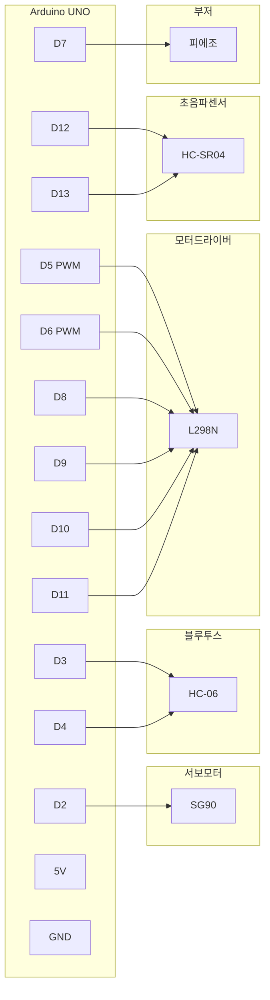
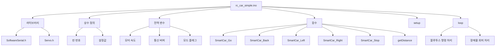
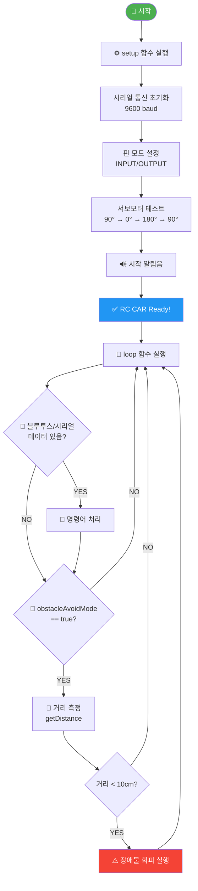
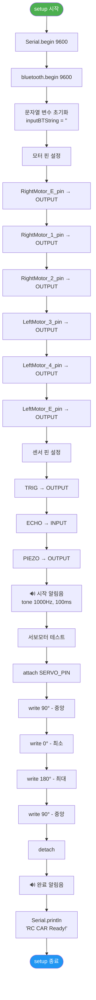
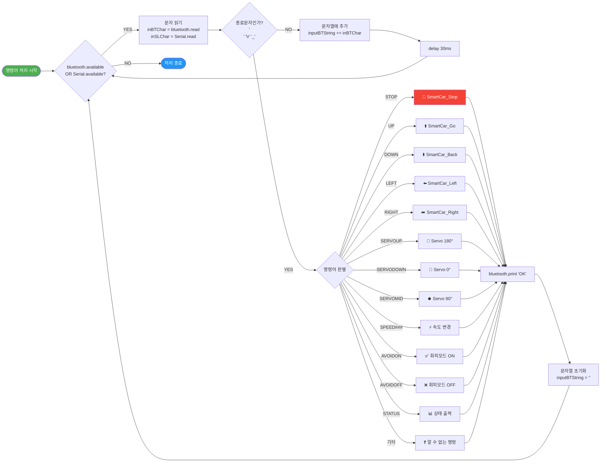
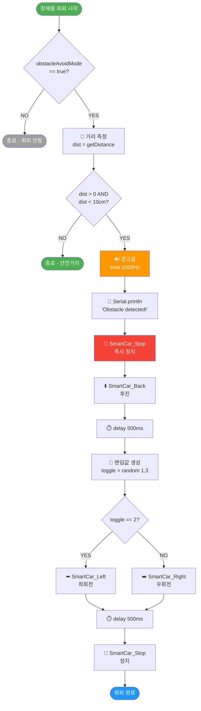
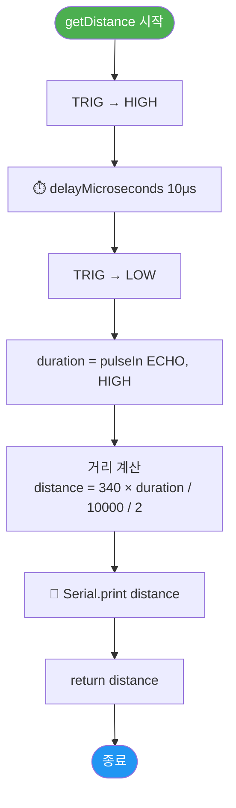
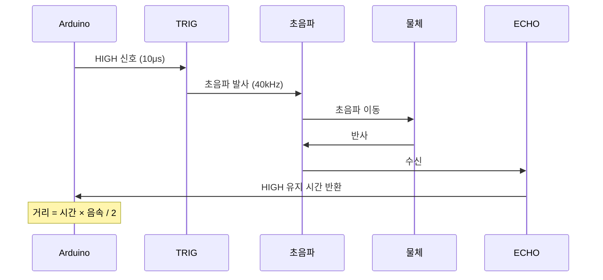
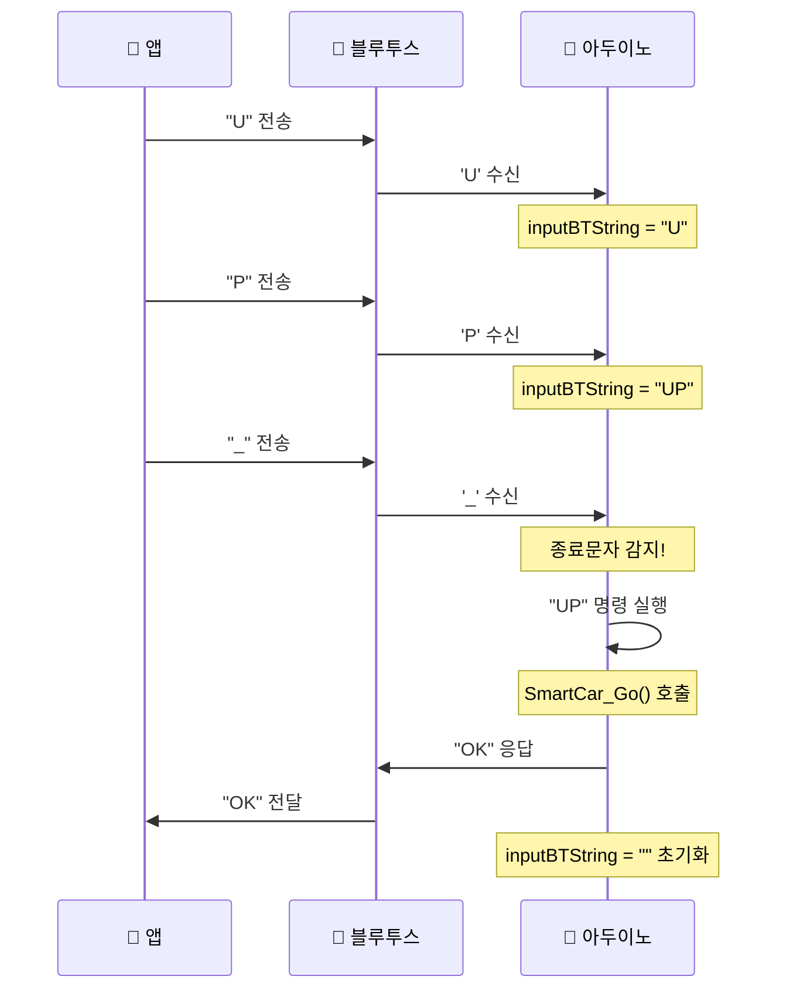

# RC CAR Simple - 소스코드 설명서

## 목차
1. [개요](#1-개요)
2. [하드웨어 구성](#2-하드웨어-구성)
3. [소프트웨어 구조](#3-소프트웨어-구조)
4. [순서도 (Flowchart)](#4-순서도-flowchart)
5. [알고리즘 설명](#5-알고리즘-설명)
6. [명령어 목록](#6-명령어-목록)
7. [함수 설명](#7-함수-설명)

---

## 1. 개요

이 프로젝트는 아두이노 기반의 RC카로, 다음 기능을 포함합니다:

| 기능 | 설명 |
|------|------|
| 🎮 **블루투스 원격 제어** | 스마트폰 앱으로 조종 |
| 💻 **시리얼 통신 제어** | PC에서 시리얼 모니터로 조종 |
| 🚧 **장애물 회피** | 초음파 센서로 장애물 감지 및 자동 회피 |
| 🔄 **서보모터 제어** | 카메라 또는 센서 방향 조절 |

---

## 2. 하드웨어 구성

### 2.1 핀 배치표

| 부품 | 핀 번호 | 기능 | 비고 |
|------|---------|------|------|
| **서보모터** | D2 | 신호선 | PWM |
| **블루투스** | D3 | RX (수신) | SoftwareSerial |
| **블루투스** | D4 | TX (송신) | SoftwareSerial |
| **모터드라이버** | D5 | 오른쪽 Enable | PWM 속도제어 |
| **모터드라이버** | D6 | 왼쪽 Enable | PWM 속도제어 |
| **피에조 부저** | D7 | 알림음 | - |
| **모터드라이버** | D8 | 오른쪽 IN1 | 방향제어 |
| **모터드라이버** | D9 | 오른쪽 IN2 | 방향제어 |
| **모터드라이버** | D10 | 왼쪽 IN3 | 방향제어 |
| **모터드라이버** | D11 | 왼쪽 IN4 | 방향제어 |
| **초음파센서** | D12 | ECHO | 입력 |
| **초음파센서** | D13 | TRIG | 출력 |

### 2.2 부품 목록

| 부품 | 수량 | 모델명 | 설명 |
|------|:----:|--------|------|
| 메인보드 | 1 | Arduino UNO | 메인 컨트롤러 |
| 모터드라이버 | 1 | L298N | DC 모터 제어 |
| DC 기어모터 | 2 | - | 좌/우 바퀴 구동 |
| 블루투스 모듈 | 1 | HC-06 | 무선 통신 |
| 초음파센서 | 1 | HC-SR04 | 거리 측정 |
| 서보모터 | 1 | SG90 | 방향 조절 |
| 피에조 부저 | 1 | - | 알림음 |

### 2.3 회로 연결도



---

## 3. 소프트웨어 구조

### 3.1 프로그램 구조도



### 3.2 변수 설명표

| 변수명 | 타입 | 초기값 | 설명 |
|--------|------|--------|------|
| `L_MotorSpeed` | int | 153 | 왼쪽 모터 속도 (0~255) |
| `R_MotorSpeed` | int | 153 | 오른쪽 모터 속도 (0~255) |
| `obstacleAvoidMode` | bool | true | 장애물 회피 모드 ON/OFF |
| `inBTChar` | char | - | 블루투스 수신 문자 (1글자) |
| `inputBTString` | String | "" | 블루투스 명령어 문자열 |
| `inSLChar` | char | - | 시리얼 수신 문자 (1글자) |
| `inputSLString` | String | "" | 시리얼 명령어 문자열 |
| `move_delay` | int | 40 | 모터 동작 지연 시간 (ms) |

---

## 4. 순서도 (Flowchart)

### 4.1 전체 프로그램 흐름



### 4.2 setup() 함수 상세 흐름



### 4.3 명령어 처리 흐름



### 4.4 장애물 회피 알고리즘



### 4.5 거리 측정 함수 (getDistance)



---

## 5. 알고리즘 설명

### 5.1 모터 제어 알고리즘

#### H-Bridge 방향 제어표

| 동작 | IN1 | IN2 | Enable | 결과 |
|:----:|:---:|:---:|:------:|------|
| ▶️ 정방향 | HIGH | LOW | PWM | 모터 정회전 |
| ◀️ 역방향 | LOW | HIGH | PWM | 모터 역회전 |
| ⏹️ 정지 | LOW | LOW | 0 | 모터 정지 |
| 🛑 브레이크 | HIGH | HIGH | - | 급정지 |

#### PWM 속도 제어표

| PWM 값 | 백분율 | 설명 |
|:------:|:------:|------|
| 0 | 0% | 정지 |
| 64 | 25% | 저속 |
| 127 | 50% | 중속 |
| **153** | **60%** | **기본값** |
| 191 | 75% | 고속 |
| 255 | 100% | 최대속도 |

#### 이동 방향별 모터 동작표

| 동작 | 오른쪽 모터 | | 왼쪽 모터 | |
|:----:|:-----------:|:-:|:---------:|:-:|
| | **방향** | **속도** | **방향** | **속도** |
| ⬆️ 전진 | 정방향 | PWM | 정방향 | PWM |
| ⬇️ 후진 | 역방향 | PWM | 역방향 | PWM |
| ⬅️ 좌회전 | 정방향 | PWM | 정지 | 0 |
| ➡️ 우회전 | 정지 | 0 | 정방향 | PWM |
| ⏹️ 정지 | 정지 | 0 | 정지 | 0 |

### 5.2 초음파 센서 알고리즘

#### 거리 측정 원리



#### 거리 계산 공식표

| 항목 | 값 | 설명 |
|------|-----|------|
| 음속 | 340 m/s | 상온 기준 |
| 음속 | 0.034 cm/μs | μs당 이동거리 |
| 공식 | `거리 = duration × 340 / 10000 / 2` | cm 단위 |
| /2 이유 | 왕복 거리 | 발사→반사→수신 |

### 5.3 블루투스 통신 알고리즘

#### 명령어 프로토콜

| 구성요소 | 형식 | 예시 |
|----------|------|------|
| 명령어 | 대문자 영문 | UP, DOWN, LEFT |
| 종료문자 | `_` 또는 `\n` | - |
| 전체형식 | `[명령어]_` | `UP_`, `SPEED200_` |

#### 문자열 파싱 과정



### 5.4 장애물 회피 알고리즘

#### 회피 전략표

| 단계 | 동작 | 시간 | 목적 |
|:----:|------|:----:|------|
| 1️⃣ | 🛑 즉시 정지 | - | 충돌 방지 |
| 2️⃣ | ⬇️ 후진 | 500ms | 안전거리 확보 |
| 3️⃣ | 🎲 랜덤 방향 선택 | - | 탈출 경로 다양화 |
| 4️⃣ | ↩️ 회전 | 500ms | 방향 전환 |
| 5️⃣ | 🛑 정지 | - | 재판단 대기 |

#### 랜덤 회전 확률표

| random(1,3) 결과 | 확률 | 동작 |
|:----------------:|:----:|------|
| 1 | 50% | ➡️ 우회전 |
| 2 | 50% | ⬅️ 좌회전 |

---

## 6. 명령어 목록

### 6.1 이동 명령어

| 명령어 | 동작 | 함수 | 응답 |
|:------:|------|------|:----:|
| `UP_` | ⬆️ 전진 | SmartCar_Go() | OK |
| `DOWN_` | ⬇️ 후진 | SmartCar_Back() | OK |
| `LEFT_` | ⬅️ 좌회전 | SmartCar_Left() | OK |
| `RIGHT_` | ➡️ 우회전 | SmartCar_Right() | OK |
| `STOP_` | 🛑 정지 | SmartCar_Stop() | OK |

### 6.2 서보모터 명령어

| 명령어 | 동작 | 각도 | 응답 |
|:------:|------|:----:|:----:|
| `SERVOUP_` | 🔼 위로 | 180° | OK |
| `SERVOMID_` | ⏺️ 중앙 | 90° | OK |
| `SERVODOWN_` | 🔽 아래로 | 0° | OK |

### 6.3 설정 명령어

| 명령어 | 동작 | 범위/값 | 응답 |
|:------:|------|---------|:----:|
| `SPEED###_` | ⚡ 속도 설정 | 0~255 | OK |
| `AVOIDON_` | ✅ 회피모드 ON | - | OK |
| `AVOIDOFF_` | ❌ 회피모드 OFF | - | OK |
| `STATUS_` | 📊 상태 확인 | - | AVOID:ON/OFF |

### 6.4 알림음 목록

| 상황 | 주파수 | 지속시간 | 패턴 |
|------|:------:|:--------:|------|
| 🚀 시작 | 1000Hz | 100ms | 단음 |
| 🛑 정지 | 1000Hz | 200ms | 단음 |
| ⚠️ 장애물 감지 | 1000Hz | 100ms | 단음 |
| ✅ 회피모드 ON | 1500Hz | 100ms | 2회 반복 |
| ❌ 회피모드 OFF | 500Hz | 200ms | 단음 (낮은음) |
| ❓ 알 수 없는 명령 | 500Hz | 100ms | 단음 (낮은음) |

---

## 7. 함수 설명

### 7.1 함수 목록 요약표

| 함수명 | 반환타입 | 매개변수 | 설명 |
|--------|:--------:|:--------:|------|
| `setup()` | void | - | 초기화 (1회 실행) |
| `loop()` | void | - | 메인 루프 (무한반복) |
| `SmartCar_Go()` | void | - | 전진 |
| `SmartCar_Back()` | void | - | 후진 |
| `SmartCar_Left()` | void | - | 좌회전 |
| `SmartCar_Right()` | void | - | 우회전 |
| `SmartCar_Stop()` | void | - | 정지 |
| `getDistance()` | long | - | 거리 측정 (cm) |

### 7.2 모터 제어 함수 상세

#### SmartCar_Go() - 전진

```cpp
void SmartCar_Go() {
  Serial.println("Forward");
  
  // 오른쪽 모터: 정방향
  digitalWrite(RightMotor_1_pin, HIGH);
  digitalWrite(RightMotor_2_pin, LOW);
  
  // 왼쪽 모터: 정방향
  digitalWrite(LeftMotor_3_pin, HIGH);
  digitalWrite(LeftMotor_4_pin, LOW);
  
  // PWM 속도 설정
  analogWrite(RightMotor_E_pin, R_MotorSpeed);
  analogWrite(LeftMotor_E_pin, L_MotorSpeed);
  
  delay(move_delay);
}
```

#### 모터 함수 핀 출력 비교표

| 함수 | IN1 | IN2 | IN3 | IN4 | ENA | ENB |
|------|:---:|:---:|:---:|:---:|:---:|:---:|
| SmartCar_Go | H | L | H | L | PWM | PWM |
| SmartCar_Back | L | H | L | H | PWM | PWM |
| SmartCar_Left | H | L | L | L | PWM | 0 |
| SmartCar_Right | L | L | H | L | 0 | PWM |
| SmartCar_Stop | L | L | L | L | 0 | 0 |

> **H** = HIGH, **L** = LOW, **PWM** = 속도값 (153)

### 7.3 getDistance() - 거리 측정

```cpp
long getDistance() {
  long duration, distance;
  
  // 1. 초음파 발사
  digitalWrite(TRIG, HIGH);
  delayMicroseconds(10);
  digitalWrite(TRIG, LOW);
  
  // 2. 에코 시간 측정
  duration = pulseIn(ECHO, HIGH);
  
  // 3. 거리 계산 (cm)
  distance = ((float)(340 * duration) / 10000) / 2;
  
  // 4. 시리얼 출력
  Serial.print("distance: ");
  Serial.print(distance);
  Serial.println(" cm");
  
  return distance;
}
```

---

## 8. 부록

### 8.1 트러블슈팅 가이드

| 증상 | 원인 | 해결방법 |
|------|------|----------|
| 모터가 안 돌아감 | 전원 부족 | 외부 전원 연결 확인 |
| 블루투스 연결 안됨 | TX/RX 반대 | 3번↔4번 핀 교체 |
| 거리 측정 이상 | 센서 방향 | TRIG/ECHO 핀 확인 |
| 한쪽으로 치우침 | 속도 불균형 | L/R_MotorSpeed 조정 |
| 명령 인식 안됨 | 종료문자 누락 | 명령어 끝에 `_` 추가 |

### 8.2 확장 가능 기능

| 기능 | 필요 부품 | 난이도 |
|------|----------|:------:|
| 라인트레이서 | IR 센서 2개 | ⭐⭐ |
| 속도 표시 | LCD 1602 | ⭐⭐ |
| 조명 제어 | LED 모듈 | ⭐ |
| 경적 | 능동 부저 | ⭐ |
| 카메라 | ESP32-CAM | ⭐⭐⭐ |

---

## 문서 정보

| 항목 | 내용 |
|------|------|
| **버전** | 1.1 |
| **작성일** | 2025년 12월 |
| **대상 파일** | `rc_car_simple.ino` |
| **호환 보드** | Arduino UNO, Nano |
| **IDE 버전** | Arduino IDE 1.8.x / 2.x |
