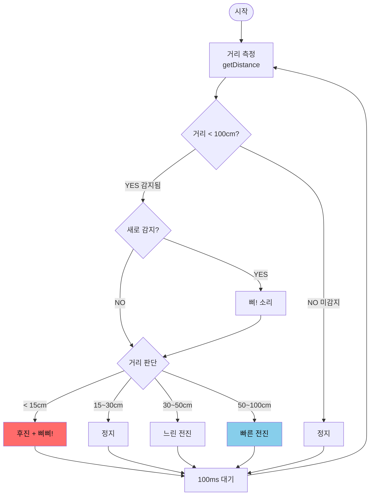

# 앞차 따라가기 스마트카 (Car Following Smart Car)

## 📋 개요

원본 예제(`2_Ultrasonic_sensor.ino`, `6_Motor_driver.ino`)와 **완전히 동일한 방식**으로 작성된 따라가기 자동차입니다.

### 핵심 특징
- ✅ **원본과 동일한 코드**: 초음파 센서, 모터 제어 방식 동일
- ✅ **직진 우선**: 전방만 스캔하여 빠른 반응
- ✅ **피에조 부저**: 감지 시 소리 알림
- ✅ **단순한 로직**: 이해하기 쉬운 구조

---

## 🔧 핀 연결 (원본과 동일!)

| 부품 | 핀 | 원본 예제 |
|------|-----|----------|
| 초음파 Trig | D13 | 2_Ultrasonic_sensor |
| 초음파 Echo | D12 | 2_Ultrasonic_sensor |
| 서보모터 | D2 | - |
| **피에조 부저** | **D3** | 새로 추가 |
| 오른쪽 모터 EN | D5 | 6_Motor_driver |
| 왼쪽 모터 EN | D6 | 6_Motor_driver |
| 오른쪽 모터 IN1 | D8 | 6_Motor_driver |
| 오른쪽 모터 IN2 | D9 | 6_Motor_driver |
| 왼쪽 모터 IN3 | D10 | 6_Motor_driver |
| 왼쪽 모터 IN4 | D11 | 6_Motor_driver |

---

## 🎯 동작 원리

### 거리에 따른 동작

```
거리 (cm)     동작
─────────────────────────────
< 15cm       후진 + 삐삐!
15~30cm      정지 (목표 거리)
30~50cm      느린 전진
50~100cm     빠른 전진
> 100cm      정지 (감지 안됨)
```

### 순서도



---

## 📊 시리얼 모니터 출력

```
=== Car Following Start ===
[OK] Ultrasonic sensor
[OK] Servo motor at 90 deg
[OK] Buzzer
[OK] Motor driver

Ready! Place object in front.

Distance: 999 cm => NO TARGET
Distance: 999 cm => NO TARGET
Distance: 65 cm [NEW!] => FAST GO
Distance: 58 cm => FAST GO
Distance: 42 cm => SLOW GO
Distance: 35 cm => SLOW GO
Distance: 28 cm => STOP
Distance: 25 cm => STOP
Distance: 12 cm => BACK        ← 후진!
Distance: 18 cm => STOP
Distance: 999 cm => NO TARGET
```

---

## 🔊 피에조 부저 알림

| 상황 | 주파수 | 길이 |
|------|--------|------|
| 물체 감지 | 1000Hz | 100ms |
| 너무 가까움 | 2000Hz | 50ms |
| 물체 놓침 | 500Hz | 200ms |

---

## 🔧 문제 해결

### 초음파 센서가 안 될 때

1. **시리얼 모니터** 열기 (9600 baud)
2. 거리값 확인:
   - 항상 `999 cm` → 센서 연결 문제
   - 값이 변함 → 센서 정상

3. **핀 확인**:
   ```
   Trig → D13
   Echo → D12
   VCC → 5V
   GND → GND
   ```

### 모터가 안 돌아갈 때

1. **전원 확인**:
   - 모터 드라이버에 외부 전원(배터리) 연결
   - GND 공유 확인

2. **핀 확인**:
   ```
   EN1 → D5 (PWM)
   IN1 → D8
   IN2 → D9
   EN2 → D6 (PWM)
   IN3 → D10
   IN4 → D11
   ```

3. **테스트**: `6_Motor_driver.ino` 업로드해서 모터만 테스트

### 서보모터가 안 돌아갈 때

1. **전원 확인**: 서보 전용 5V 전원 필요할 수 있음
2. **핀 확인**: D2 연결
3. **테스트**: `1_Servo_motor.ino` 업로드해서 서보만 테스트

---

## ⚙️ 파라미터 조정

```c
// 거리 임계값 (cm)
int DIST_TOO_CLOSE = 15;     // 후진 시작 거리
int DIST_TARGET    = 30;     // 목표 유지 거리
int DIST_FAR       = 50;     // 빠른 전진 시작 거리
int DIST_MAX       = 100;    // 감지 최대 거리

// 모터 속도 (0-255)
int L_MotorSpeed = 153;      // 왼쪽 모터
int R_MotorSpeed = 153;      // 오른쪽 모터
```

---

## 📐 코드 구조

```
setup()
├── 시리얼 초기화
├── 초음파 센서 핀 설정
├── 서보모터 초기화 (90도)
├── 피에조 부저 핀 설정
├── 모터 핀 설정
└── 시작 알림 (삐! 삐!)

loop()
├── getDistance() - 거리 측정
├── 시리얼 출력
└── 거리에 따른 동작
    ├── < 15cm: SmartCar_Back()
    ├── 15~30cm: SmartCar_Stop()
    ├── 30~50cm: SmartCar_Go() (느리게)
    ├── 50~100cm: SmartCar_Go() (빠르게)
    └── > 100cm: SmartCar_Stop()
```

---

## 🚀 확장하기

이 코드가 동작하면:

1. **서보 스캔 추가**: 좌/우 스캔하여 방향 추적
2. **PID 제어**: 부드러운 속도 제어
3. **블루투스**: 원격 제어 기능

---

## 📄 원본 예제

- `2_Ultrasonic_sensor.ino` - 초음파 거리 측정
- `6_Motor_driver.ino` - 모터 제어
- `1_Servo_motor.ino` - 서보 모터 제어

위 예제들이 각각 동작하는지 먼저 확인하세요!
