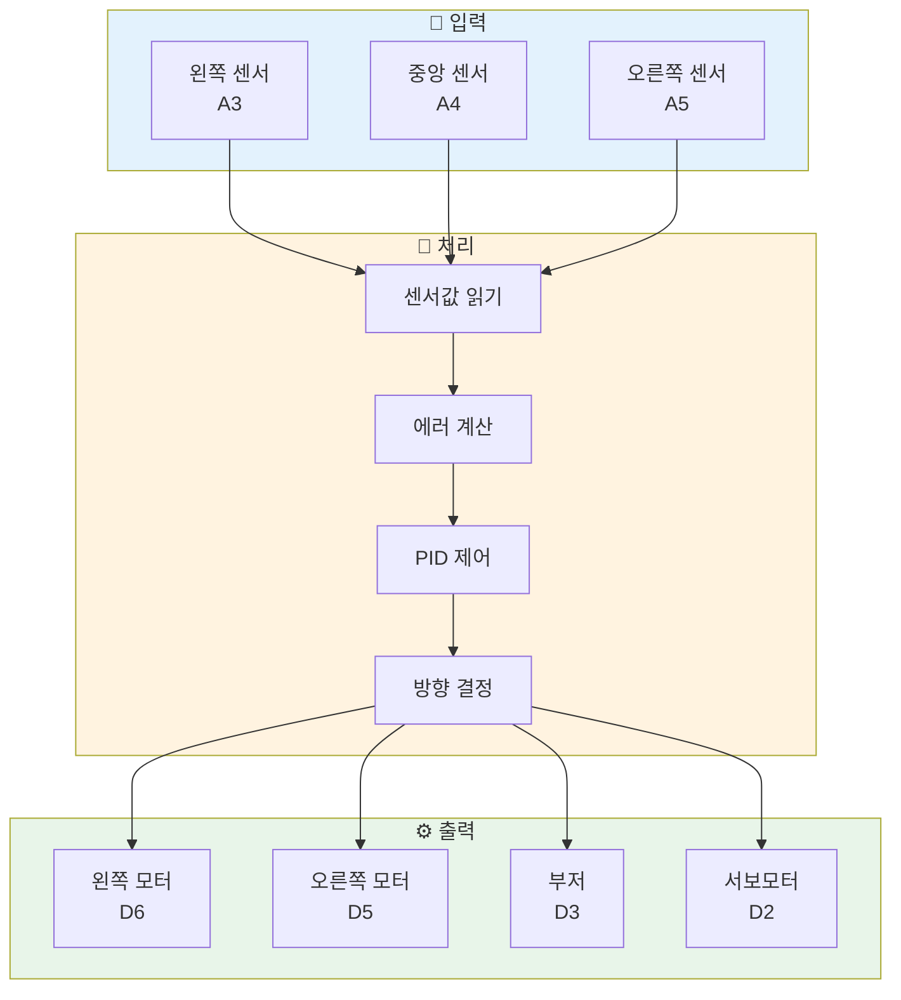
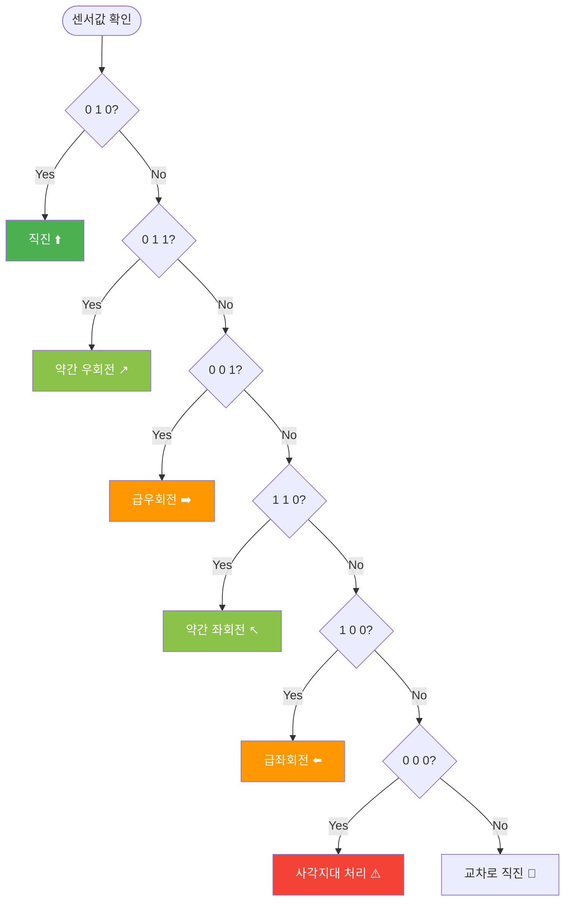
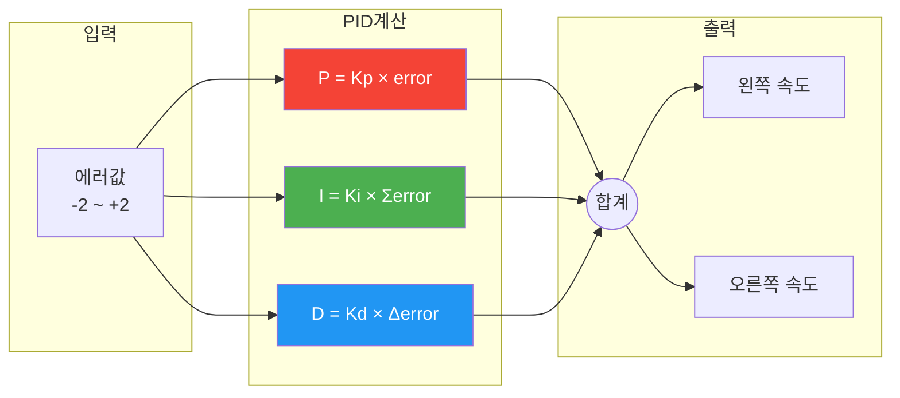
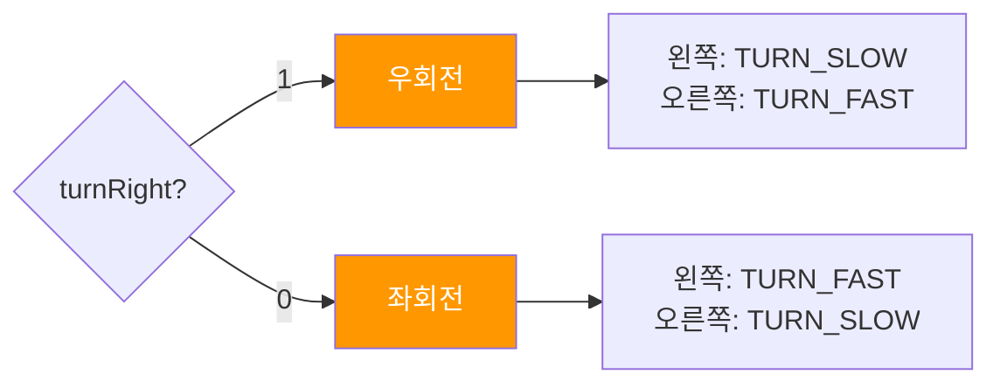
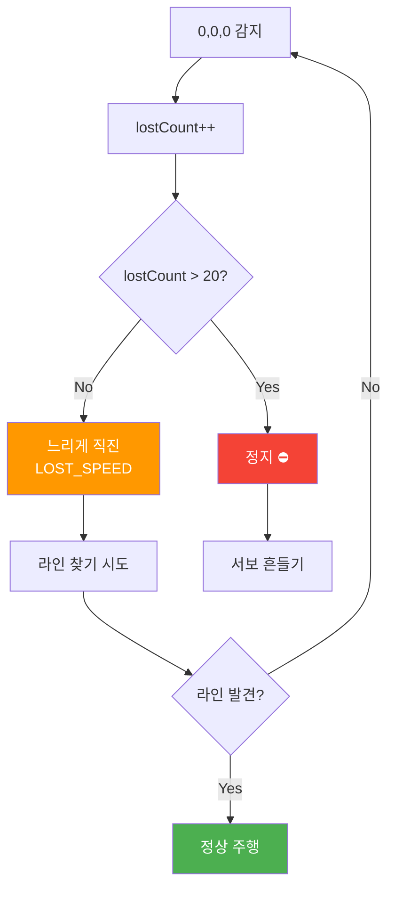
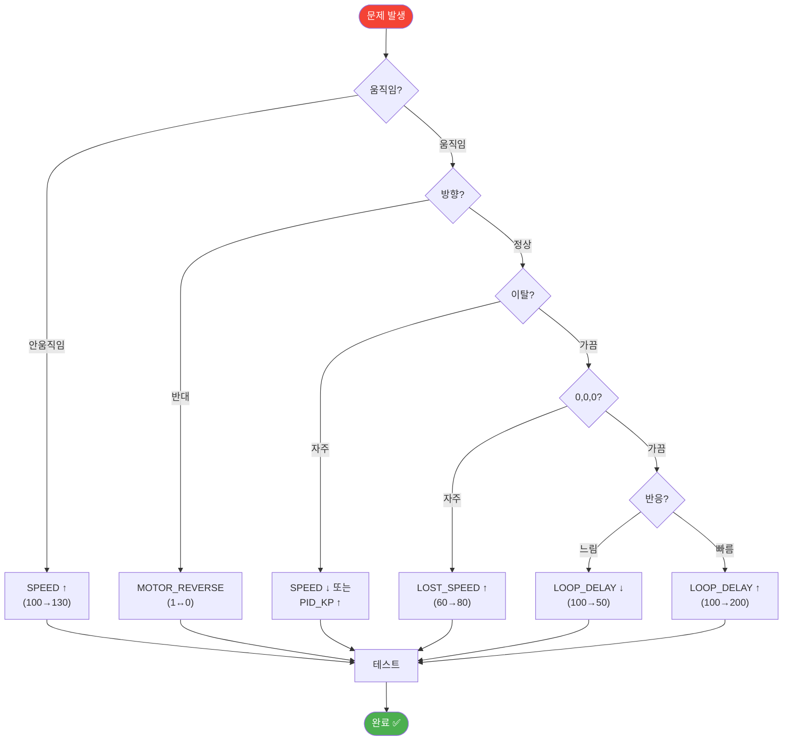

# 🚗 라인 트레이서 (Line Tracer)

검정색 라인을 따라 자율 주행하는 스마트카 프로젝트입니다.

---

## 📋 목차

1. [시스템 구성](#1-시스템-구성)
2. [주요 기능별 설명](#2-주요-기능별-설명)
   - [센서 읽기](#21-센서-읽기)
   - [라인 추적](#22-라인-추적)
   - [PID 제어](#23-pid-제어)
   - [급회전](#24-급회전)
   - [사각지대 처리](#25-사각지대-처리-000)
   - [서보모터 탐색](#26-서보모터-탐색)
   - [부저 알림](#27-부저-알림)
3. [변수 그룹별 설명](#3-변수-그룹별-설명)
4. [상황별 변수 조절 가이드](#4-상황별-변수-조절-가이드)
5. [문제 해결](#5-문제-해결)

---

## 1. 시스템 구성

### 전체 시스템 흐름



### 핀 연결표

| 구분 | 핀 | 용도 | 변수명 |
|:----:|:--:|------|--------|
| 🔴 모터 | D5 | 오른쪽 PWM | `PIN_MOTOR_RIGHT_EN` |
| 🔴 모터 | D6 | 왼쪽 PWM | `PIN_MOTOR_LEFT_EN` |
| 🔴 모터 | D8 | 오른쪽 IN1 | `PIN_MOTOR_RIGHT_1` |
| 🔴 모터 | D9 | 오른쪽 IN2 | `PIN_MOTOR_RIGHT_2` |
| 🔴 모터 | D10 | 왼쪽 IN1 | `PIN_MOTOR_LEFT_1` |
| 🔴 모터 | D11 | 왼쪽 IN2 | `PIN_MOTOR_LEFT_2` |
| 🟢 센서 | A3 | 왼쪽 센서 | `PIN_SENSOR_LEFT` |
| 🟢 센서 | A4 | 중앙 센서 | `PIN_SENSOR_CENTER` |
| 🟢 센서 | A5 | 오른쪽 센서 | `PIN_SENSOR_RIGHT` |
| 🔵 부저 | D3 | 피에조 | `PIN_BUZZER` |
| 🟡 서보 | D2 | 서보모터 | `PIN_SERVO` |

---

## 2. 주요 기능별 설명

### 2.1 센서 읽기

#### 기능 설명
3개의 적외선 센서로 바닥의 검은 라인을 감지합니다.

#### 순서도


#### 관련 변수

| 변수 | 값 | 설명 |
|------|:--:|------|
| `sensorLeft` | 0/1 | 왼쪽 센서값 |
| `sensorCenter` | 0/1 | 중앙 센서값 |
| `sensorRight` | 0/1 | 오른쪽 센서값 |

#### 시리얼 출력 예시
```
LEFT:0 CENTER:1 RIGHT:0
```

---

### 2.2 라인 추적

#### 기능 설명
센서 조합에 따라 차량의 방향을 결정합니다.

#### 순서도



#### 센서 조합표

| LEFT | CENTER | RIGHT | 의미 | 동작 | 에러값 |
|:----:|:------:|:-----:|------|------|:------:|
| 0 | 1 | 0 | 정중앙 ✅ | 직진 | 0 |
| 0 | 1 | 1 | 약간 왼쪽 | PID 우회전 | +1 |
| 0 | 0 | 1 | 많이 왼쪽 | 급우회전 | +2 |
| 1 | 1 | 0 | 약간 오른쪽 | PID 좌회전 | -1 |
| 1 | 0 | 0 | 많이 오른쪽 | 급좌회전 | -2 |
| 1 | 1 | 1 | 교차로 | 직진 | 0 |
| 0 | 0 | 0 | 사각지대 ⚠️ | 느린 직진 | - |

---

### 2.3 PID 제어

#### 기능 설명
부드러운 곡선 주행을 위한 비례-적분-미분 제어입니다.

#### 순서도



#### PID 공식

```
correction = (Kp × error) + (Ki × integral) + (Kd × derivative)

if MOTOR_REVERSE == 1:
    왼쪽 속도 = SPEED + correction
    오른쪽 속도 = SPEED - correction
else:
    왼쪽 속도 = SPEED - correction
    오른쪽 속도 = SPEED + correction
```

#### 관련 변수

| 변수 | 기본값 | 역할 | 조절 효과 |
|------|:------:|------|----------|
| `PID_KP` | 35.0 | 비례 게인 | ↑ 회전 크게 |
| `PID_KI` | 0.0 | 적분 게인 | ↑ 누적 보정 |
| `PID_KD` | 20.0 | 미분 게인 | ↑ 안정적 |

---

### 2.4 급회전

#### 기능 설명
센서가 0 0 1 또는 1 0 0 일 때 빠르게 회전합니다.

#### 순서도



#### 관련 변수

| 변수 | 기본값 | 설명 |
|------|:------:|------|
| `SPEED_TURN_FAST` | 150 | 바깥 바퀴 속도 |
| `SPEED_TURN_SLOW` | 0 | 안쪽 바퀴 속도 |

---

### 2.5 사각지대 처리 (0,0,0)

#### 기능 설명
센서가 모두 라인을 감지하지 못할 때 느리게 직진하며 라인을 찾습니다.

#### 순서도



#### 관련 변수

| 변수 | 기본값 | 설명 | 조절 효과 |
|------|:------:|------|----------|
| `LOST_SPEED` | 60 | 사각지대 직진 속도 | ↑ 빠르게 찾기 |
| `LOST_COUNT_MAX` | 20 | 허용 횟수 | ↑ 오래 직진 |

---

### 2.6 서보모터 탐색

#### 기능 설명
완전히 라인을 잃었을 때 서보모터로 주변을 탐색합니다.

#### 순서도


#### 관련 변수

| 변수 | 기본값 | 설명 |
|------|:------:|------|
| `SERVO_CENTER` | 90 | 중앙 각도 |
| `SERVO_LEFT` | 135 | 왼쪽 각도 |
| `SERVO_RIGHT` | 45 | 오른쪽 각도 |
| `SERVO_DELAY` | 500 | 이동 딜레이 (ms) |

---

### 2.7 부저 알림

#### 기능 설명
회전 방향과 경고를 소리로 알립니다.

#### 알림 종류

| 함수 | 주파수 | 상황 | 소리 |
|------|:------:|------|:----:|
| `buzzerLeft()` | 500Hz | 좌회전 | 🔈 낮은음 |
| `buzzerRight()` | 1000Hz | 우회전 | 🔊 높은음 |
| `buzzerWarning()` | 2000Hz | 라인 이탈 | ⚠️ 경고음 |
| `playStartSound()` | 도미솔 | 시작 | 🎵 멜로디 |

---

## 3. 변수 그룹별 설명

### 🚀 그룹 A: 기본 주행

| 변수 | 기본값 | 범위 | 설명 |
|------|:------:|:----:|------|
| `SPEED` | 100 | 50~150 | 기본 주행 속도 |
| `SPEED_MAX` | 180 | - | 최대 속도 제한 |
| `SPEED_MIN` | 30 | - | 최소 속도 제한 |

### 🔄 그룹 B: 회전 제어

| 변수 | 기본값 | 범위 | 설명 |
|------|:------:|:----:|------|
| `MOTOR_REVERSE` | 1 | 0/1 | 회전 방향 반전 |
| `PID_KP` | 35.0 | 20~60 | 회전 크기 |
| `PID_KD` | 20.0 | 10~40 | 회전 안정성 |
| `SPEED_TURN_FAST` | 150 | - | 급회전 바깥 바퀴 |
| `SPEED_TURN_SLOW` | 0 | - | 급회전 안쪽 바퀴 |

### ⏱️ 그룹 C: 타이밍

| 변수 | 기본값 | 범위 | 설명 |
|------|:------:|:----:|------|
| `LOOP_DELAY` | 100 | 50~500 | 센서 체크 주기 (ms) |
| `SERVO_DELAY` | 500 | 300~1000 | 서보 이동 속도 (ms) |

### ⚠️ 그룹 D: 사각지대

| 변수 | 기본값 | 범위 | 설명 |
|------|:------:|:----:|------|
| `LOST_SPEED` | 60 | 40~100 | 0,0,0 직진 속도 |
| `LOST_COUNT_MAX` | 20 | 10~50 | 이탈 허용 횟수 |

### 🔧 그룹 E: 디버그

| 변수 | 기본값 | 범위 | 설명 |
|------|:------:|:----:|------|
| `DEBUG_MODE` | 1 | 0/1 | 시리얼 출력 ON/OFF |

---

## 4. 상황별 변수 조절 가이드

### 📊 상황-변수 매트릭스

| 상황 | 그룹 | 변수 | 조절 방향 |
|------|:----:|------|:--------:|
| **차가 안 움직임** | A | `SPEED` | ⬆️ 높이기 |
| **라인 자주 이탈** | A | `SPEED` | ⬇️ 낮추기 |
| | B | `PID_KP` | ⬆️ 높이기 |
| **회전 방향 반대** | B | `MOTOR_REVERSE` | 🔄 0↔1 |
| **회전이 너무 작음** | B | `PID_KP` | ⬆️ 높이기 |
| | B | `SPEED_TURN_FAST` | ⬆️ 높이기 |
| **회전이 흔들림** | B | `PID_KD` | ⬆️ 높이기 |
| | B | `PID_KP` | ⬇️ 낮추기 |
| **반응이 느림** | C | `LOOP_DELAY` | ⬇️ 낮추기 |
| **반응이 너무 빠름** | C | `LOOP_DELAY` | ⬆️ 높이기 |
| **0,0,0 자주 발생** | D | `LOST_SPEED` | ⬆️ 높이기 |
| | D | `LOST_COUNT_MAX` | ⬆️ 높이기 |
| **서보 동작 안함** | C | `SERVO_DELAY` | ⬆️ 높이기 |
| **배터리 부족** | A | `SPEED` | ⬆️ 높이기 |

### 🎯 빠른 해결 순서도



---

## 5. 문제 해결

### 자주 묻는 질문

| 문제 | 원인 | 해결 |
|------|------|------|
| 차가 전혀 안 움직임 | 배터리 부족 / 속도 낮음 | `SPEED` 120~150으로 |
| 회전 방향이 반대 | 모터 배선 또는 설정 | `MOTOR_REVERSE` 변경 |
| 라인을 자주 벗어남 | 속도 높음 / 반응 느림 | `SPEED` ↓, `LOOP_DELAY` ↓ |
| 0,0,0이 너무 자주 | 센서 높이 / 속도 | `LOST_SPEED` ↑ |
| 회전이 흔들거림 | PID 불안정 | `PID_KD` ↑, `PID_KP` ↓ |
| 서보가 안 움직임 | 딜레이 짧음 | `SERVO_DELAY` 500 이상 |

### 배터리 상태별 권장 설정

| 배터리 | SPEED | SPEED_TURN_FAST |
|--------|:-----:|:---------------:|
| 완충 | 80~100 | 120~150 |
| 보통 | 100~120 | 150~180 |
| 부족 | 120~150 | 180~200 |

---

## 📝 참고 정보

- **라이브러리**: `Servo.h` (아두이노 기본 제공)
- **시리얼 통신**: 9600 bps
- **권장 라인 폭**: 15~25mm
- **센서 높이**: 바닥에서 5~10mm
- **권장 바닥**: 매끄러운 흰색 표면

---

> 📅 버전: 3.2  
> 🏢 에듀이노 (Eduino)
