# 🧠 AI 리터러시 기반 메이커 교육 가이드

> **핵심 철학**: 문제 정의 → AI 활용 → 분석 → 재질문 → 디버깅  
> **교육 방식**: PRIMM + 메이커 교육 + AI 리터러시  
> **목표**: 실행자와 기획자 역량 동시 배양

---

## 📋 목차

1. [교육 철학 및 핵심 역량](#1-교육-철학-및-핵심-역량)
2. [PRIMM과 메이커 교육: 역방향 학습의 힘](#2-primm과-메이커-교육-역방향-학습의-힘)
3. [미네르바 스쿨과 다학제적 문제 해결](#3-미네르바-스쿨과-다학제적-문제-해결)
4. [가상-현실 연계 학습](#4-가상-현실-연계-학습)
5. [PRIMM + AI 리터러시 통합 모델](#5-primm--ai-리터러시-통합-모델)
6. [실행자 vs 기획자 역량](#6-실행자-vs-기획자-역량)
7. [문제 정의의 중요성](#7-문제-정의의-중요성)
8. [AI 활용 프로세스](#8-ai-활용-프로세스)
9. [디버깅 능력의 중요성](#9-디버깅-능력의-중요성)
10. [실전 문제 해결 워크플로우](#10-실전-문제-해결-워크플로우)
11. [평가 및 체크리스트](#11-평가-및-체크리스트)

---

## 1. 교육 철학 및 핵심 역량

### 🎯 교육 패러다임의 변화

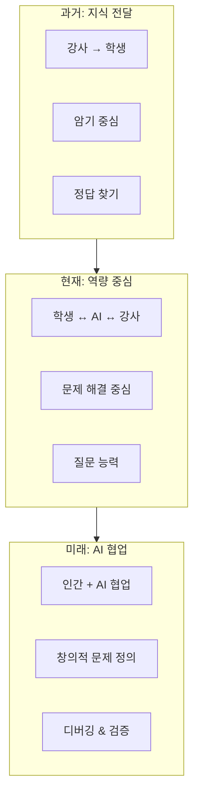

### 📊 핵심 역량 비교

| 구분 | 과거 교육 | AI 시대 교육 |
|------|-----------|--------------|
| **핵심 능력** | 암기, 계산 | 질문, 검증, 창의성 |
| **문제 접근** | 정해진 답 찾기 | 문제 정의부터 시작 |
| **도구 활용** | 계산기, 사전 | AI, 검색, 시뮬레이션 |
| **평가 기준** | 정답률 | 문제 해결 과정 |
| **협업 대상** | 사람 ↔ 사람 | 사람 ↔ AI ↔ 사람 |
| **오류 대응** | 오류 = 실패 | 오류 = 학습 기회 |

### 🔑 AI 시대 필수 역량 3가지

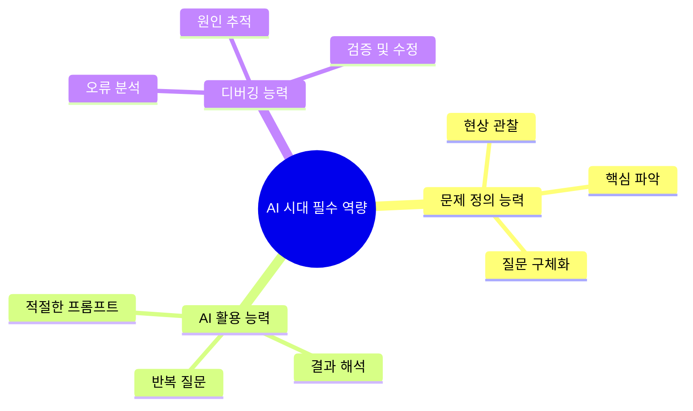

---

## 2. PRIMM과 메이커 교육: 역방향 학습의 힘 🔄

> **"완성품을 먼저 보여주고, 왜 그렇게 만들었는지 탐구하게 하라"**  
> **"목표부터 시작해서 역으로 배우면, 동기와 이해가 함께 온다"**

### 🎯 역방향 학습(Backward Learning)이란?

전통적인 교육은 **기초 → 응용 → 완성**의 순서로 진행됩니다.  
하지만 **역방향 학습**은 **완성품(목표) → 분석 → 이해 → 발전**의 순서로 진행됩니다.

```mermaid
flowchart TB
    subgraph 전통교육[❌ 전통적 교육 (순방향)]
        T1[1. 이론 학습] --> T2[2. 기초 실습]
        T2 --> T3[3. 응용 실습]
        T3 --> T4[4. 완성품 제작]
        T4 --> T5[5. 결과 확인]
    end
    
    subgraph 역방향[✅ 역방향 학습 (PRIMM/메이커)]
        R1[1. 완성품 먼저 보기] --> R2[2. 실행해보기]
        R2 --> R3[3. 왜 이렇게 동작하지?]
        R3 --> R4[4. 분석 및 탐구]
        R4 --> R5[5. 수정 및 발전]
    end
    
    전통교육 -.->|"동기 유발 어려움<br>목표 불명확"| 문제1[😞 중도 포기]
    역방향 -.->|"목표 명확<br>동기 유발"| 성공1[😊 성공적 학습]
```

### 📊 순방향 vs 역방향 학습 비교

| 구분 | 순방향 학습 | 역방향 학습 |
|------|------------|------------|
| **시작점** | 이론, 기초 개념 | 완성품, 목표 |
| **동기** | "언젠가 이게 필요할 거야" | "이걸 만들고 싶어!" |
| **질문** | "이게 뭐지?" | "왜 이렇게 동작하지?" |
| **학습 순서** | 기초 → 응용 → 완성 | 완성 → 분석 → 이해 |
| **실패 대응** | 포기 가능성 높음 | 오류 = 학습 기회 |
| **AI 활용** | 어려움 (맥락 부족) | 용이함 (구체적 질문 가능) |

### 🔄 PRIMM 방법론 상세

**PRIMM**은 영국 컴퓨팅 교육에서 개발된 방법론으로,  
**완성된 코드를 먼저 보여주고 역으로 학습**하는 접근법입니다.

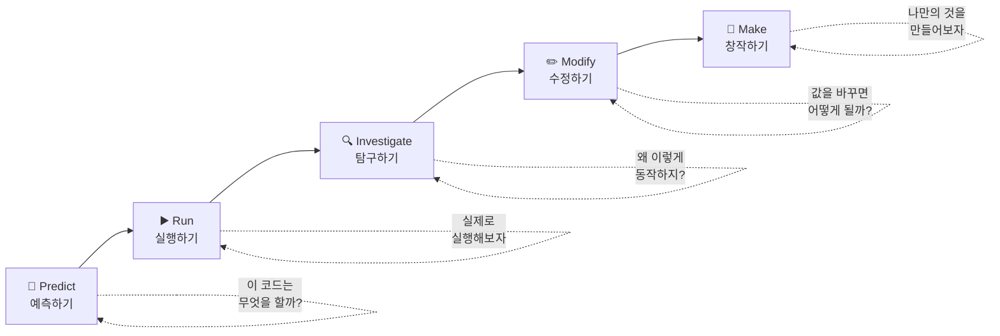

### 📋 PRIMM 단계별 상세 설명

```
┌─────────────────────────────────────────────────────────────┐
│                    PRIMM 5단계 상세                          │
├─────────────────────────────────────────────────────────────┤
│                                                             │
│  🔮 1단계: Predict (예측하기)                                │
│  ─────────────────────────────────────────────────────────  │
│  • 코드를 실행하기 전에 결과를 예측                         │
│  • "이 코드는 무엇을 할 것 같아?"                           │
│  • 사전 지식 활성화 및 관심 유발                            │
│  • 예측이 틀려도 OK → 학습의 시작점                         │
│                                                             │
│  ▶️ 2단계: Run (실행하기)                                    │
│  ─────────────────────────────────────────────────────────  │
│  • 코드를 실제로 실행                                       │
│  • 예측과 결과 비교                                         │
│  • "예상과 같았어? 달랐어?"                                 │
│  • 인지적 불일치 → 호기심 유발                              │
│                                                             │
│  🔍 3단계: Investigate (탐구하기)                            │
│  ─────────────────────────────────────────────────────────  │
│  • 코드를 자세히 분석                                       │
│  • "왜 이렇게 동작할까?"                                    │
│  • "이 부분은 무슨 역할이지?"                               │
│  • AI에게 질문하기 좋은 단계! 🤖                            │
│                                                             │
│  ✏️ 4단계: Modify (수정하기)                                 │
│  ─────────────────────────────────────────────────────────  │
│  • 코드의 일부를 수정                                       │
│  • "이 값을 바꾸면 어떻게 될까?"                            │
│  • 가설 → 실험 → 검증의 과학적 방법                        │
│  • 실패해도 원본으로 복구 가능 → 안전한 실험               │
│                                                             │
│  🎨 5단계: Make (창작하기)                                   │
│  ─────────────────────────────────────────────────────────  │
│  • 배운 것을 바탕으로 새로운 것 만들기                      │
│  • "내가 원하는 기능을 추가해보자"                          │
│  • 창의성 발휘 단계                                         │
│  • 개인화된 학습 결과물                                     │
│                                                             │
└─────────────────────────────────────────────────────────────┘
```

### 📊 PRIMM의 장단점

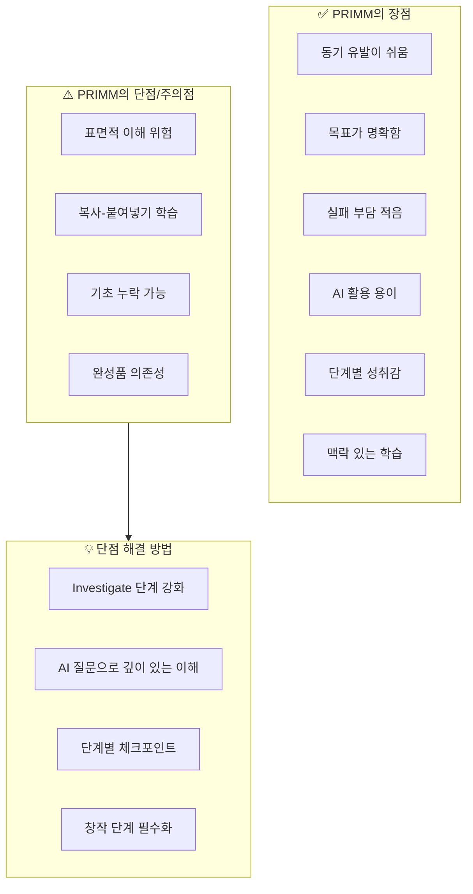

### 📋 PRIMM 장단점 상세표

| 구분 | 장점 | 단점 | 해결 방법 |
|------|------|------|----------|
| **동기** | 완성품을 보며 동기 유발 | - | - |
| **목표** | 명확한 학습 목표 | 목표에만 집중 | 다양한 변형 시도 |
| **실패** | 실패 부담 적음 | 도전 정신 부족 | Make 단계 강조 |
| **이해** | 맥락 있는 학습 | 표면적 이해 | AI 질문으로 깊이 |
| **AI 활용** | 구체적 질문 가능 | AI 의존성 | 검증 습관화 |
| **창의성** | 수정 통한 발견 | 복사 유혹 | 창작 단계 필수 |

### 🔧 메이커 교육(Maker Education)의 특징

**메이커 교육**은 **"만들면서 배운다(Learning by Making)"**를 핵심으로 합니다.

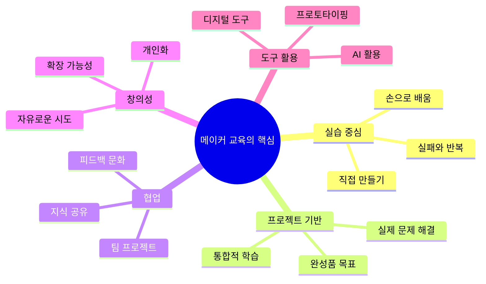

### 📊 메이커 교육의 장단점

```
┌─────────────────────────────────────────────────────────────┐
│                   메이커 교육 장단점                         │
├─────────────────────────────────────────────────────────────┤
│                                                             │
│  ✅ 장점                                                     │
│  ─────────────────────────────────────────────────────────  │
│  1. 높은 동기 부여: 눈에 보이는 결과물                      │
│  2. 실전 경험: 이론 + 실습의 통합                           │
│  3. 문제 해결력: 실제 문제를 직접 해결                      │
│  4. 창의성 발휘: 자유로운 시도와 실험                       │
│  5. 협업 능력: 팀 프로젝트 경험                             │
│  6. 실패 학습: 안전한 환경에서의 실패 경험                  │
│  7. 통합적 사고: 다양한 지식의 융합                         │
│  8. 자기 효능감: "나도 만들 수 있다!"                       │
│                                                             │
│  ⚠️ 단점 및 주의점                                          │
│  ─────────────────────────────────────────────────────────  │
│  1. 시간 소요: 강의보다 많은 시간 필요                      │
│  2. 자원 필요: 재료, 도구, 공간 비용                        │
│  3. 평가 어려움: 과정 평가의 복잡성                         │
│  4. 개인차: 학습자 수준 차이 관리                           │
│  5. 표면적 학습: "만들기만" 하고 이해 부족                  │
│  6. 강사 역량: 촉진자로서의 역할 전환 필요                  │
│                                                             │
│  💡 단점 해결을 위한 AI 활용                                 │
│  ─────────────────────────────────────────────────────────  │
│  • 시간 단축: AI가 빠른 피드백 제공                         │
│  • 개인차 해소: AI가 개인별 맞춤 설명                       │
│  • 깊은 이해: AI 질문으로 원리 탐구                         │
│  • 평가 보조: AI가 학습 과정 기록 도움                      │
│                                                             │
└─────────────────────────────────────────────────────────────┘
```

### 🤖 AI가 역방향 학습을 성공시키는 이유

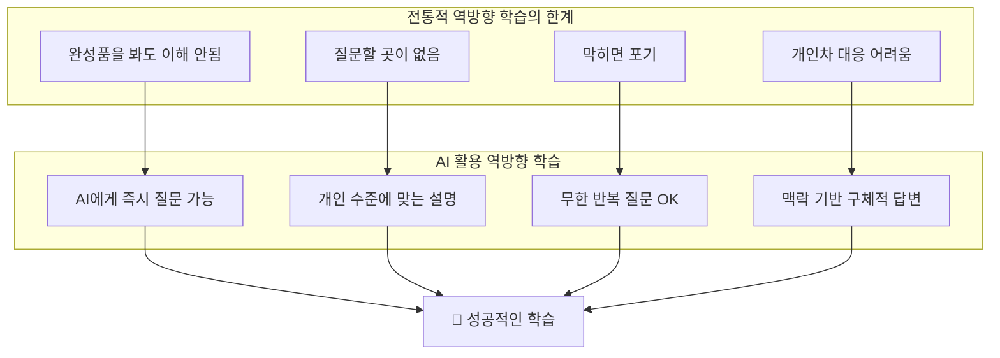

### 📋 AI 활용 역방향 학습의 핵심 전략

```
┌─────────────────────────────────────────────────────────────┐
│          AI가 역방향 학습을 성공시키는 5가지 이유            │
├─────────────────────────────────────────────────────────────┤
│                                                             │
│  1️⃣ 즉각적인 답변 (Immediate Feedback)                      │
│  ─────────────────────────────────────────────────────────  │
│  • 궁금한 순간 바로 질문 가능                               │
│  • 학습 흐름이 끊기지 않음                                  │
│  • "왜?"라는 질문에 즉시 답변                               │
│                                                             │
│  2️⃣ 맥락 기반 설명 (Context-Aware Explanation)              │
│  ─────────────────────────────────────────────────────────  │
│  • 현재 보고 있는 코드에 대한 설명                          │
│  • 추상적 개념이 아닌 구체적 사례 기반                      │
│  • "이 코드에서 이 부분은 왜 이렇게 작성했나요?"            │
│                                                             │
│  3️⃣ 개인 맞춤 수준 (Personalized Level)                     │
│  ─────────────────────────────────────────────────────────  │
│  • 이해 못하면 더 쉽게 설명 요청 가능                       │
│  • 알고 있으면 더 깊은 내용 질문 가능                       │
│  • 개인의 속도에 맞춘 학습                                  │
│                                                             │
│  4️⃣ 무한 인내심 (Unlimited Patience)                        │
│  ─────────────────────────────────────────────────────────  │
│  • 같은 질문 100번 해도 OK                                  │
│  • 부끄러움 없이 기초 질문 가능                             │
│  • 반복 학습의 장벽 제거                                    │
│                                                             │
│  5️⃣ 다각도 설명 (Multi-Perspective Explanation)             │
│  ─────────────────────────────────────────────────────────  │
│  • "다른 방식으로 설명해줘"                                 │
│  • 비유, 그림, 코드 등 다양한 표현                          │
│  • 자신에게 맞는 이해 방식 발견                             │
│                                                             │
└─────────────────────────────────────────────────────────────┘
```

### 📊 PRIMM + AI 통합 학습 사이클

```mermaid
flowchart TD
    P[🔮 Predict<br>예측하기] --> |"이 코드는 뭘 할까?"| R[▶️ Run<br>실행하기]
    R --> |"예상과 다르네?"| I[🔍 Investigate<br>탐구하기]
    
    I --> AI1[🤖 AI에게 질문<br>"왜 이렇게 동작하지?"]
    AI1 --> AI2[📝 AI 답변 분석]
    AI2 --> AI3{이해됨?}
    
    AI3 -->|No| AI4[🔄 재질문<br>"더 쉽게 설명해줘"]
    AI4 --> AI1
    
    AI3 -->|Yes| M1[✏️ Modify<br>수정하기]
    M1 --> |"이 값을 바꾸면?"| AI5[🤖 AI에게 예측 질문]
    AI5 --> M1T[테스트]
    M1T --> AI6{AI 예측과 일치?}
    
    AI6 -->|No| AI7[🔍 AI 답변 검증<br>"틀린 것 같은데?"]
    AI7 --> AI1
    
    AI6 -->|Yes| M2[🎨 Make<br>창작하기]
    M2 --> AI8[🤖 AI와 협업 설계]
    AI8 --> DONE[✅ 학습 완료]
```

### 🎯 스마트카 프로젝트에 적용

```
┌─────────────────────────────────────────────────────────────┐
│        스마트카 프로젝트 - PRIMM + AI 적용 예시              │
├─────────────────────────────────────────────────────────────┤
│                                                             │
│  📌 프로젝트: 장애물 피하기                                  │
│                                                             │
│  🔮 Predict (예측)                                           │
│  ─────────────────────────────────────────────────────────  │
│  학생: "이 코드를 실행하면 어떻게 될까?"                    │
│  → 완성된 장애물 피하기 코드를 먼저 제공                    │
│  → 실행 전에 동작을 예측하게 함                             │
│                                                             │
│  ▶️ Run (실행)                                               │
│  ─────────────────────────────────────────────────────────  │
│  학생: "와, 진짜 장애물을 피하네!"                          │
│  → 예측과 결과 비교                                         │
│  → "왜 그런 거지?"라는 호기심 유발                          │
│                                                             │
│  🔍 Investigate (탐구) + 🤖 AI 활용                          │
│  ─────────────────────────────────────────────────────────  │
│  학생 → AI: "이 코드에서 if(distance < 20) 부분이           │
│              왜 20인가요? 다른 값으로 하면 안 되나요?"       │
│                                                             │
│  AI 답변: "20cm는 센서의 신뢰도와 차량 속도를 고려한       │
│           안전 거리입니다. 더 짧으면 반응 시간 부족,        │
│           더 길면 불필요한 정지가 발생할 수 있습니다."      │
│                                                             │
│  학생: "아하! 그래서 20이구나!"                             │
│                                                             │
│  ✏️ Modify (수정) + 🤖 AI 검증                               │
│  ─────────────────────────────────────────────────────────  │
│  학생: "그럼 30으로 바꾸면 어떻게 될까?"                    │
│  → AI에게 예측 질문 후 실제 테스트                          │
│  → AI 예측과 실제 결과 비교                                 │
│  → 일치/불일치 분석을 통한 깊은 이해                        │
│                                                             │
│  🎨 Make (창작)                                              │
│  ─────────────────────────────────────────────────────────  │
│  학생: "장애물을 피할 때 부저 소리도 나게 하고 싶어!"       │
│  → AI와 협업하여 새로운 기능 추가                           │
│  → 자신만의 스마트카 완성                                   │
│                                                             │
└─────────────────────────────────────────────────────────────┘
```

### 📊 역방향 학습 성공의 핵심 조건

| 조건 | 전통 방식 | AI 활용 방식 |
|------|----------|--------------|
| **질문 가능** | 강사 1명 vs 학생 다수 | AI가 1:1 대응 |
| **즉각 피드백** | 대기 시간 발생 | 즉시 답변 |
| **반복 질문** | 눈치 보임 | 무제한 가능 |
| **수준 맞춤** | 평균에 맞춤 | 개인에 맞춤 |
| **실패 대응** | 포기 가능 | AI가 대안 제시 |
| **깊이 탐구** | 시간 제한 | 원하는 만큼 |

### 💡 교육적 성공을 위한 핵심 메시지

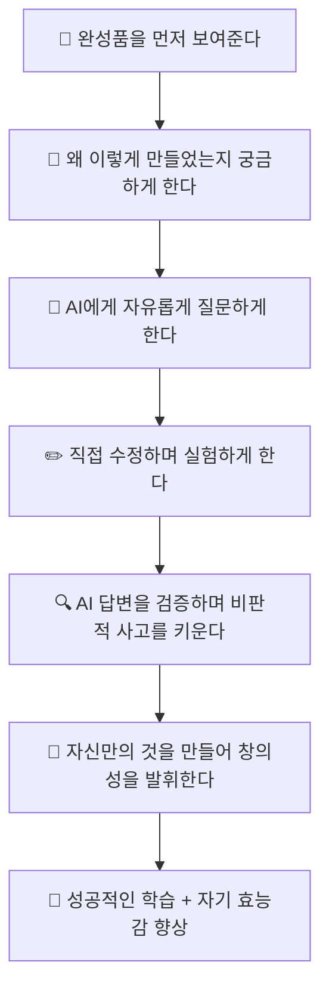

```
┌─────────────────────────────────────────────────────────────┐
│                 🌟 핵심 교육 메시지                          │
├─────────────────────────────────────────────────────────────┤
│                                                             │
│  "코드를 처음부터 작성하는 것이 아니라,                     │
│   완성된 코드를 먼저 보고, 분석하고, 수정하면서 배웁니다.  │
│                                                             │
│   이 과정에서 AI는 24시간 대기하는 개인 튜터입니다.         │
│   부끄러움 없이 질문하고, 틀려도 다시 물어보세요.           │
│                                                             │
│   AI 답변이 항상 맞는 것은 아닙니다.                        │
│   직접 테스트하고 검증하는 것이 진짜 실력입니다.            │
│                                                             │
│   최종 목표는 AI 없이도 문제를 해결할 수 있는 능력,         │
│   그리고 AI와 함께 더 큰 문제를 해결할 수 있는 역량입니다." │
│                                                             │
└─────────────────────────────────────────────────────────────┘
```

---

## 3. 미네르바 스쿨과 다학제적 문제 해결 🌍

> **"문제를 정의하는 방식이 해결책을 결정한다"** - 미네르바 스쿨 교육 철학

### 🎓 미네르바 스쿨이란?

**미네르바 스쿨(Minerva Schools)**은 2014년 설립된 혁신적인 대학으로, 
**캠퍼스 없이 7개국을 돌아다니며** 실제 문제를 해결하는 프로젝트 기반 교육을 진행합니다.

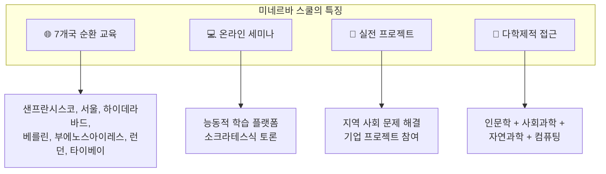

### 🧠 미네르바의 "Habits of Mind & Foundational Concepts"

미네르바 스쿨은 단순한 지식 전달이 아닌, **사고의 습관(Habits of Mind)**과 
**기초 개념(Foundational Concepts)**을 통해 문제를 바라보는 **다양한 렌즈**를 제공합니다.

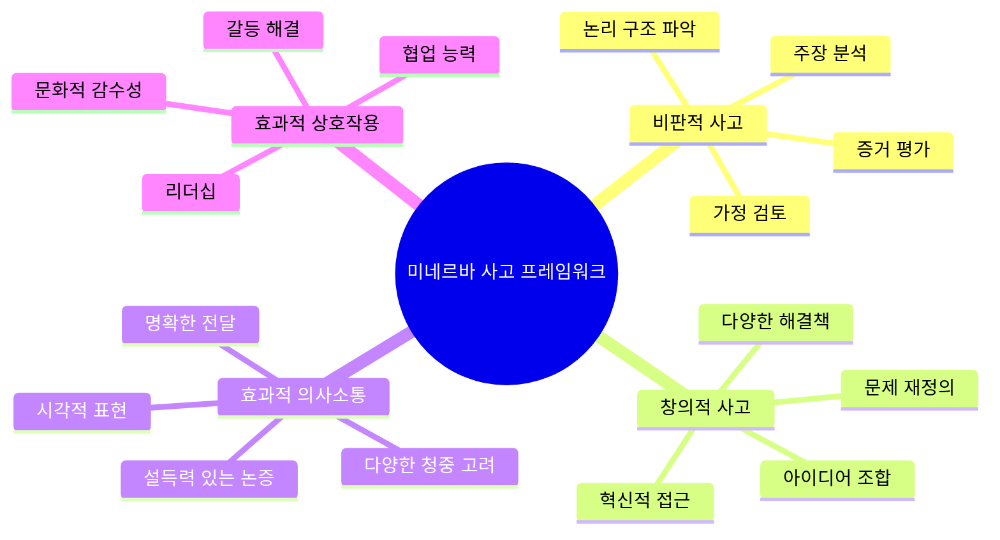

### 📊 다학제적 관점으로 자율주행 문제 바라보기

**같은 문제도 어떤 렌즈로 보느냐에 따라 완전히 다른 해결책이 나옵니다.**

| 관점 | 질문 | 자율주행차 예시 |
|------|------|----------------|
| **공학적 관점** | "어떻게 작동하는가?" | 센서, 알고리즘, 모터 제어 |
| **인문학적 관점** | "이것이 인간에게 어떤 의미인가?" | 운전의 자유 vs 편리함, 인간성 |
| **사회학적 관점** | "사회에 어떤 영향을 미치는가?" | 일자리 변화, 교통 문화, 불평등 |
| **윤리적 관점** | "무엇이 옳은가?" | 트롤리 딜레마, 책임 소재 |
| **경제적 관점** | "비용과 효익은?" | 산업 구조 변화, 보험, 투자 |
| **법적 관점** | "누가 책임지는가?" | 사고 시 책임, 규제, 인증 |

### 🚗 자율주행 "트롤리 딜레마" - 다학제적 분석

```
┌─────────────────────────────────────────────────────────────┐
│          🚗 자율주행차의 윤리적 딜레마 (트롤리 문제)         │
├─────────────────────────────────────────────────────────────┤
│                                                             │
│  [상황]                                                     │
│  자율주행차가 갑자기 나타난 보행자를 피하려면               │
│  다른 차선의 차량과 충돌해야 하는 상황                      │
│                                                             │
│  ┌─────────────────────────────────────────────────────┐   │
│  │     🚗 ──────→  👤 보행자                           │   │
│  │      │                                              │   │
│  │      ↓                                              │   │
│  │     🚙 다른 차량                                    │   │
│  └─────────────────────────────────────────────────────┘   │
│                                                             │
├─────────────────────────────────────────────────────────────┤
│                                                             │
│  [다학제적 분석]                                            │
│                                                             │
│  🔧 공학적 관점:                                            │
│  "더 빠른 센서와 더 정확한 예측 알고리즘으로 해결"         │
│  → 기술적 한계가 있음                                       │
│                                                             │
│  📚 인문학적 관점:                                          │
│  "인간이 운전할 때도 순간 판단의 한계가 있음"              │
│  → 완벽을 기대하는 것이 합리적인가?                        │
│                                                             │
│  👥 사회학적 관점:                                          │
│  "사회 구성원이 함께 결정해야 할 가치 판단"                │
│  → 민주적 의사결정 과정 필요                                │
│                                                             │
│  ⚖️ 윤리적 관점:                                            │
│  "공리주의 vs 의무론 vs 덕윤리"                            │
│  → 최대 다수의 최대 행복? 개인의 권리?                     │
│                                                             │
│  📜 법적 관점:                                              │
│  "알고리즘이 사람을 죽이도록 설계될 수 있는가?"            │
│  → 법적 책임의 새로운 패러다임 필요                        │
│                                                             │
└─────────────────────────────────────────────────────────────┘
```

### 🎯 미네르바식 문제 정의 프로세스

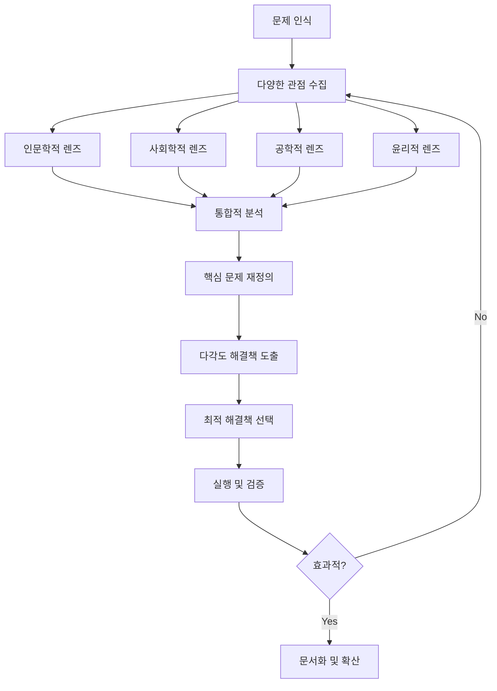

### 📋 스마트카 프로젝트에 미네르바식 접근 적용

```
┌─────────────────────────────────────────────────────────────┐
│        스마트카 프로젝트 - 다학제적 문제 정의 워크시트       │
├─────────────────────────────────────────────────────────────┤
│                                                             │
│  ■ 프로젝트: 장애물 피하기                                  │
│  ─────────────────────────────────────────────────────────  │
│                                                             │
│  🔧 공학적 관점                                             │
│  Q. 기술적으로 어떻게 구현하는가?                           │
│  A: 초음파 센서로 거리 측정 → 조건문으로 판단 → 모터 제어  │
│                                                             │
│  📚 인문학적 관점                                           │
│  Q. 이 기술이 인간에게 어떤 의미를 가지는가?                │
│  A: 인간의 안전 욕구 충족, 위험 판단의 자동화               │
│     → "기계가 대신 판단한다"는 것의 의미는?                │
│                                                             │
│  👥 사회학적 관점                                           │
│  Q. 사회에 어떤 영향을 미치는가?                            │
│  A: 교통사고 감소, 운전자 책임 변화, 직업 구조 변화        │
│     → 누가 이득을 보고 누가 손해를 보는가?                 │
│                                                             │
│  ⚖️ 윤리적 관점                                             │
│  Q. 어떤 결정이 "옳은" 것인가?                              │
│  A: 급정거 vs 회피 기동, 탑승자 안전 vs 보행자 안전        │
│     → 알고리즘에 어떤 가치를 담을 것인가?                  │
│                                                             │
│  💰 경제적 관점                                             │
│  Q. 비용과 효익은 무엇인가?                                 │
│  A: 센서 비용, 개발 비용 vs 사고 감소, 보험료 절감         │
│     → 어느 수준의 안전이 "충분한" 것인가?                  │
│                                                             │
│  ■ 통합 문제 정의                                           │
│  ─────────────────────────────────────────────────────────  │
│  "단순히 '장애물을 피하는 것'이 아니라,                     │
│   '안전과 효율, 책임의 균형을 어떻게 맞출 것인가'가        │
│   진짜 문제이다."                                           │
│                                                             │
└─────────────────────────────────────────────────────────────┘
```

### 🌟 왜 다학제적 관점이 중요한가?

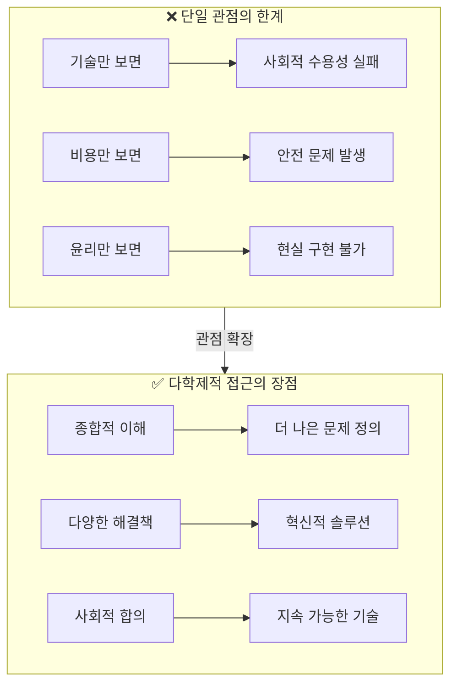

---

## 4. 가상-현실 연계 학습 🎮↔️🚗

> **"가상에서 배운 것이 현실에서 작동할 때, 진정한 학습이 완성된다"**

### 🎯 왜 가상-현실 연계가 중요한가?

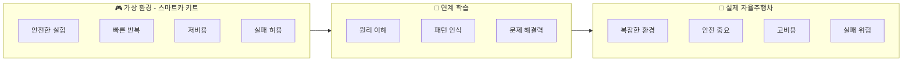

### 📊 스마트카 키트 vs 실제 자율주행차 비교

| 구분 | 🎮 스마트카 키트 | 🚗 실제 자율주행차 | 공통 원리 |
|------|-----------------|-------------------|----------|
| **센서** | 초음파 HC-SR04 (1개) | LiDAR, 레이더, 카메라 (다수) | 거리 측정 → 판단 |
| **처리장치** | Arduino (16MHz) | NVIDIA Drive (수십 TOPS) | 센서 데이터 → 결정 |
| **액추에이터** | DC 모터 (4개) | 조향, 제동, 가속 시스템 | 결정 → 물리적 동작 |
| **속도** | ~2m/s | ~130km/h | 속도 제어 필요 |
| **환경** | 실내, 단순 | 도로, 복잡 | 환경 인식 필요 |
| **비용** | ~10만원 | ~수억원 | 최적화 필요 |
| **실패 시** | 재시작 | 인명 피해 | 안전 설계 중요 |

### 🔄 학습 전이 (Transfer Learning) 개념

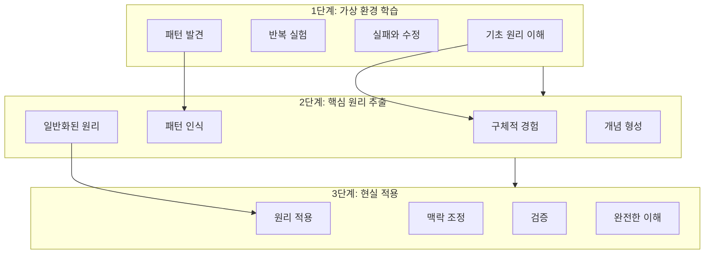

### 📋 프로젝트별 가상-현실 연계 맵

#### 프로젝트 1: 원격 제어

```
┌─────────────────────────────────────────────────────────────┐
│              원격 제어: 가상 → 현실 연계                     │
├─────────────────────────────────────────────────────────────┤
│                                                             │
│  🎮 가상 (스마트카 키트)         🚗 현실 (자율주행차)       │
│  ────────────────────────       ──────────────────────      │
│                                                             │
│  블루투스 HC-06            →    V2X 통신                    │
│  (근거리 1:1 통신)              (차량-인프라 통신)          │
│                                                             │
│  앱 인벤터 앱              →    텔레오퍼레이션 시스템       │
│  (간단한 UI)                    (원격 제어실)               │
│                                                             │
│  음성 명령 (STT)           →    음성 비서 (HMI)             │
│  ("앞으로 가")                  ("내비게이션 시작")         │
│                                                             │
│  ■ 공통 핵심 원리                                           │
│  ─────────────────────────────────────────────────────────  │
│  • 명령어 → 신호 변환 → 전송 → 수신 → 해석 → 실행         │
│  • 통신 지연 (Latency) 처리                                 │
│  • 연결 끊김 시 안전 모드 (Fail-safe)                       │
│                                                             │
└─────────────────────────────────────────────────────────────┘
```

#### 프로젝트 2: 라인 트레이서

```
┌─────────────────────────────────────────────────────────────┐
│              라인 트레이서: 가상 → 현실 연계                 │
├─────────────────────────────────────────────────────────────┤
│                                                             │
│  🎮 가상 (스마트카 키트)         🚗 현실 (자율주행차)       │
│  ────────────────────────       ──────────────────────      │
│                                                             │
│  IR 센서 3개               →    카메라 + 영상 처리          │
│  (흑백 구분)                    (차선 인식 AI)              │
│                                                             │
│  아날로그 값 비교          →    딥러닝 모델                 │
│  (if-else 조건문)               (신경망 추론)               │
│                                                             │
│  검정 테이프 트랙          →    실제 도로 차선              │
│  (고정된 환경)                  (다양한 환경)               │
│                                                             │
│  ■ 공통 핵심 원리                                           │
│  ─────────────────────────────────────────────────────────  │
│  • 센서 → 인식 → 판단 → 조향                               │
│  • 피드백 루프 (현재 위치 → 목표 위치 차이 → 조정)         │
│  • LKAS (Lane Keeping Assist System) 기본 원리 동일        │
│                                                             │
└─────────────────────────────────────────────────────────────┘
```

#### 프로젝트 3: 장애물 피하기

```
┌─────────────────────────────────────────────────────────────┐
│              장애물 피하기: 가상 → 현실 연계                 │
├─────────────────────────────────────────────────────────────┤
│                                                             │
│  🎮 가상 (스마트카 키트)         🚗 현실 (자율주행차)       │
│  ────────────────────────       ──────────────────────      │
│                                                             │
│  초음파 센서 1개           →    LiDAR + 레이더 + 카메라     │
│  (정면 감지)                    (360° 감지)                 │
│                                                             │
│  서보모터 스캔             →    센서 퓨전                   │
│  (좌우 탐색)                    (다중 센서 통합)            │
│                                                             │
│  단순 회피 알고리즘        →    경로 계획 알고리즘          │
│  (정지 → 회전)                  (RRT, A* 등)                │
│                                                             │
│  ■ 공통 핵심 원리                                           │
│  ─────────────────────────────────────────────────────────  │
│  • 감지 → 거리 측정 → 위험 판단 → 회피 결정 → 실행        │
│  • AEB (Auto Emergency Braking) 기본 원리 동일             │
│  • 안전 거리 = 속도 × 반응 시간 + 정지 거리               │
│                                                             │
└─────────────────────────────────────────────────────────────┘
```

#### 프로젝트 4: 자동차 따라가기

```
┌─────────────────────────────────────────────────────────────┐
│              자동차 따라가기: 가상 → 현실 연계               │
├─────────────────────────────────────────────────────────────┤
│                                                             │
│  🎮 가상 (스마트카 키트)         🚗 현실 (자율주행차)       │
│  ────────────────────────       ──────────────────────      │
│                                                             │
│  초음파 센서 거리 유지     →    레이더 기반 ACC            │
│  (고정 거리)                    (속도 비례 거리)            │
│                                                             │
│  단순 P 제어               →    PID + 예측 제어             │
│  (Kp만 적용)                    (정밀 제어)                 │
│                                                             │
│  앞차 속도 고정            →    앞차 속도 변화 대응         │
│  (단순 상황)                    (복잡한 교통 상황)          │
│                                                             │
│  ■ 공통 핵심 원리                                           │
│  ─────────────────────────────────────────────────────────  │
│  • 목표 거리 설정 → 현재 거리 측정 → 오차 계산 → 속도 조절│
│  • ACC (Adaptive Cruise Control) 기본 원리 동일            │
│  • 제어 이론: 피드백 루프, 안정성, 응답 속도               │
│                                                             │
└─────────────────────────────────────────────────────────────┘
```

### 🚗 실제 자율주행 기술과의 상세 비교

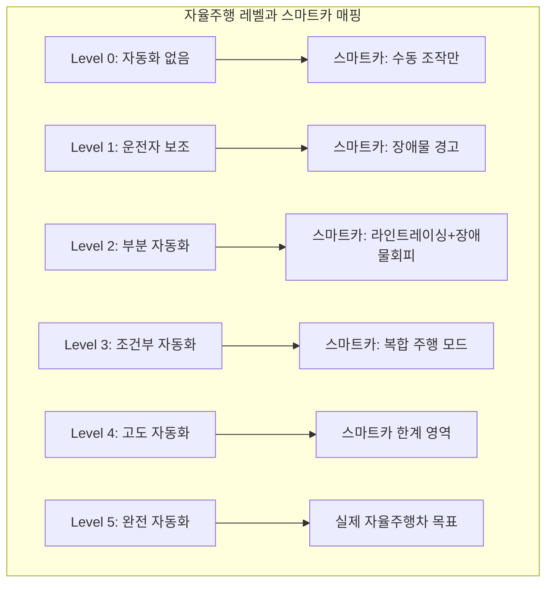

### 📊 기술 요소별 스케일 비교

| 기술 요소 | 스마트카 키트 | 스케일업 | 실제 자율주행차 |
|-----------|--------------|----------|----------------|
| **센서 개수** | 1-3개 | ×100 | 수십 개 |
| **처리 속도** | 16MHz | ×10,000 | 수십 GHz |
| **의사결정 시간** | 100ms | ×10 | 10ms 이하 |
| **환경 복잡도** | 단순 | ×1000 | 매우 복잡 |
| **안전 요구** | 낮음 | ×∞ | 매우 높음 |
| **비용** | ~10만원 | ×10,000 | 수억원 |

### 🎯 가상-현실 학습의 핵심 포인트

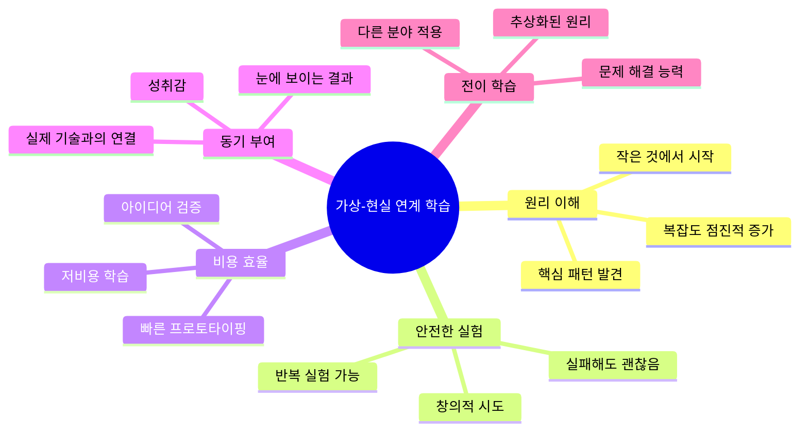

### 📋 학습 전이 체크리스트

```
┌─────────────────────────────────────────────────────────────┐
│               가상-현실 학습 전이 체크리스트                  │
├─────────────────────────────────────────────────────────────┤
│                                                             │
│  ■ 1단계: 가상 환경 학습 (스마트카)                         │
│  ─────────────────────────────────────────────────────────  │
│  ☐ 기본 동작 원리를 이해했다                                │
│  ☐ 코드 수정을 통해 동작을 변경할 수 있다                   │
│  ☐ 문제 발생 시 디버깅할 수 있다                            │
│  ☐ 왜 그렇게 동작하는지 설명할 수 있다                      │
│                                                             │
│  ■ 2단계: 원리 추출                                         │
│  ─────────────────────────────────────────────────────────  │
│  ☐ 센서 → 처리 → 액추에이터 흐름을 이해한다                │
│  ☐ 피드백 루프의 개념을 설명할 수 있다                      │
│  ☐ 안전 설계의 중요성을 이해한다                            │
│  ☐ 여러 프로젝트의 공통점을 찾을 수 있다                    │
│                                                             │
│  ■ 3단계: 현실 연결                                         │
│  ─────────────────────────────────────────────────────────  │
│  ☐ 실제 자율주행차의 해당 기술을 알고 있다                  │
│  ☐ 스케일의 차이를 이해한다                                 │
│  ☐ 왜 더 복잡한 기술이 필요한지 설명할 수 있다              │
│  ☐ 미래 기술 발전 방향을 예측할 수 있다                     │
│                                                             │
│  ■ 4단계: 확장 적용                                         │
│  ─────────────────────────────────────────────────────────  │
│  ☐ 다른 분야에서 비슷한 원리를 찾을 수 있다                 │
│  ☐ 새로운 문제에 학습한 원리를 적용할 수 있다               │
│  ☐ 기술의 사회적 영향을 고려할 수 있다                      │
│  ☐ 자신만의 프로젝트 아이디어를 제안할 수 있다              │
│                                                             │
└─────────────────────────────────────────────────────────────┘
```

---

## 5. PRIMM + AI 리터러시 통합 모델

### 📐 전통 PRIMM 모델

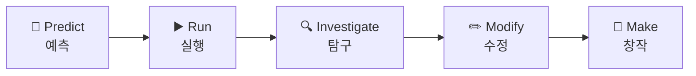

### 🚀 AI 통합 PRIMM 모델

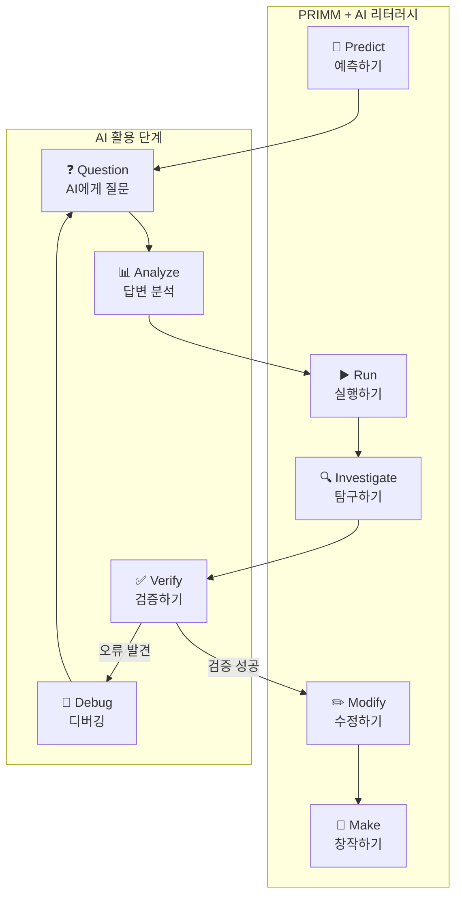

### 📋 단계별 상세 설명

| 단계 | PRIMM | AI 활용 | 활동 내용 |
|:----:|-------|---------|-----------|
| 1 | **Predict** | Question | 코드 실행 전 결과 예측, AI에게 원리 질문 |
| 2 | **Run** | Analyze | 코드 실행, AI 답변과 실제 결과 비교 |
| 3 | **Investigate** | Verify | 코드 분석, AI 설명의 정확성 검증 |
| 4 | **Modify** | Debug | 코드 수정, AI 답변 오류 시 재질문 |
| 5 | **Make** | Create | 새로운 기능 창작, AI와 협업 설계 |

---

## 6. 실행자 vs 기획자 역량

### 🎭 두 역할의 정의

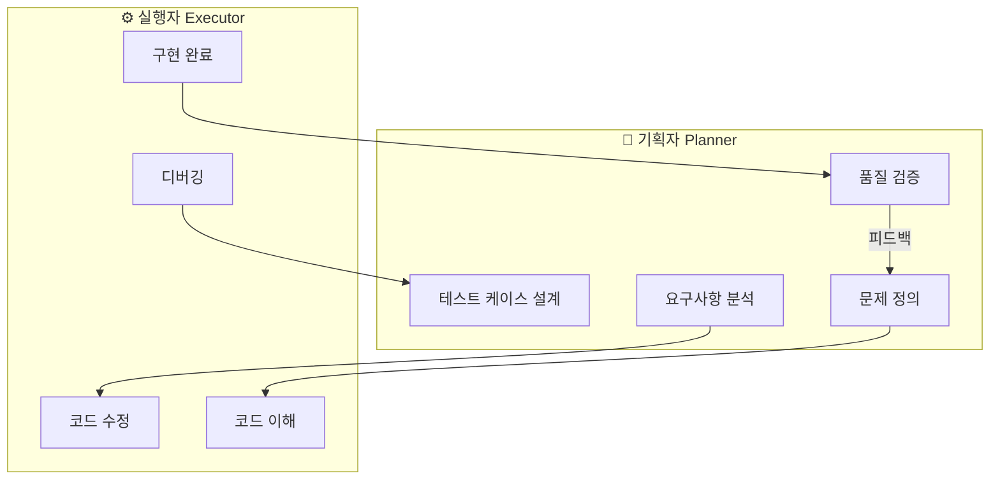

### 📊 역할별 핵심 역량 비교

| 구분 | 기획자 (Planner) | 실행자 (Executor) |
|------|------------------|-------------------|
| **주요 질문** | "무엇을 해결해야 하나?" | "어떻게 구현하나?" |
| **핵심 능력** | 문제 정의, 분석 | 코드 이해, 수정 |
| **AI 활용** | 요구사항 정리, 검색 | 코드 생성, 디버깅 |
| **산출물** | 명세서, 테스트 케이스 | 동작하는 코드 |
| **성공 기준** | 문제가 해결되었는가? | 코드가 동작하는가? |
| **오류 대응** | 요구사항 재정의 | 코드 수정 |

### 🔄 실전에서의 역할 순환

```mermaid
flowchart LR
    A[문제 발견] --> B[기획자: 문제 정의]
    B --> C[실행자: 구현 시도]
    C --> D{동작?}
    D -->|Yes| E[기획자: 테스트]
    D -->|No| F[실행자: 디버깅]
    F --> C
    E --> G{요구사항 충족?}
    G -->|Yes| H[완료]
    G -->|No| B
```

### 📝 역할별 AI 활용 예시

#### 기획자의 AI 활용

```
[상황] 스마트카가 장애물을 피하지 못함

[AI 질문 - 기획자 관점]
"자율주행차의 장애물 회피 시스템에서 
고려해야 할 요구사항은 무엇인가요?
감지 거리, 반응 시간, 회피 방향 결정 등을 
포함해서 체크리스트를 만들어주세요."

[AI 답변 분석]
→ 테스트 케이스 도출
→ 성공 기준 정의
→ 예외 상황 목록화
```

#### 실행자의 AI 활용

```
[상황] 초음파 센서 값이 이상함

[AI 질문 - 실행자 관점]
"아두이노에서 초음파 센서 HC-SR04를 사용할 때
pulseIn 함수가 0을 반환하는 원인은 무엇인가요?
TRIG, ECHO 핀 연결과 타이밍 문제를 설명해주세요."

[AI 답변 분석]
→ 핀 연결 확인
→ 타이밍 코드 수정
→ 디버깅 진행
```

---

## 7. 문제 정의의 중요성 ⭐

> **"문제를 잘 정의하면 해결의 50%는 끝난 것이다"** - 알버트 아인슈타인

### 🎯 왜 문제 정의가 가장 중요한가?

```mermaid
flowchart TB
    subgraph 문제정의_중요성[문제 정의가 중요한 이유]
        A[잘못된 문제 정의] --> B[잘못된 해결책]
        B --> C[시간/자원 낭비]
        C --> D[재작업 필요]
        
        E[정확한 문제 정의] --> F[올바른 방향]
        F --> G[효율적 해결]
        G --> H[성공적 결과]
    end
```

### 💡 문제 정의가 답보다 중요한 5가지 이유

```mermaid
mindmap
  root((문제 정의가 중요한 이유))
    1. 방향 설정
      잘못된 방향 = 시간 낭비
      올바른 방향 = 효율적 해결
    2. AI 활용 효과
      모호한 질문 = 모호한 답변
      구체적 질문 = 정확한 답변
    3. 협업 효율
      명확한 전달 = 빠른 협업
      모호한 전달 = 오해와 재작업
    4. 학습 깊이
      표면적 해결 = 얕은 학습
      근본 원인 파악 = 깊은 학습
    5. 재발 방지
      증상만 해결 = 재발 가능
      원인 해결 = 영구 해결
```

### 📊 문제 정의 수준 비교

| 수준 | 문제 정의 예시 | AI 질문 품질 | 결과 | 학습 효과 |
|:----:|---------------|--------------|------|-----------|
| **Lv.1** | "안 돼요" | AI가 이해 못함 | ❌ 실패 | 없음 |
| **Lv.2** | "모터가 안 돌아요" | 일반적 답변 | △ 부분 해결 | 낮음 |
| **Lv.3** | "왼쪽 모터만 안 돌아요" | 구체적 답변 | ○ 해결 가능 | 보통 |
| **Lv.4** | "왼쪽 모터 D11핀, 시리얼에서 값 150 확인됨" | 정확한 답변 | ◎ 즉시 해결 | 높음 |
| **Lv.5** | "D11핀 PWM 출력 안됨, pinMode는 OUTPUT 설정됨, 다른 핀은 정상" | 핵심 원인 답변 | ★ 완벽 해결 | 매우 높음 |

### 🔄 문제 정의 5W1H 프레임워크

```mermaid
flowchart LR
    subgraph 5W1H[5W1H 문제 정의 프레임워크]
        W1[What<br>무엇이?]
        W2[Where<br>어디서?]
        W3[When<br>언제?]
        W4[Who/Which<br>어떤 것이?]
        W5[Why<br>왜?]
        H1[How<br>어떻게?]
    end
    
    W1 --> |"모터가 안 돌아요"| A1[현상 파악]
    W2 --> |"왼쪽 모터에서"| A2[위치 특정]
    W3 --> |"전원 켜자마자"| A3[시점 확인]
    W4 --> |"D11핀에 연결된"| A4[대상 특정]
    W5 --> |"PWM 신호가 없어서?"| A5[원인 가설]
    H1 --> |"시리얼 모니터로 확인"| A6[검증 방법]
    
    A1 --> B[통합]
    A2 --> B
    A3 --> B
    A4 --> B
    A5 --> B
    A6 --> B
    
    B --> C[최종 문제 정의]
```

### 📋 문제 정의 7단계 프로세스

```mermaid
flowchart TD
    A[1단계: 현상 관찰] --> B[2단계: 정상 상태 비교]
    B --> C[3단계: 범위 축소]
    C --> D[4단계: 변수 분리]
    D --> E[5단계: 원인 가설]
    E --> F[6단계: 가설 검증]
    F --> G{문제 특정?}
    G -->|No| C
    G -->|Yes| H[7단계: 문제 정의 완료]
    
    A1["무엇이 안 되는가?<br>(What)"] -.-> A
    B1["원래 어떻게 되어야 하는가?<br>(Expected)"] -.-> B
    C1["어디서 안 되는가?<br>(Where)"] -.-> C
    D1["어떤 조건에서 안 되는가?<br>(Condition)"] -.-> D
    E1["왜 안 될 것 같은가?<br>(Why - 가설)"] -.-> E
    F1["가설이 맞는가?<br>(Verify)"] -.-> F
    H1["정확한 문제 기술<br>(Definition)"] -.-> H
```

### 📊 단계별 질문 가이드

| 단계 | 핵심 질문 | 예시 답변 | 다음 단계로 가는 기준 |
|:----:|-----------|-----------|----------------------|
| 1. 현상 관찰 | 무엇이 안 되는가? | "장애물을 피하지 못함" | 증상을 명확히 기술 |
| 2. 정상 비교 | 원래 어떻게 되어야 하나? | "20cm 이내에서 정지해야 함" | 기대 동작 명확화 |
| 3. 범위 축소 | 어디서 문제인가? | "센서? 코드? 모터?" | 문제 영역 좁히기 |
| 4. 변수 분리 | 어떤 조건에서? | "거리값이 항상 0" | 단일 변수로 좁히기 |
| 5. 원인 가설 | 왜 그럴 것 같은가? | "TRIG 타이밍 문제?" | 가설 3개 이상 수립 |
| 6. 가설 검증 | 가설이 맞는가? | "타이밍 변경 후 정상" | 원인 확정 |
| 7. 문제 정의 | 정확한 문제는? | "TRIG 펄스 2μs → 10μs 필요" | 재현 가능한 정의 |

### 📝 문제 정의 워크시트 (상세 버전)

```
┌─────────────────────────────────────────────────────────────┐
│                   문제 정의 워크시트 v2.0                    │
├─────────────────────────────────────────────────────────────┤
│                                                             │
│  ■ STEP 1: 현상 기록                                        │
│  ─────────────────────────────────────────────────────────  │
│  Q. 무엇이 발생했는가? (What)                               │
│  A: ________________________________________________       │
│                                                             │
│  Q. 언제 발생했는가? (When)                                 │
│  A: ________________________________________________       │
│                                                             │
├─────────────────────────────────────────────────────────────┤
│                                                             │
│  ■ STEP 2: 정상 상태 비교                                   │
│  ─────────────────────────────────────────────────────────  │
│  Q. 원래 어떻게 동작해야 하는가?                            │
│  A: ________________________________________________       │
│                                                             │
│  Q. 현재 상태와 정상 상태의 차이는?                         │
│  정상: ______________________________________________       │
│  현재: ______________________________________________       │
│                                                             │
├─────────────────────────────────────────────────────────────┤
│                                                             │
│  ■ STEP 3: 범위 축소 (어디서?)                              │
│  ─────────────────────────────────────────────────────────  │
│  Q. 문제가 발생하는 위치는?                                 │
│                                                             │
│  □ 하드웨어 (센서, 모터, 배선)                              │
│    └ 구체적: ________________________________________       │
│  □ 소프트웨어 (코드, 로직)                                  │
│    └ 구체적: ________________________________________       │
│  □ 환경 (전원, 온도, 간섭)                                  │
│    └ 구체적: ________________________________________       │
│                                                             │
├─────────────────────────────────────────────────────────────┤
│                                                             │
│  ■ STEP 4: 변수 분리                                        │
│  ─────────────────────────────────────────────────────────  │
│  Q. 어떤 조건에서 발생하는가?                               │
│                                                             │
│  발생하는 경우:                                             │
│  □ 항상 발생                                                │
│  □ 특정 조건에서만: _________________________________       │
│                                                             │
│  정상 동작하는 경우:                                        │
│  □ 없음 (항상 문제)                                         │
│  □ 특정 조건에서: ___________________________________       │
│                                                             │
├─────────────────────────────────────────────────────────────┤
│                                                             │
│  ■ STEP 5: 가설 수립                                        │
│  ─────────────────────────────────────────────────────────  │
│  Q. 왜 이런 문제가 발생할까? (원인 가설)                    │
│                                                             │
│  가설 1: ____________________________________________       │
│  검증 방법: _________________________________________       │
│                                                             │
│  가설 2: ____________________________________________       │
│  검증 방법: _________________________________________       │
│                                                             │
│  가설 3: ____________________________________________       │
│  검증 방법: _________________________________________       │
│                                                             │
├─────────────────────────────────────────────────────────────┤
│                                                             │
│  ■ STEP 6: 가설 검증                                        │
│  ─────────────────────────────────────────────────────────  │
│  가설 1 검증: ☐ 맞음  ☐ 틀림  ☐ 부분적                     │
│  → 결과: ____________________________________________       │
│                                                             │
│  가설 2 검증: ☐ 맞음  ☐ 틀림  ☐ 부분적                     │
│  → 결과: ____________________________________________       │
│                                                             │
│  가설 3 검증: ☐ 맞음  ☐ 틀림  ☐ 부분적                     │
│  → 결과: ____________________________________________       │
│                                                             │
├─────────────────────────────────────────────────────────────┤
│                                                             │
│  ■ STEP 7: 최종 문제 정의                                   │
│  ─────────────────────────────────────────────────────────  │
│                                                             │
│  ┌───────────────────────────────────────────────────────┐ │
│  │                                                       │ │
│  │  "[구체적 위치]에서 [구체적 현상]이 발생함.           │ │
│  │   원인은 [확인된 원인]이며,                           │ │
│  │   [해결 방향]으로 수정 필요."                         │ │
│  │                                                       │ │
│  │  예시:                                                │ │
│  │  "초음파 센서의 TRIG 핀에서 펄스 신호가               │ │
│  │   2μs로 설정되어 센서가 동작하지 않음.               │ │
│  │   원인은 delayMicroseconds(2) 설정이며,              │ │
│  │   10μs 이상으로 수정 필요."                          │ │
│  │                                                       │ │
│  └───────────────────────────────────────────────────────┘ │
│                                                             │
└─────────────────────────────────────────────────────────────┘
```

### 🚫 문제 정의 시 흔한 실수

```mermaid
flowchart TB
    subgraph 실수_유형[흔한 실수 유형]
        M1[❌ 증상만 말함]
        M2[❌ 추측을 사실로]
        M3[❌ 범위가 너무 넓음]
        M4[❌ 확인 없이 원인 단정]
        M5[❌ 재현 조건 불명확]
    end
    
    subgraph 올바른_방법[올바른 방법]
        C1[✅ 증상 + 조건 + 확인사항]
        C2[✅ 가설과 사실 구분]
        C3[✅ 범위 축소 후 질문]
        C4[✅ 가설 검증 후 결론]
        C5[✅ 재현 가능한 조건 기술]
    end
    
    M1 --> C1
    M2 --> C2
    M3 --> C3
    M4 --> C4
    M5 --> C5
```

### 📊 나쁜 문제 정의 vs 좋은 문제 정의

| 구분 | ❌ 나쁜 예시 | ✅ 좋은 예시 |
|------|-------------|-------------|
| **모호함** | "코드가 안 돼요" | "23번 줄 if문이 항상 false를 반환함" |
| **추측** | "센서가 고장 난 것 같아요" | "센서 출력값이 항상 0, 배선은 정상 확인됨" |
| **너무 넓음** | "자동차가 안 움직여요" | "왼쪽 모터만 안 돌아감, PWM 150 출력 확인됨" |
| **재현 불가** | "가끔 멈춰요" | "배터리 전압 6V 이하일 때 정지함" |
| **원인 단정** | "모터가 고장났어요" | "모터에 전압이 걸리지 않음, 드라이버 확인 필요" |

### 🎯 AI에게 질문할 때 문제 정의 활용

```
┌─────────────────────────────────────────────────────────────┐
│                문제 정의 → AI 질문 변환                      │
├─────────────────────────────────────────────────────────────┤
│                                                             │
│  [문제 정의]                                                │
│  "초음파 센서 HC-SR04에서 pulseIn 함수가 항상 0을 반환.    │
│   TRIG=D7, ECHO=A5 연결, delayMicroseconds(2) 사용 중."    │
│                                                             │
│                         ↓                                   │
│                                                             │
│  [AI 질문 - 나쁜 예]                                        │
│  "초음파 센서가 안 돼요. 도와주세요."                       │
│                                                             │
│                         ↓                                   │
│                                                             │
│  [AI 질문 - 좋은 예]                                        │
│  "아두이노 UNO에서 HC-SR04 초음파 센서를 사용하고 있습니다.│
│                                                             │
│   - TRIG: D7, ECHO: A5 연결                                 │
│   - pulseIn(ECHO, HIGH) 함수가 항상 0 반환                  │
│   - delayMicroseconds(2)로 TRIG 펄스 생성 중                │
│   - 다른 핀으로 변경해도 동일한 증상                        │
│                                                             │
│   pulseIn이 0을 반환하는 원인과 TRIG 펄스의 적정 시간을    │
│   알려주세요."                                              │
│                                                             │
└─────────────────────────────────────────────────────────────┘
```

---

## 8. AI 활용 프로세스

### 🤖 AI 협업 워크플로우

```mermaid
flowchart TB
    A[문제 인식] --> B[문제 정의]
    B --> C[1차 AI 질문]
    C --> D[답변 분석]
    D --> E{이해됨?}
    
    E -->|No| F[재질문: 더 쉽게]
    F --> D
    
    E -->|Yes| G{정확함?}
    
    G -->|의심| H[검증 질문]
    H --> I[교차 검증]
    I --> G
    
    G -->|Yes| J[적용 시도]
    J --> K{성공?}
    
    K -->|No| L[디버깅 질문]
    L --> M[오류 원인 분석]
    M --> N[수정 후 재시도]
    N --> J
    
    K -->|Yes| O[완료]
```

### 📊 AI 질문 수준별 비교

| 수준 | 질문 예시 | AI 답변 품질 | 학습 효과 |
|:----:|-----------|--------------|-----------|
| **Level 1** | "코드 짜줘" | 일반적 코드 | ❌ 낮음 |
| **Level 2** | "이 코드가 왜 안 돼?" | 추측성 답변 | △ 보통 |
| **Level 3** | "이 코드에서 X 부분이 Y 결과를 내는 이유는?" | 구체적 설명 | ○ 좋음 |
| **Level 4** | "X 원리를 이해했는데, Y 상황에서 Z 방식으로 적용하면 어떻게 될까?" | 심화 답변 | ◎ 매우 좋음 |
| **Level 5** | "AI 답변 중 A 부분이 틀린 것 같은데, B 원리 때문이 아닌가?" | 수정된 답변 | ★ 최고 |

### 🎯 효과적인 AI 질문 공식

```
┌─────────────────────────────────────────────────┐
│             효과적인 AI 질문 구조               │
├─────────────────────────────────────────────────┤
│                                                 │
│   [상황] + [구체적 문제] + [시도한 것] +        │
│   [기대 결과] + [실제 결과] + [질문]            │
│                                                 │
├─────────────────────────────────────────────────┤
│                                                 │
│   예시:                                         │
│                                                 │
│   [상황]                                        │
│   "아두이노 UNO에서 초음파 센서 HC-SR04를      │
│    사용하고 있습니다."                          │
│                                                 │
│   [구체적 문제]                                 │
│   "거리 측정값이 항상 0으로 나옵니다."          │
│                                                 │
│   [시도한 것]                                   │
│   "TRIG는 D7, ECHO는 A5에 연결했고,            │
│    pulseIn 함수를 사용했습니다."                │
│                                                 │
│   [기대 결과]                                   │
│   "10-50cm 범위의 거리값이 출력되어야 합니다." │
│                                                 │
│   [실제 결과]                                   │
│   "시리얼 모니터에 0만 출력됩니다."             │
│                                                 │
│   [질문]                                        │
│   "pulseIn이 0을 반환하는 원인과                │
│    해결 방법을 알려주세요."                     │
│                                                 │
└─────────────────────────────────────────────────┘
```

### 🔄 AI 답변 분석 체크리스트

```mermaid
flowchart TD
    A[AI 답변 수신] --> B{이해가 되는가?}
    B -->|No| C[용어 설명 요청]
    C --> A
    
    B -->|Yes| D{논리적인가?}
    D -->|No| E[근거 요청]
    E --> A
    
    D -->|Yes| F{검증 가능한가?}
    F -->|No| G[검증 방법 요청]
    G --> A
    
    F -->|Yes| H[직접 검증]
    H --> I{검증 통과?}
    
    I -->|No| J[오류 지적 및 재질문]
    J --> A
    
    I -->|Yes| K[답변 신뢰 & 적용]
```

---

## 9. 디버깅 능력의 중요성 ⭐

> **"프로그래밍의 50%는 코드 작성, 나머지 50%는 디버깅이다. 실력자의 차이는 디버깅에서 나타난다."**

### 🔧 디버깅이란?

**디버깅(Debugging)**은 코드나 시스템에서 **버그(Bug)**를 찾아 수정하는 과정입니다.  
단순히 오류를 고치는 것이 아니라, **원인을 추적하고 근본적으로 해결하는 능력**입니다.

```mermaid
flowchart LR
    A[🐛 버그 발견] --> B[🔍 원인 추적]
    B --> C[💡 가설 수립]
    C --> D[🧪 검증]
    D --> E{해결?}
    E -->|No| B
    E -->|Yes| F[✅ 수정 완료]
    F --> G[📝 문서화]
```

### 🎯 AI 시대에 디버깅이 더 중요한 이유

```mermaid
mindmap
  root((디버깅 능력이 핵심인 이유))
    1. AI도 틀린다
      AI 답변 100% 신뢰 불가
      검증 없이 적용 = 위험
      비판적 사고 필수
      AI 오류 발견 = 실력 증명
    2. 코드 작성 < 디버깅
      AI가 코드 생성 대체
      디버깅은 인간 영역
      맥락 이해 필요
      창의적 추론 필요
    3. 깊은 학습의 핵심
      오류에서 가장 많이 배움
      원리 이해의 기회
      시행착오 = 경험 축적
      다음 오류 예방
    4. 실무 핵심 역량
      모든 개발자 필수
      코드 품질 보증
      유지보수 능력
      문제 해결력 증명
```

### 📊 디버깅 능력 5단계

```mermaid
flowchart TB
    subgraph Level1[🔰 Level 1: 초보]
        L1A[오류 메시지만 복사]
        L1B["AI에게: 이 오류 해결해줘"]
        L1C[결과: 운에 의존]
    end
    
    subgraph Level2[📗 Level 2: 입문]
        L2A[오류 위치 파악]
        L2B["AI에게: 이 줄에서 왜 오류?"]
        L2C[결과: 부분적 이해]
    end
    
    subgraph Level3[📘 Level 3: 중급]
        L3A[원인 가설 수립]
        L3B["AI에게: A 때문인 것 같은데 맞아?"]
        L3C[결과: 능동적 학습]
    end
    
    subgraph Level4[📙 Level 4: 고급]
        L4A[체계적 검증]
        L4B["AI에게: A, B, C 중 어떤 것이 원인?"]
        L4C[결과: 효율적 해결]
    end
    
    subgraph Level5[📕 Level 5: 전문가]
        L5A[AI 답변 오류 발견]
        L5B["AI에게: 답변 중 X가 틀린 것 같은데?"]
        L5C[결과: AI 활용 극대화]
    end
    
    Level1 --> Level2 --> Level3 --> Level4 --> Level5
```

### 📋 디버깅 능력 수준별 특징 상세

| 수준 | 특징 | AI 질문 예시 | 학습 깊이 | 해결률 |
|:----:|------|-------------|-----------|--------|
| **Lv.1** | 오류 메시지만 복사 | "이 오류 해결해줘" | ❌ 얕음 | 20% |
| **Lv.2** | 오류 위치 파악 | "이 줄에서 이 오류가 나는 이유?" | △ 낮음 | 40% |
| **Lv.3** | 가설 수립 | "A 때문인 것 같은데, 맞아?" | ○ 보통 | 60% |
| **Lv.4** | 체계적 검증 | "A, B, C 가설 중 어떤 것이 맞아?" | ◎ 깊음 | 80% |
| **Lv.5** | AI 오류 발견 | "AI 답변 중 X가 틀렸는데, Y가 맞지?" | ★ 매우 깊음 | 95% |

### 🔄 체계적 디버깅 프로세스 (10단계)

```mermaid
flowchart TD
    A[1. 오류 인식] --> B[2. 재현 확인]
    B --> C[3. 증상 기록]
    C --> D[4. 범위 축소]
    D --> E[5. 변수 분리]
    E --> F[6. 가설 수립]
    F --> G[7. 가설 검증]
    G --> H{원인 특정?}
    H -->|No| I[8. 다른 가설]
    I --> F
    H -->|Yes| J[9. 수정 및 테스트]
    J --> K{해결?}
    K -->|No| L[부작용 확인]
    L --> D
    K -->|Yes| M[10. 문서화 및 회고]
```

### 📋 디버깅 단계별 상세 가이드

| 단계 | 활동 | 질문 | 체크포인트 |
|:----:|------|------|-----------|
| 1. 오류 인식 | 문제 발견 | "무엇이 잘못되었는가?" | 오류 메시지 캡처 |
| 2. 재현 확인 | 반복 테스트 | "같은 오류가 다시 발생하는가?" | 재현 가능 여부 |
| 3. 증상 기록 | 상세 기록 | "언제, 어디서, 어떻게?" | 5W1H 기록 |
| 4. 범위 축소 | 영역 좁히기 | "HW? SW? 환경?" | 문제 영역 특정 |
| 5. 변수 분리 | 조건 분리 | "어떤 조건에서만 발생?" | 단일 변수 분리 |
| 6. 가설 수립 | 원인 추측 | "왜 이런 오류가?" | 가설 3개 이상 |
| 7. 가설 검증 | 실험 | "가설이 맞는가?" | 검증 결과 기록 |
| 8. 다른 가설 | 재탐색 | "다른 원인은 없는가?" | 새 가설 수립 |
| 9. 수정 테스트 | 수정 후 테스트 | "문제가 해결되었는가?" | 정상 동작 확인 |
| 10. 문서화 | 기록 | "무엇을 배웠는가?" | 해결 과정 기록 |

### 🔍 디버깅 기법 종류

```mermaid
flowchart TB
    subgraph 기법[디버깅 기법]
        T1[🖨️ Print 디버깅]
        T2[🔀 이진 탐색]
        T3[🦆 러버덕 디버깅]
        T4[↩️ 롤백]
        T5[🧹 최소화]
    end
    
    T1 --> T1D["Serial.println() 으로<br>중간값 출력하여 확인"]
    T2 --> T2D["코드 절반씩 주석 처리하여<br>오류 위치 좁히기"]
    T3 --> T3D["문제를 말로 설명하면서<br>스스로 해결책 발견"]
    T4 --> T4D["작동하던 버전으로 돌아가<br>변경 사항 비교"]
    T5 --> T5D["최소한의 코드로<br>문제 재현하여 원인 분리"]
```

### 📊 디버깅 기법별 상세 설명

#### 1️⃣ Print 디버깅 (가장 기본)

```arduino
// 예시: 초음파 센서 값 확인
void loop() {
    long distance = getDistance();
    
    // 🔍 디버깅용 출력
    Serial.print("STEP 1 - distance: ");
    Serial.println(distance);
    
    if (distance < 20) {
        Serial.println("STEP 2 - 조건문 진입");  // 여기 도달하는지?
        stopCar();
    }
    
    Serial.print("STEP 3 - 루프 끝, motor state: ");
    Serial.println(motorState);  // 모터 상태 확인
}
```

#### 2️⃣ 이진 탐색 디버깅

```mermaid
flowchart TD
    A[전체 코드에서 오류] --> B[코드 절반 주석 처리]
    B --> C{오류 발생?}
    C -->|Yes| D[주석 처리한 부분에 오류]
    C -->|No| E[나머지 부분에 오류]
    D --> F[해당 부분 다시 절반 주석]
    E --> G[해당 부분 다시 절반 주석]
    F --> H{범위 좁혀짐}
    G --> H
    H --> I[오류 위치 특정]
```

#### 3️⃣ 러버덕 디버깅 (말로 설명하기)

```
┌─────────────────────────────────────────────────────────────┐
│                     러버덕 디버깅 방법                       │
├─────────────────────────────────────────────────────────────┤
│                                                             │
│  1. 문제를 처음부터 설명한다 (혼잣말 또는 AI에게)           │
│     "지금 스마트카가 장애물을 피하지 못하는 상황이야..."    │
│                                                             │
│  2. 코드를 한 줄씩 설명한다                                 │
│     "먼저 초음파 센서로 거리를 측정하고..."                 │
│     "그 다음에 거리가 20cm 미만이면..."                     │
│     "어? 근데 여기서 왜 20cm인데...?"                       │
│                                                             │
│  3. 🎉 설명하는 과정에서 스스로 오류 발견!                  │
│                                                             │
│  💡 왜 효과적인가?                                          │
│  - 말로 설명하면 논리적 허점이 드러남                       │
│  - 가정하고 넘어갔던 부분을 다시 생각하게 됨                │
│  - AI에게 설명하면 질문을 통해 힌트를 얻을 수 있음          │
│                                                             │
└─────────────────────────────────────────────────────────────┘
```

### 📝 디버깅 워크시트 (상세 버전)

```
┌─────────────────────────────────────────────────────────────┐
│                   디버깅 워크시트 v2.0                       │
├─────────────────────────────────────────────────────────────┤
│                                                             │
│  ■ STEP 1: 오류 인식 및 재현                                │
│  ─────────────────────────────────────────────────────────  │
│  오류 증상: _________________________________________       │
│  오류 메시지: _______________________________________       │
│  발생 시점: _________________________________________       │
│  재현 가능 여부: ☐ 항상  ☐ 가끔  ☐ 1회만                   │
│                                                             │
├─────────────────────────────────────────────────────────────┤
│                                                             │
│  ■ STEP 2: 정상 vs 비정상 비교                              │
│  ─────────────────────────────────────────────────────────  │
│  정상 동작 (기대값):                                        │
│  _______________________________________________________   │
│                                                             │
│  비정상 동작 (실제값):                                      │
│  _______________________________________________________   │
│                                                             │
│  차이점:                                                    │
│  _______________________________________________________   │
│                                                             │
├─────────────────────────────────────────────────────────────┤
│                                                             │
│  ■ STEP 3: 범위 축소 (문제 영역 좁히기)                     │
│  ─────────────────────────────────────────────────────────  │
│                                                             │
│  체크 항목:                                                 │
│  ☐ 하드웨어 (센서, 모터, 배선, 전원)                        │
│    └ 확인 결과: ____________________________________        │
│  ☐ 소프트웨어 (코드 로직, 변수, 조건문)                     │
│    └ 확인 결과: ____________________________________        │
│  ☐ 환경 (전원 전압, 간섭, 온도)                             │
│    └ 확인 결과: ____________________________________        │
│                                                             │
│  축소된 범위: _______________________________________       │
│                                                             │
├─────────────────────────────────────────────────────────────┤
│                                                             │
│  ■ STEP 4: 가설 수립 및 우선순위                            │
│  ─────────────────────────────────────────────────────────  │
│                                                             │
│  가설 1 (가장 의심됨):                                      │
│  원인: ______________________________________________       │
│  이유: ______________________________________________       │
│  검증 방법: _________________________________________       │
│                                                             │
│  가설 2:                                                    │
│  원인: ______________________________________________       │
│  이유: ______________________________________________       │
│  검증 방법: _________________________________________       │
│                                                             │
│  가설 3:                                                    │
│  원인: ______________________________________________       │
│  이유: ______________________________________________       │
│  검증 방법: _________________________________________       │
│                                                             │
├─────────────────────────────────────────────────────────────┤
│                                                             │
│  ■ STEP 5: 가설 검증                                        │
│  ─────────────────────────────────────────────────────────  │
│                                                             │
│  가설 1 검증:                                               │
│  실험 방법: _________________________________________       │
│  결과: ☐ 원인 맞음  ☐ 원인 아님  ☐ 부분적                  │
│  세부 결과: _________________________________________       │
│                                                             │
│  가설 2 검증:                                               │
│  실험 방법: _________________________________________       │
│  결과: ☐ 원인 맞음  ☐ 원인 아님  ☐ 부분적                  │
│  세부 결과: _________________________________________       │
│                                                             │
│  가설 3 검증:                                               │
│  실험 방법: _________________________________________       │
│  결과: ☐ 원인 맞음  ☐ 원인 아님  ☐ 부분적                  │
│  세부 결과: _________________________________________       │
│                                                             │
├─────────────────────────────────────────────────────────────┤
│                                                             │
│  ■ STEP 6: 확정된 원인                                      │
│  ─────────────────────────────────────────────────────────  │
│                                                             │
│  최종 원인:                                                 │
│  _______________________________________________________   │
│                                                             │
│  원인이 된 이유:                                            │
│  _______________________________________________________   │
│                                                             │
├─────────────────────────────────────────────────────────────┤
│                                                             │
│  ■ STEP 7: 해결 및 검증                                     │
│  ─────────────────────────────────────────────────────────  │
│                                                             │
│  해결 방법:                                                 │
│  _______________________________________________________   │
│                                                             │
│  수정 전 코드:                                              │
│  _______________________________________________________   │
│                                                             │
│  수정 후 코드:                                              │
│  _______________________________________________________   │
│                                                             │
│  테스트 결과: ☐ 해결됨  ☐ 부분 해결  ☐ 미해결              │
│  부작용 여부: ☐ 없음  ☐ 있음: _________________________     │
│                                                             │
├─────────────────────────────────────────────────────────────┤
│                                                             │
│  ■ STEP 8: 회고 및 학습                                     │
│  ─────────────────────────────────────────────────────────  │
│                                                             │
│  이번 디버깅에서 배운 점:                                   │
│  1. ________________________________________________       │
│  2. ________________________________________________       │
│  3. ________________________________________________       │
│                                                             │
│  다음에 같은 오류를 예방하려면:                             │
│  _______________________________________________________   │
│                                                             │
│  기억해야 할 패턴:                                          │
│  "이런 증상 → 이런 원인 가능성 높음"                        │
│  _______________________________________________________   │
│                                                             │
└─────────────────────────────────────────────────────────────┘
```

### 🐛 아두이노 스마트카 흔한 버그 패턴

```mermaid
flowchart TB
    subgraph 하드웨어_버그[🔌 하드웨어 관련 버그]
        HW1[모터가 안 돌아감]
        HW2[센서값이 이상함]
        HW3[블루투스 연결 안됨]
    end
    
    subgraph 소프트웨어_버그[💻 소프트웨어 관련 버그]
        SW1[조건문이 작동 안함]
        SW2[변수값이 이상함]
        SW3[타이밍 문제]
    end
    
    HW1 --> HW1S["배선 확인, 전원 확인,<br>핀 번호 확인"]
    HW2 --> HW2S["배선 확인, 전원 확인,<br>센서 불량 교체"]
    HW3 --> HW3S["TX/RX 교차 확인,<br>페어링 상태 확인"]
    
    SW1 --> SW1S["조건식 논리 확인,<br>변수값 출력 확인"]
    SW2 --> SW2S["초기화 확인,<br>자료형 확인"]
    SW3 --> SW3S["delay 시간 조정,<br>비동기 처리 확인"]
```

### 📊 버그 패턴별 디버깅 가이드

| 증상 | 가능한 원인 | 확인 방법 | 해결 방법 |
|------|-------------|-----------|-----------|
| **모터 안 돌아감** | 배선 잘못 | 핀 번호 재확인 | 올바른 핀 연결 |
| | PWM 값 0 | Serial로 값 출력 | analogWrite 값 확인 |
| | 전원 부족 | 전압 측정 | 별도 전원 사용 |
| **센서값 0** | 배선 오류 | 연결 상태 확인 | 재연결 |
| | 타이밍 문제 | delay 값 변경 | 권장값으로 수정 |
| | 센서 불량 | 다른 센서 테스트 | 센서 교체 |
| **블루투스 안됨** | TX/RX 반대 | 교차 연결 확인 | 핀 교환 |
| | 통신 속도 | 9600bps 확인 | 속도 일치 |
| | 페어링 해제 | 앱 연결 상태 | 재페어링 |
| **조건문 안됨** | 비교 연산자 오류 | == vs = 확인 | 연산자 수정 |
| | 자료형 불일치 | 변수 타입 확인 | 형변환 |
| | 논리 오류 | Serial로 추적 | 조건식 수정 |

### 🤖 AI를 활용한 디버깅 방법

```mermaid
flowchart TD
    A[오류 발생] --> B[1차 자가 분석]
    B --> C{원인 특정?}
    
    C -->|Yes| D[직접 수정]
    C -->|No| E[AI에게 질문 준비]
    
    E --> F[상황 정리]
    F --> G[코드 정리]
    G --> H[시도한 것 정리]
    H --> I[AI 질문]
    
    I --> J[AI 답변 수신]
    J --> K{답변 이해?}
    
    K -->|No| L["용어 설명 요청<br>'~가 무슨 뜻인가요?'"]
    L --> J
    
    K -->|Yes| M{논리적?}
    
    M -->|No| N["근거 요청<br>'왜 그렇게 생각하나요?'"]
    N --> J
    
    M -->|Yes| O{검증 필요?}
    
    O -->|Yes| P[실제 테스트]
    P --> Q{결과 일치?}
    
    Q -->|No| R["오류 지적<br>'결과가 다릅니다. 원인이 뭘까요?'"]
    R --> J
    
    Q -->|Yes| S[해결 완료]
    
    O -->|No| S
    D --> S
```

### 📋 AI 디버깅 질문 템플릿

```
┌─────────────────────────────────────────────────────────────┐
│               AI 디버깅 질문 템플릿                          │
├─────────────────────────────────────────────────────────────┤
│                                                             │
│  ■ Level 1: 기본 질문 (초급)                                │
│  ─────────────────────────────────────────────────────────  │
│  "[환경]에서 [코드/기능]을 실행했을 때                      │
│   [오류 메시지/증상]이 발생합니다.                          │
│   원인과 해결 방법을 알려주세요."                           │
│                                                             │
│  예시:                                                      │
│  "아두이노 UNO에서 초음파 센서 코드를 실행했을 때           │
│   거리값이 항상 0으로 출력됩니다.                           │
│   원인과 해결 방법을 알려주세요."                           │
│                                                             │
├─────────────────────────────────────────────────────────────┤
│                                                             │
│  ■ Level 2: 상세 질문 (중급)                                │
│  ─────────────────────────────────────────────────────────  │
│  "[환경]에서 [코드/기능]을 실행했습니다.                    │
│                                                             │
│   현재 상황:                                                │
│   - [세부 상황 1]                                           │
│   - [세부 상황 2]                                           │
│                                                             │
│   시도한 것:                                                │
│   - [시도 1]: 결과 [결과 1]                                 │
│   - [시도 2]: 결과 [결과 2]                                 │
│                                                             │
│   예상 원인:                                                │
│   - [가설 1]                                                │
│   - [가설 2]                                                │
│                                                             │
│   위 가설 중 어떤 것이 맞는지, 또는 다른 원인이 있는지     │
│   알려주세요."                                              │
│                                                             │
├─────────────────────────────────────────────────────────────┤
│                                                             │
│  ■ Level 3: 검증 질문 (고급)                                │
│  ─────────────────────────────────────────────────────────  │
│  "이전 답변에서 [A]라고 하셨는데,                           │
│                                                             │
│   제가 알기로는 [B 원리]에 의해                             │
│   [C 결과]가 되어야 할 것 같습니다.                         │
│                                                             │
│   실제로 테스트해보니 [실제 결과]가 나왔습니다.            │
│                                                             │
│   [A]가 맞는지, 아니면 [다른 원인]이 있는지                │
│   설명해주세요."                                            │
│                                                             │
├─────────────────────────────────────────────────────────────┤
│                                                             │
│  ■ Level 4: 반박 질문 (전문가)                              │
│  ─────────────────────────────────────────────────────────  │
│  "답변 중 [X 부분]이 틀린 것 같습니다.                      │
│                                                             │
│   [공식 문서/데이터시트]에 따르면                           │
│   [정확한 정보]이며,                                        │
│                                                             │
│   실제 테스트에서도 [실험 결과]로 확인됩니다.              │
│                                                             │
│   [X]가 아닌 [Y]가 맞지 않나요?                            │
│   아니면 제가 놓친 부분이 있는지 알려주세요."              │
│                                                             │
└─────────────────────────────────────────────────────────────┘
```

### 🎯 디버깅 마인드셋

```mermaid
flowchart TB
    subgraph 잘못된_마인드셋[❌ 피해야 할 마인드셋]
        W1["코드가 틀렸을 리 없어"]
        W2["빨리 해결해야 해"]
        W3["AI가 알아서 해주겠지"]
        W4["모르면 포기해야지"]
    end
    
    subgraph 올바른_마인드셋[✅ 가져야 할 마인드셋]
        R1["모든 코드는 의심 대상"]
        R2["차분하게 단계별로"]
        R3["AI는 도구, 검증은 내가"]
        R4["모르면 배우는 기회"]
    end
    
    W1 --> R1
    W2 --> R2
    W3 --> R3
    W4 --> R4
```

### 📊 디버깅 역량 자가 진단

```
┌─────────────────────────────────────────────────────────────┐
│                 디버깅 역량 자가 진단표                      │
├─────────────────────────────────────────────────────────────┤
│                                                             │
│  ■ 기본 역량 (각 항목 1-5점)                                │
│  ─────────────────────────────────────────────────────────  │
│  1. 오류 메시지를 읽고 의미를 이해할 수 있다    ___/5      │
│  2. 문제의 범위를 축소할 수 있다                ___/5      │
│  3. 가설을 세우고 검증할 수 있다                ___/5      │
│  4. Serial.println()으로 값을 추적할 수 있다   ___/5      │
│  5. 배선과 핀 연결을 확인할 수 있다            ___/5      │
│                                                             │
│  기본 역량 소계: ___/25                                     │
│                                                             │
├─────────────────────────────────────────────────────────────┤
│                                                             │
│  ■ AI 활용 역량 (각 항목 1-5점)                             │
│  ─────────────────────────────────────────────────────────  │
│  1. 상황을 정확히 전달하는 질문을 할 수 있다   ___/5      │
│  2. AI 답변의 논리를 검토할 수 있다            ___/5      │
│  3. AI 답변을 실제로 검증할 수 있다            ___/5      │
│  4. AI 답변이 틀렸을 때 반박할 수 있다         ___/5      │
│  5. 재질문으로 더 정확한 답을 얻을 수 있다     ___/5      │
│                                                             │
│  AI 활용 역량 소계: ___/25                                  │
│                                                             │
├─────────────────────────────────────────────────────────────┤
│                                                             │
│  ■ 총점 해석                                                │
│  ─────────────────────────────────────────────────────────  │
│  40-50점: 전문가 수준 - AI와 협업하여 고급 문제 해결 가능  │
│  30-39점: 고급 수준 - 대부분의 문제를 독립적으로 해결      │
│  20-29점: 중급 수준 - 기본 문제 해결 가능, AI 도움 활용   │
│  10-19점: 초급 수준 - 기초 학습 필요                       │
│  0-9점:  입문 수준 - 디버깅 기초부터 학습 시작             │
│                                                             │
│  나의 총점: ___/50 → _______ 수준                          │
│                                                             │
└─────────────────────────────────────────────────────────────┘
```

---

## 10. 실전 문제 해결 워크플로우

### 🔄 통합 워크플로우

```mermaid
flowchart TB
    subgraph 1_문제발견[1단계: 문제 발견]
        A1[현상 관찰]
        A2[이상 감지]
    end
    
    subgraph 2_문제정의[2단계: 문제 정의]
        B1[증상 기록]
        B2[범위 축소]
        B3[문제 명확화]
    end
    
    subgraph 3_AI질문[3단계: AI 활용]
        C1[1차 질문]
        C2[답변 분석]
        C3[검증/재질문]
    end
    
    subgraph 4_실행[4단계: 실행]
        D1[코드 수정]
        D2[테스트]
        D3[검증]
    end
    
    subgraph 5_디버깅[5단계: 디버깅]
        E1[오류 분석]
        E2[원인 추적]
        E3[수정 반복]
    end
    
    subgraph 6_완료[6단계: 완료]
        F1[문서화]
        F2[회고]
    end
    
    1_문제발견 --> 2_문제정의
    2_문제정의 --> 3_AI질문
    3_AI질문 --> 4_실행
    4_실행 --> |실패| 5_디버깅
    5_디버깅 --> 3_AI질문
    4_실행 --> |성공| 6_완료
```

### 📋 실전 예시: 장애물 피하기 문제

#### 상황
> 스마트카가 장애물 앞에서 멈추지 않고 충돌함

#### 단계별 해결 과정

```
┌─────────────────────────────────────────────────┐
│  Step 1: 문제 정의                              │
├─────────────────────────────────────────────────┤
│                                                 │
│  현상: 장애물 앞에서 멈추지 않음                │
│  위치: 초음파 센서? 코드? 모터?                 │
│  조건: 항상 발생 vs 간헐적?                     │
│                                                 │
│  확인 방법:                                     │
│  → 시리얼 모니터에서 거리값 확인                │
│  → 결과: 거리값 = 0 (측정 안됨)                │
│                                                 │
│  문제 정의:                                     │
│  "초음파 센서가 거리를 측정하지 못함"           │
│                                                 │
└─────────────────────────────────────────────────┘

┌─────────────────────────────────────────────────┐
│  Step 2: AI 질문                                │
├─────────────────────────────────────────────────┤
│                                                 │
│  [질문 1]                                       │
│  "아두이노에서 HC-SR04 초음파 센서 사용 시      │
│   pulseIn 함수가 0을 반환하는 원인은?"          │
│                                                 │
│  [AI 답변]                                      │
│  1. TRIG/ECHO 핀 연결 오류                      │
│  2. 타이밍 문제 (TRIG 펄스 너무 짧음)           │
│  3. 전원 부족                                   │
│  4. 타임아웃 초과                               │
│                                                 │
│  [질문 2 - 검증]                                │
│  "TRIG 펄스는 몇 마이크로초가 적절한가요?"      │
│                                                 │
│  [AI 답변]                                      │
│  "10μs가 권장됩니다"                           │
│                                                 │
└─────────────────────────────────────────────────┘

┌─────────────────────────────────────────────────┐
│  Step 3: 검증 및 수정                           │
├─────────────────────────────────────────────────┤
│                                                 │
│  [코드 확인]                                    │
│  delayMicroseconds(2);  // 현재 값              │
│                                                 │
│  [수정]                                         │
│  delayMicroseconds(10); // 권장 값              │
│                                                 │
│  [테스트]                                       │
│  → 거리값 정상 출력 확인                        │
│  → 장애물 감지 후 정지 확인                     │
│                                                 │
└─────────────────────────────────────────────────┘

┌─────────────────────────────────────────────────┐
│  Step 4: 회고 및 문서화                         │
├─────────────────────────────────────────────────┤
│                                                 │
│  원인: TRIG 펄스 시간 부족 (2μs → 10μs)        │
│                                                 │
│  배운 점:                                       │
│  - 초음파 센서는 10μs 이상의 TRIG 펄스 필요    │
│  - 시리얼 모니터로 센서값 먼저 확인하기         │
│  - 문제를 단계별로 분리해서 접근하기            │
│                                                 │
└─────────────────────────────────────────────────┘
```

---

## 11. 평가 및 체크리스트

### 📊 역량 평가 루브릭

| 역량 | 상 (5점) | 중 (3점) | 하 (1점) |
|------|----------|----------|----------|
| **문제 정의** | 구체적이고 검증 가능한 문제 정의 | 대략적인 문제 파악 | 현상만 나열 |
| **AI 질문** | 맥락 + 구체적 조건 + 기대 결과 포함 | 기본적인 질문 | 단순 요청 |
| **답변 분석** | 논리 검증 + 교차 확인 | 내용 이해 | 그대로 수용 |
| **디버깅** | 체계적 가설 검증 | 시행착오 | 답을 찾지 못함 |
| **학습 태도** | 오류에서 배움 추출 | 해결에 만족 | 좌절 |

### ✅ 자기 점검 체크리스트

```
┌─────────────────────────────────────────────────┐
│           AI 리터러시 자기 점검표               │
├─────────────────────────────────────────────────┤
│                                                 │
│  문제 정의 능력                                 │
│  ☐ 현상과 원인을 구분할 수 있다                │
│  ☐ 문제의 범위를 축소할 수 있다                │
│  ☐ 검증 가능한 형태로 문제를 정의한다          │
│                                                 │
│  AI 활용 능력                                   │
│  ☐ 맥락을 포함한 질문을 할 수 있다             │
│  ☐ AI 답변의 논리를 검토한다                   │
│  ☐ 필요시 재질문으로 심화한다                  │
│                                                 │
│  디버깅 능력                                    │
│  ☐ 오류 메시지를 해석할 수 있다                │
│  ☐ 가설을 세우고 검증할 수 있다                │
│  ☐ AI 답변의 오류를 발견할 수 있다             │
│                                                 │
│  협업 능력                                      │
│  ☐ 기획자/실행자 역할을 이해한다               │
│  ☐ 문제를 명확히 전달할 수 있다                │
│  ☐ 피드백을 주고받을 수 있다                   │
│                                                 │
│  학습 태도                                      │
│  ☐ 오류를 학습 기회로 본다                     │
│  ☐ 해결 과정을 기록한다                        │
│  ☐ 배운 점을 정리한다                          │
│                                                 │
└─────────────────────────────────────────────────┘
```

### 🎯 성장 단계별 목표

```mermaid
flowchart LR
    subgraph L1[Level 1: 입문]
        A1[AI에게 질문하기]
        A2[답변 이해하기]
    end
    
    subgraph L2[Level 2: 초급]
        B1[구체적 질문하기]
        B2[답변 검증하기]
    end
    
    subgraph L3[Level 3: 중급]
        C1[재질문으로 심화]
        C2[오류 발견하기]
    end
    
    subgraph L4[Level 4: 고급]
        D1[AI 답변 디버깅]
        D2[창의적 문제 해결]
    end
    
    subgraph L5[Level 5: 전문가]
        E1[AI와 협업 설계]
        E2[다른 사람 멘토링]
    end
    
    L1 --> L2 --> L3 --> L4 --> L5
```

---

## 📚 요약: 핵심 메시지

### 🔑 AI 시대 교육의 핵심

```mermaid
flowchart TB
    A[📋 문제 정의가 답보다 중요하다]
    B[🤖 AI는 도구이지 선생님이 아니다]
    C[🔍 검증 없는 신뢰는 위험하다]
    D[🔧 디버깅 능력이 실력이다]
    E[📝 오류에서 가장 많이 배운다]
    
    A --> B --> C --> D --> E
```

### 💡 기억해야 할 10가지 핵심 원칙

| 번호 | 핵심 원칙 | 미네르바/실전 연계 |
|:----:|-----------|-------------------|
| 1 | **문제를 정의하는 사람**이 해결책도 찾는다 | 다학제적 관점으로 문제 정의 |
| 2 | **좋은 질문**이 좋은 답변을 만든다 | AI 활용 프롬프트 스킬 |
| 3 | AI 답변은 항상 **검증**이 필요하다 | 비판적 사고 |
| 4 | **재질문**은 학습의 시작이다 | 소크라테스식 대화 |
| 5 | **디버깅**은 가장 깊은 학습이다 | 체계적 문제 해결 |
| 6 | **오류**는 실패가 아니라 기회다 | 성장 마인드셋 |
| 7 | **기획자와 실행자** 역량 모두 필요하다 | T자형 인재 |
| 8 | **가상에서 배운 원리**가 현실에 적용된다 | 학습 전이 |
| 9 | **다양한 관점**이 더 나은 해결책을 만든다 | 다학제적 접근 |
| 10 | **작은 성공**이 큰 도전의 기반이 된다 | 프로젝트 기반 학습 |

---

## 🔗 다음 단계: 실전 적용

### 📋 프로젝트별 학습 목표와 연계

```mermaid
flowchart TB
    subgraph 프로젝트1[🟢 프로젝트 1: 원격 제어]
        P1A[AI 활용: 블루투스 원리 질문]
        P1B[문제 정의: 통신 오류 시 분석]
        P1C[현실 연계: V2X, 텔레오퍼레이션]
    end
    
    subgraph 프로젝트2[🟡 프로젝트 2: 라인 트레이서]
        P2A[AI 활용: 센서 캘리브레이션]
        P2B[디버깅: 센서값 이상 시 분석]
        P2C[현실 연계: LKAS 차선 유지]
    end
    
    subgraph 프로젝트3[🟠 프로젝트 3: 장애물 피하기]
        P3A[문제 정의: 회피 알고리즘 설계]
        P3B[다학제: 윤리적 판단 토론]
        P3C[현실 연계: AEB 자동 긴급 제동]
    end
    
    subgraph 프로젝트4[🔴 프로젝트 4: 따라가기]
        P4A[AI 활용: Kp 튜닝 질문]
        P4B[검증: AI 답변 실험으로 확인]
        P4C[현실 연계: ACC 적응형 순항]
    end
    
    프로젝트1 --> 프로젝트2 --> 프로젝트3 --> 프로젝트4
```

### 🎯 실습 활동 체크리스트

```
┌─────────────────────────────────────────────────────────────┐
│                실습 활동 완료 체크리스트                      │
├─────────────────────────────────────────────────────────────┤
│                                                             │
│  ■ 문제 정의 실습                                           │
│  ─────────────────────────────────────────────────────────  │
│  ☐ 5W1H 문제 정의 워크시트 작성                             │
│  ☐ 다학제적 관점(공학/인문/사회/윤리)으로 분석             │
│  ☐ AI에게 질문하기 전 문제 정의 완료                        │
│                                                             │
│  ■ AI 활용 실습                                             │
│  ─────────────────────────────────────────────────────────  │
│  ☐ Level 1~4 질문 템플릿 활용                               │
│  ☐ AI 답변 검증 후 실제 테스트                              │
│  ☐ AI 답변 오류 발견 및 재질문                              │
│                                                             │
│  ■ 디버깅 실습                                              │
│  ─────────────────────────────────────────────────────────  │
│  ☐ 디버깅 워크시트 작성                                     │
│  ☐ Print 디버깅으로 값 추적                                 │
│  ☐ 가설 3개 이상 수립 및 검증                               │
│                                                             │
│  ■ 가상-현실 연계 학습                                      │
│  ─────────────────────────────────────────────────────────  │
│  ☐ 스마트카 원리와 실제 자율주행 기술 비교                  │
│  ☐ 핵심 원리(센서→판단→제어) 설명 가능                     │
│  ☐ 학습 전이 체크리스트 완료                                │
│                                                             │
│  ■ 미네르바식 다학제 실습                                   │
│  ─────────────────────────────────────────────────────────  │
│  ☐ 자율주행 윤리 딜레마 토론 참여                           │
│  ☐ 다양한 이해관계자 관점 분석                              │
│  ☐ 사회적 영향 고려한 해결책 제안                           │
│                                                             │
└─────────────────────────────────────────────────────────────┘
```

### 🌟 성공적인 학습을 위한 마인드맵

```mermaid
mindmap
  root((AI 시대 메이커 교육 성공))
    문제 정의
      다학제적 관점
      5W1H 프레임워크
      핵심 문제 특정
    AI 협업
      좋은 질문
      답변 검증
      재질문
    디버깅
      체계적 접근
      가설 검증
      문서화
    가상-현실 연계
      원리 이해
      스케일 인식
      전이 학습
    성장 마인드셋
      오류 = 기회
      지속적 개선
      협업과 공유
```

---
미네르바 스쿨의 교육 철학과 가상-현실 연계 학습에 대한 내용을 추가하겠습니다.

[1 tool called]

목차를 업데이트하고 새로운 섹션들을 추가하겠습니다.

[2 tools called]

이제 나머지 섹션 번호들을 업데이트하겠습니다.

[6 tools called]

마지막으로 실습 프로젝트 적용 부분도 업데이트하겠습니다.

[2 tools called]

마지막 부분을 업데이트하여 미네르바 스쿨과 가상-현실 연계 내용을 반영하겠습니다.

[1 tool called]

문서를 크게 보강하였습니다. 주요 추가 내용을 요약해 드립니다:

---

## 📋 추가된 주요 내용

### 1️⃣ 미네르바 스쿨과 다학제적 문제 해결 (새 섹션 2)

```mermaid
mindmap
  root((미네르바 스쿨 교육 철학))
    비판적 사고
      주장 분석
      증거 평가
    창의적 사고
      문제 재정의
      혁신적 접근
    효과적 의사소통
      명확한 전달
      설득력 있는 논증
    효과적 상호작용
      협업 능력
      문화적 감수성
```

**핵심 포인트:**
- **같은 문제도 어떤 렌즈로 보느냐에 따라 해결책이 달라짐**
- 공학적 + 인문학적 + 사회학적 + 윤리적 관점 통합
- **트롤리 딜레마** 예시로 자율주행의 윤리적 문제 토론

---

### 2️⃣ 가상-현실 연계 학습 (새 섹션 3)

| 스마트카 키트 🎮 | 실제 자율주행차 🚗 | 공통 원리 |
|-----------------|-------------------|----------|
| 초음파 센서 1개 | LiDAR, 레이더 다수 | 거리 측정 → 판단 |
| Arduino 16MHz | NVIDIA Drive | 센서 데이터 → 결정 |
| DC 모터 4개 | 조향/제동 시스템 | 결정 → 물리적 동작 |

**프로젝트별 현실 기술 매핑:**
- **원격 제어** → V2X 통신, 텔레오퍼레이션
- **라인 트레이서** → LKAS (차선 유지 보조)
- **장애물 피하기** → AEB (자동 긴급 제동)
- **따라가기** → ACC (적응형 순항 제어)

---

### 3️⃣ 문제 정의 섹션 강화 (섹션 6)

```
┌───────────────────────────────────────────────┐
│         문제 정의 7단계 프로세스              │
├───────────────────────────────────────────────┤
│  1. 현상 관찰 → 2. 정상 상태 비교            │
│  3. 범위 축소 → 4. 변수 분리                 │
│  5. 원인 가설 → 6. 가설 검증                 │
│  7. 문제 정의 완료                            │
└───────────────────────────────────────────────┘
```

- **5W1H 프레임워크** 추가
- **문제 정의 워크시트 v2.0** (상세 버전)
- **나쁜 vs 좋은 문제 정의** 비교표

---

### 4️⃣ 디버깅 섹션 강화 (섹션 8)

**디버깅 5단계 레벨:**
| 레벨 | 특징 | 해결률 |
|:----:|------|--------|
| Lv.1 | 오류 메시지만 복사 | 20% |
| Lv.2 | 오류 위치 파악 | 40% |
| Lv.3 | 가설 수립 | 60% |
| Lv.4 | 체계적 검증 | 80% |
| Lv.5 | AI 오류 발견 | 95% |

**디버깅 기법 추가:**
- Print 디버깅
- 이진 탐색 디버깅
- 러버덕 디버깅 (말로 설명하기)
- 롤백 / 최소화

---

### 5️⃣ 실전 적용 체크리스트

```
✅ 문제 정의 실습
✅ AI 활용 실습  
✅ 디버깅 실습
✅ 가상-현실 연계 학습
✅ 미네르바식 다학제 실습
```

---

이제 학생들이 **스마트카 키트라는 가상 환경에서 배운 원리**가 **실제 자율주행차**에 어떻게 적용되는지 명확히 이해하고, **다학제적 관점**으로 문제를 바라볼 수 있게 되었습니다! 🚗✨

---

## 🤖 AI 리터러시 교육 전략 상세

### AI 리터러시의 정의와 중요성

> **AI 리터러시(AI Literacy)**란 AI 기술을 이해하고, 비판적으로 평가하며, 
> 효과적으로 활용하고, 윤리적으로 사용할 수 있는 종합적인 역량입니다.

```mermaid
mindmap
  root((AI 리터러시의 4가지 핵심 역량))
    1. AI 이해
      AI의 원리 이해
      AI의 한계 인식
      AI vs 인간 지능 구분
    2. AI 평가
      AI 결과물 검증
      편향성 인식
      신뢰성 판단
    3. AI 활용
      효과적인 프롬프트
      적절한 도구 선택
      협업 전략
    4. AI 윤리
      책임 있는 사용
      프라이버시 고려
      사회적 영향 인식
```

### 📊 AI 리터러시 5단계 발달 모델

```mermaid
flowchart TB
    subgraph L1[Level 1: AI 인식]
        L1A[AI가 무엇인지 안다]
        L1B[AI 제품을 구분할 수 있다]
        L1C[AI의 일상적 활용을 인식]
    end
    
    subgraph L2[Level 2: AI 이해]
        L2A[AI 작동 원리 기초 이해]
        L2B[데이터와 학습의 관계 이해]
        L2C[AI의 한계 인식]
    end
    
    subgraph L3[Level 3: AI 활용]
        L3A[AI 도구 효과적 사용]
        L3B[프롬프트 엔지니어링]
        L3C[AI 결과물 검증]
    end
    
    subgraph L4[Level 4: AI 평가]
        L4A[AI 결과의 편향성 분석]
        L4B[AI 답변 오류 발견]
        L4C[AI vs 인간 판단 비교]
    end
    
    subgraph L5[Level 5: AI 창조]
        L5A[AI와 협업 설계]
        L5B[AI 활용 솔루션 개발]
        L5C[AI 윤리적 가이드라인 수립]
    end
    
    L1 --> L2 --> L3 --> L4 --> L5
```

### 📋 AI 리터러시 역량별 상세 설명

| 역량 | 설명 | 스마트카 프로젝트 적용 | 평가 기준 |
|------|------|----------------------|----------|
| **AI 이해** | AI가 데이터로부터 패턴을 학습한다는 것을 이해 | 센서 데이터 → 패턴 인식 → 판단 과정 이해 | 원리 설명 가능 |
| **AI 평가** | AI 결과물의 정확성과 한계를 평가 | AI가 제안한 코드의 오류 발견 | 비판적 검토 수행 |
| **AI 활용** | 효과적인 프롬프트로 원하는 답변 획득 | 디버깅 시 AI에게 구체적 질문 | 질문 품질 향상 |
| **AI 협업** | AI를 파트너로 활용하여 문제 해결 | AI와 함께 알고리즘 설계 | 협업 결과물 품질 |
| **AI 윤리** | AI 사용의 윤리적 측면 고려 | 자율주행 윤리 딜레마 토론 | 윤리적 판단 참여 |

### 🎯 AI 리터러시 교육의 핵심 원칙

```
┌─────────────────────────────────────────────────────────────┐
│              AI 리터러시 교육 5대 원칙                        │
├─────────────────────────────────────────────────────────────┤
│                                                             │
│  1️⃣ AI는 도구이다 (Tool, not Master)                        │
│  ─────────────────────────────────────────────────────────  │
│  • AI는 인간을 대체하는 것이 아니라 보조하는 도구           │
│  • 최종 판단과 책임은 인간에게 있음                         │
│  • AI 의존이 아닌 AI 활용 능력 배양                         │
│                                                             │
│  2️⃣ 질문이 답보다 중요하다 (Question over Answer)           │
│  ─────────────────────────────────────────────────────────  │
│  • 좋은 질문이 좋은 답변을 만든다                           │
│  • 프롬프트 엔지니어링은 핵심 역량                          │
│  • "무엇을 물어볼지"가 "답을 아는 것"보다 중요              │
│                                                             │
│  3️⃣ 검증은 필수이다 (Verify Always)                         │
│  ─────────────────────────────────────────────────────────  │
│  • AI 답변은 100% 신뢰할 수 없음                            │
│  • 항상 검증하고 테스트해야 함                              │
│  • 비판적 사고가 AI 시대의 필수 역량                        │
│                                                             │
│  4️⃣ 맥락이 핵심이다 (Context is Key)                        │
│  ─────────────────────────────────────────────────────────  │
│  • AI는 맥락을 완전히 이해하지 못함                         │
│  • 인간만이 전체 맥락을 파악할 수 있음                      │
│  • 맥락을 제공하는 것이 인간의 역할                         │
│                                                             │
│  5️⃣ 윤리는 선택이 아니다 (Ethics is Essential)              │
│  ─────────────────────────────────────────────────────────  │
│  • AI 사용에는 윤리적 책임이 따름                           │
│  • 편향, 프라이버시, 공정성 고려 필수                       │
│  • 사회적 영향을 항상 생각해야 함                           │
│                                                             │
└─────────────────────────────────────────────────────────────┘
```

### 🔄 AI 활용 학습 사이클

```mermaid
flowchart LR
    A[1. 문제 인식] --> B[2. AI에게 질문]
    B --> C[3. 답변 수신]
    C --> D[4. 답변 이해]
    D --> E{5. 검증}
    
    E -->|의심| F[6. 재질문]
    F --> C
    
    E -->|확인 필요| G[7. 실제 테스트]
    G --> H{8. 결과 일치?}
    
    H -->|불일치| I[9. 오류 분석]
    I --> J[10. AI에게 피드백]
    J --> C
    
    H -->|일치| K[11. 학습 완료]
    
    E -->|신뢰| K
    
    K --> L[12. 문서화 및 공유]
    L --> M[13. 새로운 문제에 적용]
    M --> A
```

### 📊 프롬프트 엔지니어링 가이드

```
┌─────────────────────────────────────────────────────────────┐
│              효과적인 프롬프트 작성 전략                      │
├─────────────────────────────────────────────────────────────┤
│                                                             │
│  ■ CRISPE 프레임워크                                        │
│  ─────────────────────────────────────────────────────────  │
│                                                             │
│  C - Capacity (역할 부여)                                   │
│      "당신은 아두이노 전문 개발자입니다."                   │
│                                                             │
│  R - Request (요청 사항)                                    │
│      "초음파 센서 코드를 분석해 주세요."                    │
│                                                             │
│  I - Information (정보 제공)                                │
│      "HC-SR04 센서를 사용하고, TRIG는 D7,                   │
│       ECHO는 A5에 연결되어 있습니다."                       │
│                                                             │
│  S - Specific (구체적 조건)                                 │
│      "거리값이 항상 0으로 출력되는 상황입니다."             │
│                                                             │
│  P - Personality (응답 스타일)                              │
│      "초보자가 이해할 수 있게 단계별로 설명해 주세요."      │
│                                                             │
│  E - Example (예시 요청)                                    │
│      "올바른 코드 예시도 함께 제공해 주세요."               │
│                                                             │
├─────────────────────────────────────────────────────────────┤
│                                                             │
│  ■ 프롬프트 품질 레벨                                       │
│  ─────────────────────────────────────────────────────────  │
│                                                             │
│  Level 1 (나쁨):                                            │
│  "코드 고쳐줘"                                              │
│                                                             │
│  Level 2 (보통):                                            │
│  "아두이노 코드에서 센서가 안 돼요. 왜 그런가요?"          │
│                                                             │
│  Level 3 (좋음):                                            │
│  "아두이노 UNO에서 HC-SR04 초음파 센서 코드를 실행하면     │
│   거리값이 0으로 출력됩니다. 원인이 뭘까요?"               │
│                                                             │
│  Level 4 (매우 좋음):                                       │
│  "당신은 아두이노 전문가입니다.                             │
│   아두이노 UNO에서 HC-SR04 센서를 사용 중입니다.           │
│   - TRIG: D7, ECHO: A5 연결                                 │
│   - pulseIn() 함수로 거리 측정                              │
│   - 결과: 항상 0 출력                                       │
│   delayMicroseconds(2)를 사용 중인데,                       │
│   이 값이 문제일까요? 다른 원인도 알려주세요."             │
│                                                             │
│  Level 5 (전문가):                                          │
│  Level 4 + "HC-SR04 데이터시트에 따르면 TRIG 펄스는        │
│   10μs 이상이 필요하다고 하는데, 제가 알기로는 2μs로      │
│   설정되어 있습니다. 이것이 원인인지, 아니면 다른          │
│   가능성(타임아웃, 배선 등)도 함께 분석해 주세요."         │
│                                                             │
└─────────────────────────────────────────────────────────────┘
```

### 🎓 AI 리터러시 수업 활동 예시

| 활동 | 목표 | 방법 | 평가 |
|------|------|------|------|
| **AI 답변 비교** | AI 평가 능력 | 같은 질문을 다르게 해서 답변 비교 | 차이점 분석 |
| **프롬프트 대회** | AI 활용 능력 | 누가 더 좋은 답변을 얻는지 경쟁 | 결과물 품질 |
| **AI 오류 찾기** | 비판적 사고 | AI 답변에서 틀린 부분 찾기 | 오류 발견 수 |
| **AI 면접** | AI 이해 | AI에게 질문하며 원리 파악 | 질문 깊이 |
| **윤리 토론** | AI 윤리 | AI 사용의 윤리적 문제 토론 | 참여도 |

---

## 🏫 미네르바 스쿨 교육 전략 상세

### 미네르바 스쿨의 핵심 교육 철학

> **"지식을 전달하는 것이 아니라, 생각하는 방법을 가르친다"**

```mermaid
flowchart TB
    subgraph 전통교육[❌ 전통적 교육]
        T1[강의 중심]
        T2[암기 위주]
        T3[정답 찾기]
        T4[개별 학습]
        T5[교실 한정]
    end
    
    subgraph 미네르바[✅ 미네르바 교육]
        M1[토론 중심]
        M2[적용 위주]
        M3[질문 만들기]
        M4[협업 학습]
        M5[전 세계가 교실]
    end
    
    T1 --> M1
    T2 --> M2
    T3 --> M3
    T4 --> M4
    T5 --> M5
```

### 📚 Habits of Mind (사고의 습관) 상세

미네르바 스쿨은 **4가지 핵심 역량**과 **다양한 사고 습관(HCs/FCs)**을 체계적으로 교육합니다.

```mermaid
mindmap
  root((Habits of Mind))
    비판적 사고
      논증 분석
        전제 식별
        결론 평가
        오류 탐지
      증거 평가
        출처 검증
        데이터 해석
        편향 인식
      의사결정
        대안 생성
        기준 적용
        결과 예측
    창의적 사고
      문제 재정의
        관점 전환
        가정 도전
        경계 확장
      아이디어 생성
        브레인스토밍
        유추 활용
        조합과 변형
      혁신
        프로토타이핑
        반복 개선
        실패에서 학습
    효과적 의사소통
      명확한 표현
        구조화
        시각화
        단순화
      설득력
        논증 구성
        청중 분석
        감정 활용
      경청
        적극적 듣기
        피드백
        공감
    효과적 상호작용
      협업
        역할 분담
        갈등 해결
        시너지 창출
      리더십
        비전 제시
        동기 부여
        책임감
      글로벌 시민의식
        문화 이해
        다양성 존중
        사회적 책임
```

### 🎯 미네르바의 능동적 학습 포럼 (ALF)

미네르바 스쿨은 모든 수업을 **온라인 실시간 세미나(Active Learning Forum)**로 진행합니다.

```
┌─────────────────────────────────────────────────────────────┐
│          미네르바 ALF (Active Learning Forum) 특징           │
├─────────────────────────────────────────────────────────────┤
│                                                             │
│  ■ 수업 구조                                                │
│  ─────────────────────────────────────────────────────────  │
│  • 최대 19명의 소규모 클래스                                │
│  • 90분 실시간 온라인 세미나                                │
│  • 교수는 "지식 전달자"가 아닌 "학습 촉진자"               │
│  • 학생 발언 시간 75% 이상                                  │
│                                                             │
│  ■ 소크라테스식 질문법                                      │
│  ─────────────────────────────────────────────────────────  │
│  • 교수가 답을 주지 않고 질문으로 이끔                      │
│  • "왜 그렇게 생각하나요?"                                  │
│  • "다른 관점은 없을까요?"                                  │
│  • "그 주장을 뒷받침하는 증거는?"                           │
│  • "만약 ~라면 어떻게 될까요?"                              │
│                                                             │
│  ■ 실시간 피드백 시스템                                     │
│  ─────────────────────────────────────────────────────────  │
│  • 발언 시간, 참여도 실시간 추적                            │
│  • AI 기반 학습 분석                                        │
│  • 개인별 맞춤 피드백 제공                                  │
│                                                             │
│  ■ 사전/사후 학습                                           │
│  ─────────────────────────────────────────────────────────  │
│  • 수업 전: 개념 학습 (영상, 자료)                          │
│  • 수업 중: 토론, 적용, 문제 해결                           │
│  • 수업 후: 프로젝트, 실전 적용                             │
│                                                             │
└─────────────────────────────────────────────────────────────┘
```

### 📊 미네르바식 문제 해결 프레임워크

```mermaid
flowchart TB
    A[1. 문제 발견] --> B[2. 다양한 관점 수집]
    
    B --> C1[공학적 관점]
    B --> C2[인문학적 관점]
    B --> C3[사회학적 관점]
    B --> C4[윤리적 관점]
    B --> C5[경제적 관점]
    
    C1 --> D[3. 관점 통합]
    C2 --> D
    C3 --> D
    C4 --> D
    C5 --> D
    
    D --> E[4. 핵심 문제 재정의]
    E --> F[5. 가설 수립]
    F --> G[6. 증거 수집]
    G --> H[7. 가설 검증]
    H --> I{검증 결과?}
    
    I -->|실패| J[8. 가설 수정]
    J --> F
    
    I -->|성공| K[9. 해결책 도출]
    K --> L[10. 이해관계자 분석]
    L --> M[11. 실행 계획]
    M --> N[12. 실행 및 평가]
    N --> O[13. 회고 및 학습]
```

### 🌍 Location-Based Learning (위치 기반 학습)

미네르바 학생들은 **7개국을 순환**하며 각 도시의 **실제 문제**를 해결합니다.

```
┌─────────────────────────────────────────────────────────────┐
│              미네르바 7개국 순환 학습                         │
├─────────────────────────────────────────────────────────────┤
│                                                             │
│  1학년: 🇺🇸 샌프란시스코 (미국)                              │
│  ────────────────────────────────────────────────────────   │
│  • 기초 역량 교육                                           │
│  • 실리콘밸리 혁신 문화 체험                                │
│  • 스타트업 생태계 이해                                     │
│                                                             │
│  2학년: 🇰🇷 서울 (한국) + 🇮🇳 하이데라바드 (인도)            │
│  ────────────────────────────────────────────────────────   │
│  • 아시아 경제 성장 연구                                    │
│  • 기술 발전과 사회 변화                                    │
│  • 다양한 문화적 맥락에서의 문제 해결                       │
│                                                             │
│  3학년: 🇩🇪 베를린 (독일) + 🇦🇷 부에노스아이레스 (아르헨티나)│
│  ────────────────────────────────────────────────────────   │
│  • 유럽과 남미의 사회 시스템 비교                           │
│  • 역사적 맥락에서의 현대 문제 이해                         │
│  • 글로벌 이슈에 대한 지역적 접근                           │
│                                                             │
│  4학년: 🇬🇧 런던 (영국) + 🇹🇼 타이베이 (대만)                │
│  ────────────────────────────────────────────────────────   │
│  • 캡스톤 프로젝트                                          │
│  • 글로벌 네트워크 구축                                     │
│  • 커리어 준비                                              │
│                                                             │
└─────────────────────────────────────────────────────────────┘
```

### 📋 스마트카 프로젝트에 미네르바식 접근 적용

```
┌─────────────────────────────────────────────────────────────┐
│        스마트카 프로젝트 - 미네르바식 수업 설계              │
├─────────────────────────────────────────────────────────────┤
│                                                             │
│  ■ 사전 학습 (수업 전)                                      │
│  ─────────────────────────────────────────────────────────  │
│  • 아두이노 기초 영상 시청                                  │
│  • 초음파 센서 원리 자료 읽기                               │
│  • 자율주행 관련 뉴스 기사 분석                             │
│                                                             │
│  ■ 수업 중 토론 (ALF 스타일)                                │
│  ─────────────────────────────────────────────────────────  │
│  교수: "자율주행차가 장애물을 피해야 할 때,                 │
│         어떤 기준으로 판단해야 할까요?"                      │
│                                                             │
│  학생1: "가장 가까운 장애물을 피해야죠."                    │
│  교수: "왜 가장 가까운 것이 우선일까요?"                    │
│                                                             │
│  학생2: "충돌 위험이 가장 높으니까요."                      │
│  교수: "그럼 느린 장애물과 빠른 장애물 중                   │
│         어떤 것이 더 위험할까요?"                            │
│                                                             │
│  학생3: "빠른 장애물이요. 충돌 시 충격이 크니까."           │
│  교수: "그 주장을 뒷받침하는 물리적 근거는?"               │
│                                                             │
│  (소크라테스식 질문으로 깊은 사고 유도)                     │
│                                                             │
│  ■ 다학제적 분석 활동                                       │
│  ─────────────────────────────────────────────────────────  │
│  조별로 다른 관점에서 "장애물 회피" 문제 분석:              │
│  • A조: 공학적 관점 (센서, 알고리즘)                        │
│  • B조: 윤리적 관점 (트롤리 딜레마)                         │
│  • C조: 사회적 관점 (교통 문화, 규제)                       │
│  • D조: 경제적 관점 (비용, 효익)                            │
│                                                             │
│  ■ 통합 발표 및 토론                                        │
│  ─────────────────────────────────────────────────────────  │
│  각 조의 분석을 통합하여 "최적의 장애물 회피 전략" 도출    │
│  → 단순히 코드만 작성하는 것이 아닌, 왜 그렇게 설계하는지 │
│     깊이 이해                                               │
│                                                             │
│  ■ 실전 적용                                                │
│  ─────────────────────────────────────────────────────────  │
│  토론에서 도출한 전략을 실제 코드로 구현                    │
│  → 이론과 실습의 통합                                       │
│                                                             │
└─────────────────────────────────────────────────────────────┘
```

### 🎯 미네르바식 평가 방법

```mermaid
flowchart TB
    subgraph 전통평가[❌ 전통적 평가]
        T1[시험 점수]
        T2[정답률]
        T3[결과 중심]
        T4[개인 평가]
    end
    
    subgraph 미네르바평가[✅ 미네르바식 평가]
        M1[역량 기반 평가]
        M2[과정 중심]
        M3[포트폴리오]
        M4[동료 평가 포함]
    end
    
    T1 --> M1
    T2 --> M2
    T3 --> M3
    T4 --> M4
```

### 📊 역량 기반 평가 루브릭

| 역량 | Level 1 | Level 2 | Level 3 | Level 4 |
|------|---------|---------|---------|---------|
| **비판적 사고** | 정보 수용 | 질문 제기 | 논리적 분석 | 가정 도전 |
| **창의적 사고** | 기존 방식 따름 | 변형 시도 | 새로운 조합 | 패러다임 전환 |
| **의사소통** | 단순 전달 | 구조화된 설명 | 청중 맞춤 | 설득력 있는 논증 |
| **협업** | 개인 작업 | 역할 수행 | 시너지 창출 | 갈등 해결 리더십 |
| **문제 정의** | 현상 나열 | 범위 축소 | 핵심 특정 | 다학제 통합 |
| **AI 활용** | 단순 질문 | 구체적 질문 | 검증 및 재질문 | AI 오류 발견 |

### 💡 미네르바 + AI 리터러시 통합 프레임워크

```mermaid
flowchart TB
    subgraph 미네르바[미네르바 교육 철학]
        M1[다학제적 사고]
        M2[소크라테스식 대화]
        M3[실전 프로젝트]
        M4[글로벌 관점]
    end
    
    subgraph AI리터러시[AI 리터러시]
        A1[효과적 질문]
        A2[비판적 검증]
        A3[AI 협업]
        A4[윤리적 사용]
    end
    
    subgraph 통합[통합 역량]
        I1[AI에게 다학제적 질문]
        I2[AI 답변 비판적 분석]
        I3[AI와 함께 실전 문제 해결]
        I4[AI 사용의 사회적 영향 고려]
    end
    
    M1 --> I1
    A1 --> I1
    
    M2 --> I2
    A2 --> I2
    
    M3 --> I3
    A3 --> I3
    
    M4 --> I4
    A4 --> I4
```

### 📋 최종 통합: 스마트카 수업에서의 적용

```
┌─────────────────────────────────────────────────────────────┐
│     미네르바 + AI 리터러시 통합 스마트카 수업 모델           │
├─────────────────────────────────────────────────────────────┤
│                                                             │
│  ■ 수업 구조 (12시간 기준)                                  │
│  ─────────────────────────────────────────────────────────  │
│                                                             │
│  🕐 1-2시간: 도입 및 조립                                   │
│  • 자율주행의 사회적 의미 토론 (미네르바식)                 │
│  • 키트 조립                                                │
│                                                             │
│  🕑 3-4시간: 프로젝트 1 - 원격 제어                         │
│  • 다학제 분석: 원격 제어의 윤리적 문제 (드론 공격 등)     │
│  • AI 활용: 블루투스 통신 원리 질문                         │
│  • 실습: 코드 수정 및 테스트                                │
│                                                             │
│  🕒 5-6시간: 프로젝트 2 - 라인 트레이서                     │
│  • 다학제 분석: 자율주행 규제의 국가별 차이                 │
│  • AI 활용: 센서 캘리브레이션 문제 해결                     │
│  • 실습: LKAS 원리와 연계 학습                              │
│                                                             │
│  🕓 7-9시간: 프로젝트 3 - 장애물 피하기                     │
│  • 다학제 분석: 트롤리 딜레마 토론 (미네르바식)             │
│  • AI 활용: 회피 알고리즘 설계 질문                         │
│  • 실습: AEB 원리와 연계 학습                               │
│                                                             │
│  🕔 10-11시간: 프로젝트 4 - 따라가기                        │
│  • 다학제 분석: 군집 주행의 사회적 영향                     │
│  • AI 활용: PID 제어 원리 질문 및 검증                      │
│  • 실습: ACC 원리와 연계 학습                               │
│                                                             │
│  🕕 12시간: 통합 및 발표                                    │
│  • 프로젝트 포트폴리오 발표                                 │
│  • 동료 평가 및 피드백                                      │
│  • 미래 자율주행 사회 토론                                  │
│                                                             │
│  ■ 핵심 역량 체크                                           │
│  ─────────────────────────────────────────────────────────  │
│  ☐ 다학제적 관점으로 문제를 분석할 수 있다                  │
│  ☐ AI에게 효과적인 질문을 할 수 있다                        │
│  ☐ AI 답변을 비판적으로 검증할 수 있다                      │
│  ☐ 가상 환경의 원리를 현실에 연결할 수 있다                 │
│  ☐ 기술의 사회적 영향을 고려할 수 있다                      │
│                                                             │
└─────────────────────────────────────────────────────────────┘
```

---

## 📖 참고 자료

### 미네르바 스쿨 관련
- Minerva Schools 공식 웹사이트
- "Building the Intentional University" (Stephen Kosslyn)
- Habits of Mind & Foundational Concepts 프레임워크

### 자율주행 기술 관련
- SAE 자율주행 레벨 정의 (J3016)
- Tesla Autopilot / Waymo 기술 문서
- 현대자동차 스마트 센스 기술 설명

### AI 리터러시 관련
- AI4K12 이니셔티브 (AAAI, CSTA)
- Prompt Engineering 가이드
- 비판적 AI 활용 교육 자료

---

*© 2025 AI 리터러시 기반 메이커 교육*  
*미네르바 스쿨 교육 철학 + 가상-현실 연계 학습 + PRIMM 방법론*

