# 📊 자율주행 스마트카 알고리즘 상세 순서도

> **목적**: 실행자와 기획자 모두 개발 프로세스를 이해하고 테스트할 수 있도록 알고리즘을 시각화

---

## 1. 시스템 전체 아키텍처

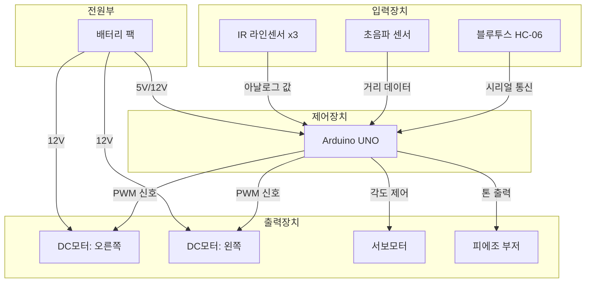

---

## 2. 블루투스 명령 처리 알고리즘

### 2.1 문자열 파싱 순서도

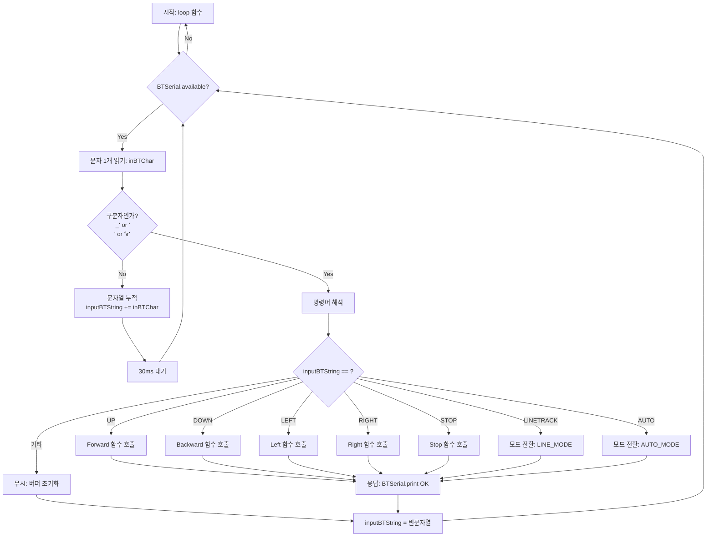

### 2.2 통신 프로토콜 명세

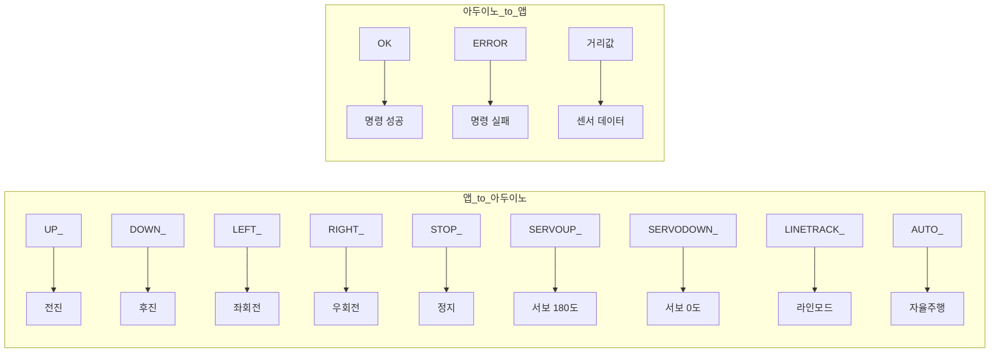

---

## 3. 모터 제어 알고리즘

### 3.1 DC 모터 제어 원리

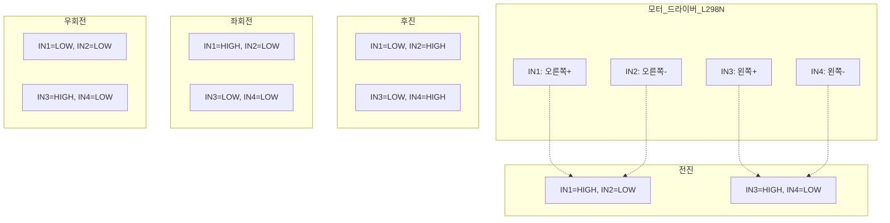

### 3.2 PWM 속도 제어

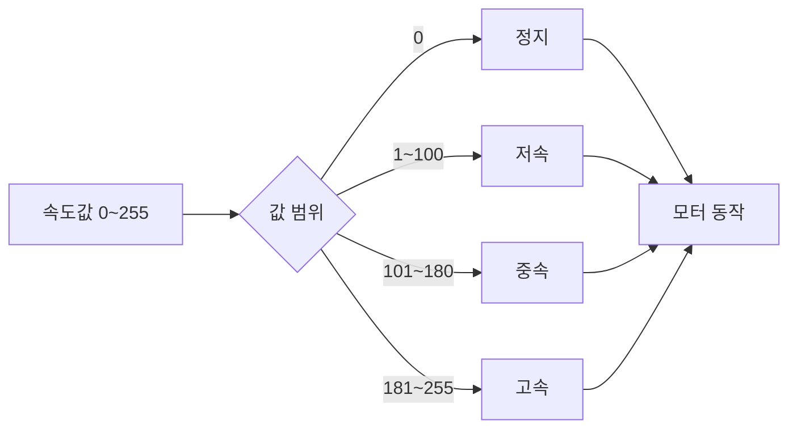

---

## 4. 초음파 센서 알고리즘

### 4.1 거리 측정 순서도

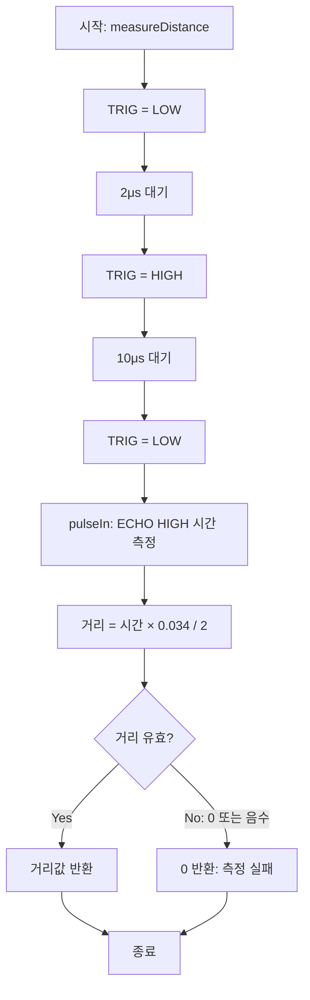

### 4.2 거리 기반 의사결정

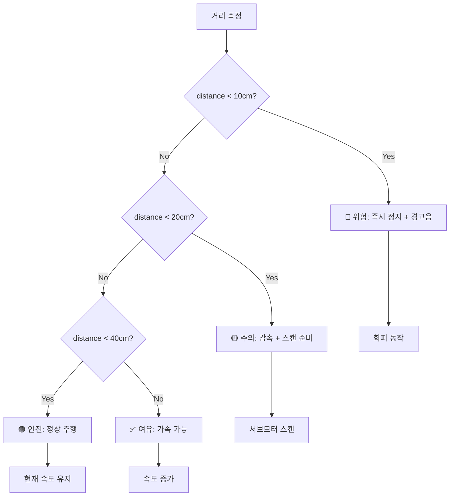

---

## 5. 서보모터 스캔 알고리즘

### 5.1 3방향 스캔

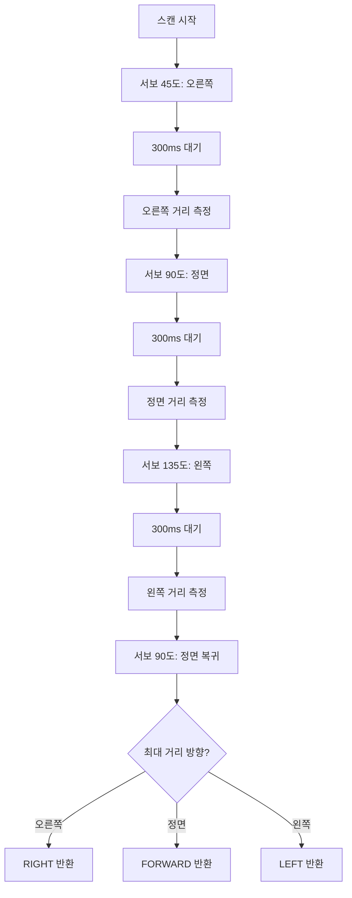

### 5.2 5방향 정밀 스캔 (확장)

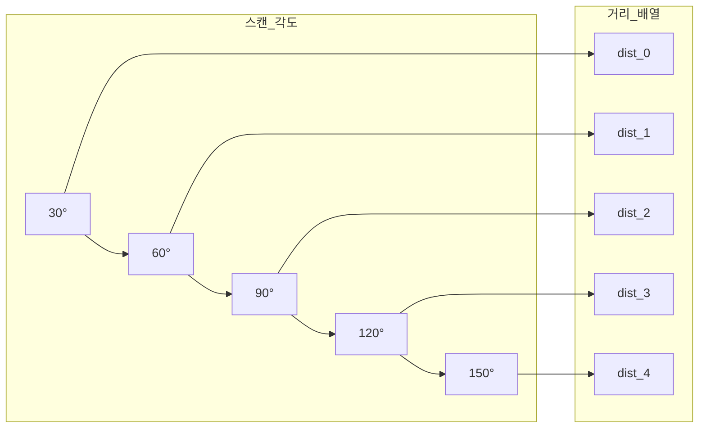

---

## 6. 장애물 회피 알고리즘

### 6.1 기본 회피 알고리즘

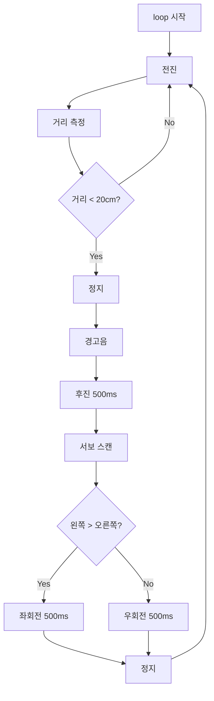

### 6.2 고급 회피 알고리즘 (막다른 길 처리)

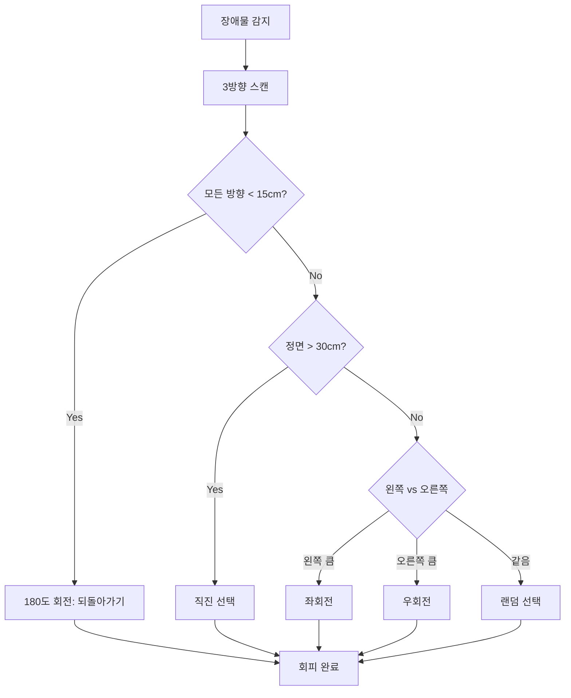

---

## 7. 라인 트레이싱 알고리즘

### 7.1 3센서 기본 알고리즘

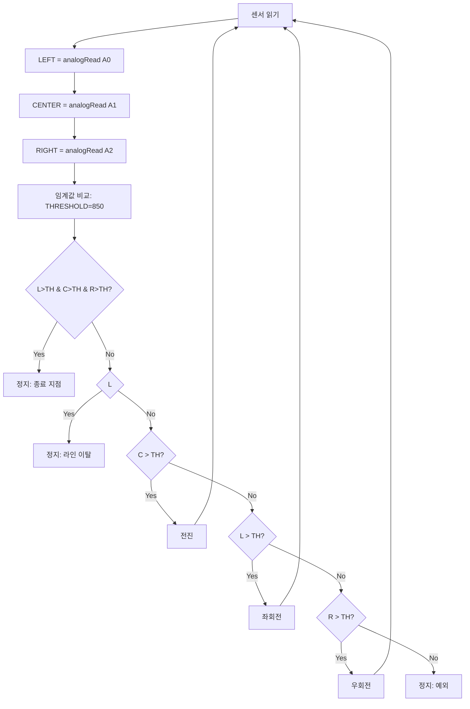

### 7.2 센서 조합별 동작 매트릭스

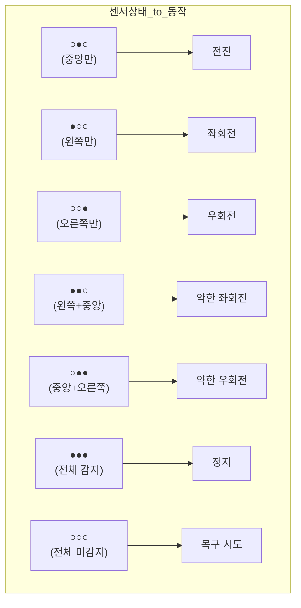

### 7.3 라인 이탈 복구 알고리즘

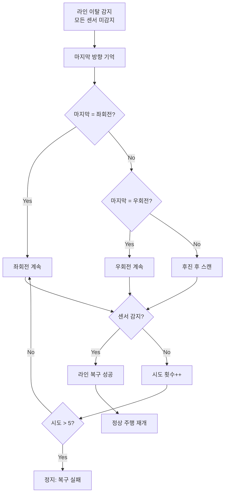

---

## 8. 자동차 따라가기 알고리즘

### 8.1 목표 거리 유지

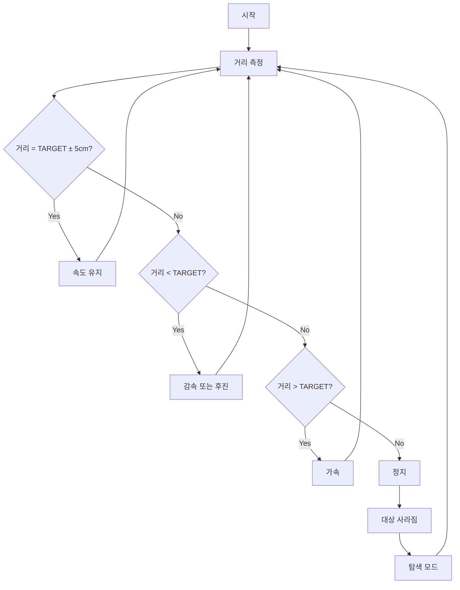

### 8.2 PID 제어 개념 (심화)

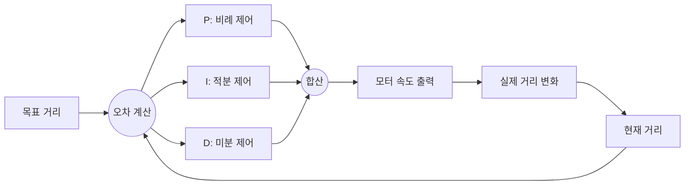

---

## 9. 통합 상태 관리

### 9.1 상태 머신 다이어그램

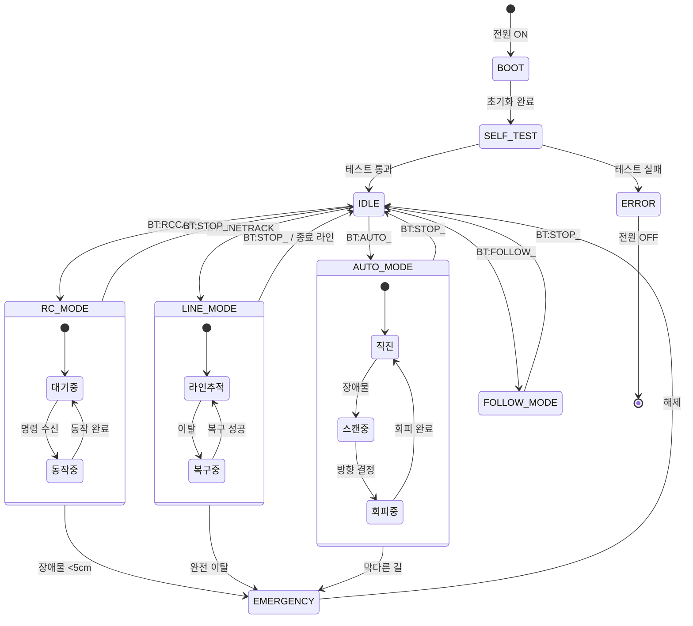

---

## 10. 테스트 케이스 설계

### 10.1 기능별 테스트 매트릭스

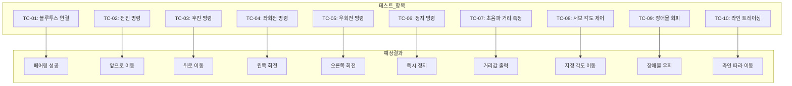

### 10.2 에러 시나리오 테스트

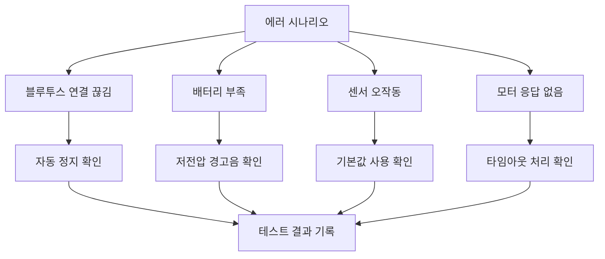

---

## 📋 알고리즘 체크리스트

| 알고리즘 | PRIMM 단계 | 완료 |
|----------|-----------|:----:|
| 블루투스 통신 | P-R-I-M-M | ☐ |
| DC 모터 제어 | P-R-I-M-M | ☐ |
| 초음파 거리 측정 | P-R-I-M-M | ☐ |
| 서보모터 제어 | P-R-I-M-M | ☐ |
| 장애물 회피 | P-R-I-M-M | ☐ |
| 라인 트레이싱 | P-R-I-M-M | ☐ |
| 통합 상태 관리 | P-R-I-M-M | ☐ |

---

*이 문서의 모든 Mermaid 다이어그램은 학습자가 알고리즘을 시각적으로 이해하고, 테스트 케이스를 직접 설계할 수 있도록 구성되었습니다.*

