# 🚗 자율주행 스마트카 메이커 교육 커리큘럼

> **교육 기간**: 2일 (총 12시간)  
> **대상**: 메이커 입문자 ~ 중급자  
> **교육 방식**: PRIMM (Predict → Run → Investigate → Modify → Make)  
> **교구재**: [에듀이노 4휠 스마트카 키트](https://www.eduino.kr/product/detail.html?product_no=80&cate_no=181&display_group=1)

---

## 📋 교육 목표

| 구분 | 목표 |
|------|------|
| **실행자** | 코드를 이해하고 수정하여 원하는 동작을 구현할 수 있다 |
| **기획자** | 개발 프로세스를 이해하고 테스트 케이스를 설계할 수 있다 |

---

## 🗓️ Day 1 (6시간) - 기초 제작 및 원격 제어

### 📌 1교시: 교구재 조립 (1시간)

**학습 목표**: 스마트카 하드웨어 구조 이해 및 조립


**활동 내용**:
- 키트 구성품 확인 (체크리스트 활용)
- 조립 설명서 따라 하드웨어 조립
- 모터 드라이버 연결 확인

---

### 📌 2교시: Arduino IDE 환경 설정 (30분)

**학습 목표**: 개발 환경 구축 및 기본 업로드 테스트

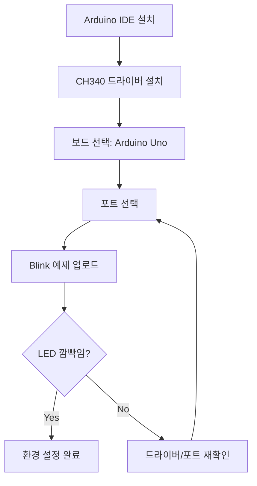

---

### 📌 3교시: DC 모터 기본 제어 (1시간)

**학습 목표**: 모터 제어 원리 이해 및 방향/속도 제어

#### 🔄 PRIMM 학습 단계

**1️⃣ Predict (예측)**: 코드 실행 전 결과 예측하기

```arduino
// 질문: 이 코드를 실행하면 자동차가 어떻게 움직일까요?
void Forward() {
    analogWrite(MOTOR_1, 150);  // 오른쪽 모터 전진
    analogWrite(MOTOR_2, 0);
    analogWrite(MOTOR_3, 150);  // 왼쪽 모터 전진
    analogWrite(MOTOR_4, 0);
}
```

**2️⃣ Run (실행)**: 코드 업로드 및 동작 확인

**3️⃣ Investigate (탐구)**: 코드 분석

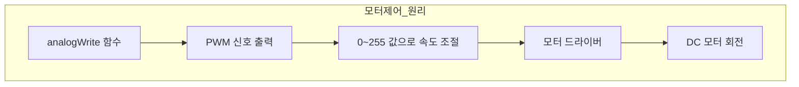

**4️⃣ Modify (수정)**: 속도값 변경하여 테스트

| 속도값 | 예상 동작 | 실제 동작 | 비고 |
|--------|-----------|-----------|------|
| 100 | 느림 | | |
| 150 | 보통 | | |
| 200 | 빠름 | | |

**5️⃣ Make (창작)**: 8자 주행 코드 작성

---

### 📌 4교시: 블루투스 통신 기초 (1시간)

**학습 목표**: HC-06 블루투스 모듈 연결 및 시리얼 통신 이해

#### 블루투스 통신 흐름도

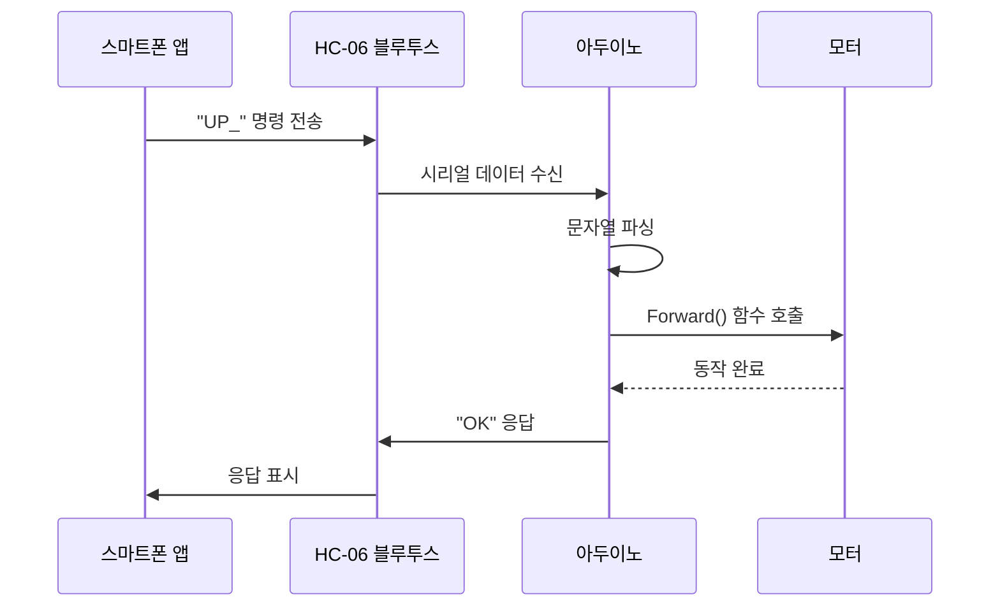

#### 핵심 코드 분석

```arduino
// 블루투스 데이터 수신 처리
while (BTSerial.available()) {
    inBTChar = (char)BTSerial.read();  // 한 글자씩 읽기
    
    if (inBTChar == '_') {  // 구분자 확인
        // 명령어 처리
        if (inputBTString.equals("UP")) {
            Forward();
        }
        inputBTString = "";  // 버퍼 초기화
    } else {
        inputBTString += inBTChar;  // 문자열 누적
    }
}
```

---

### 📌 5교시: App Inventor 앱 제작 (1시간 30분)

**학습 목표**: 블루투스 RC카 제어 앱 제작

#### App Inventor 화면 구성

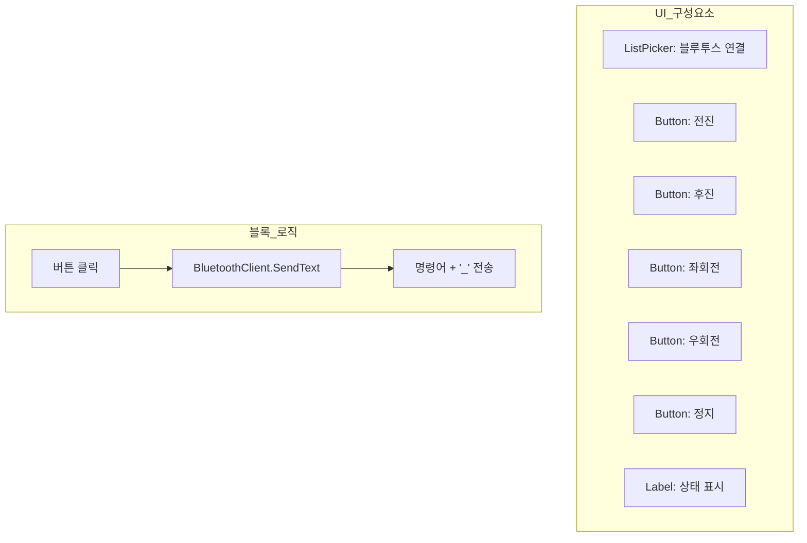

#### App Inventor 블록 설계

```
[버튼_전진.Click]
    └── BluetoothClient.SendText("UP_")

[버튼_후진.Click]
    └── BluetoothClient.SendText("DOWN_")

[버튼_좌회전.Click]
    └── BluetoothClient.SendText("LEFT_")

[버튼_우회전.Click]
    └── BluetoothClient.SendText("RIGHT_")

[버튼_정지.Click]
    └── BluetoothClient.SendText("STOP_")
```

---

### 📌 6교시: 통합 테스트 및 디버깅 (1시간)

**학습 목표**: 앱-아두이노 연동 테스트 및 문제 해결

#### 테스트 체크리스트

| 테스트 항목 | 예상 결과 | 실제 결과 | Pass/Fail |
|-------------|-----------|-----------|-----------|
| 블루투스 페어링 | 연결 성공 | | |
| 전진 명령 | 앞으로 이동 | | |
| 후진 명령 | 뒤로 이동 | | |
| 좌회전 명령 | 왼쪽 회전 | | |
| 우회전 명령 | 오른쪽 회전 | | |
| 정지 명령 | 즉시 정지 | | |

#### 디버깅 순서도

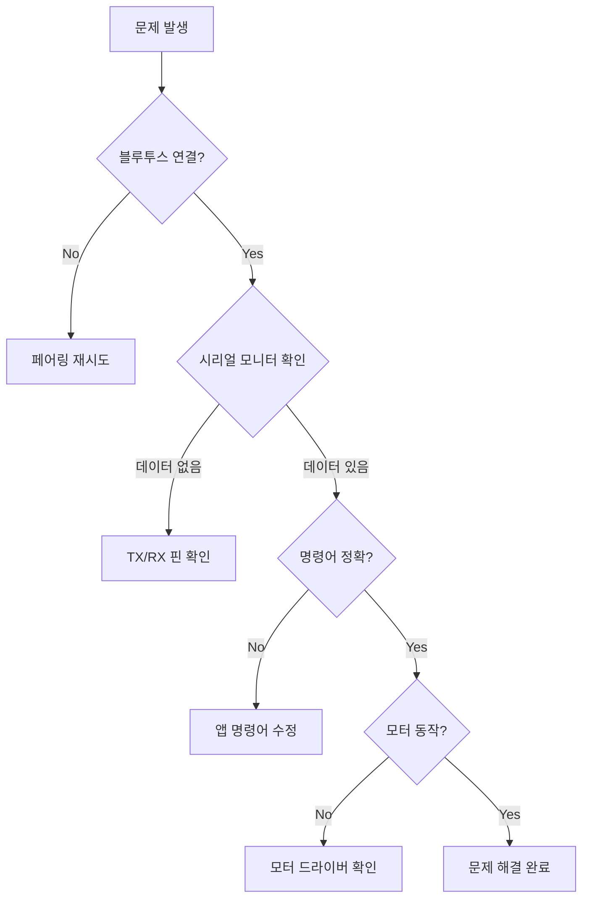

---

## 🗓️ Day 2 (6시간) - 자율주행 기능 구현

### 📌 7교시: 초음파 센서 원리 및 활용 (1시간)

**학습 목표**: 초음파 센서 동작 원리 이해 및 거리 측정

#### 초음파 센서 동작 원리

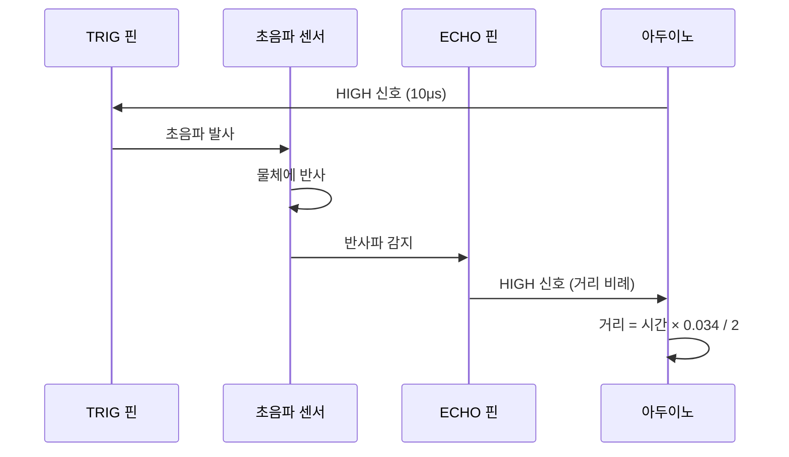

#### 거리 측정 함수

```arduino
long measureDistance() {
    // 초음파 발사
    digitalWrite(TRIG, LOW);
    delayMicroseconds(2);
    digitalWrite(TRIG, HIGH);
    delayMicroseconds(10);
    digitalWrite(TRIG, LOW);
    
    // 반사파 시간 측정 및 거리 계산
    long duration = pulseIn(ECHO, HIGH);
    long distance = duration * 0.034 / 2;  // cm 단위
    
    return distance;
}
```

#### 🔬 실습: 거리별 LED/부저 반응

| 거리 (cm) | 동작 |
|-----------|------|
| > 30 | LED 초록 (안전) |
| 15 ~ 30 | LED 노랑 (주의) |
| < 15 | LED 빨강 + 부저 (위험) |

---

### 📌 8교시: 서보모터 제어 (1시간)

**학습 목표**: 서보모터로 초음파 센서 방향 조절

#### 서보모터 각도 제어

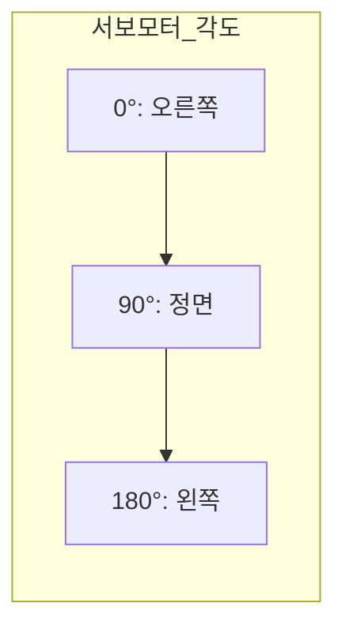

#### 주변 스캔 알고리즘

```arduino
// 서보모터로 좌우 스캔하여 거리 측정
int scanAndFindPath() {
    int distances[3];  // 오른쪽, 정면, 왼쪽
    int angles[] = {45, 90, 135};
    
    for (int i = 0; i < 3; i++) {
        myservo.write(angles[i]);
        delay(300);
        distances[i] = measureDistance();
    }
    
    // 가장 먼 방향 선택
    if (distances[0] > distances[2]) {
        return 0;  // 오른쪽으로 이동
    } else {
        return 2;  // 왼쪽으로 이동
    }
}
```

---

### 📌 9교시: 장애물 피하기 자율주행 (1시간 30분)

**학습 목표**: 초음파 센서 + 서보모터로 장애물 회피 알고리즘 구현

#### 장애물 회피 알고리즘 순서도

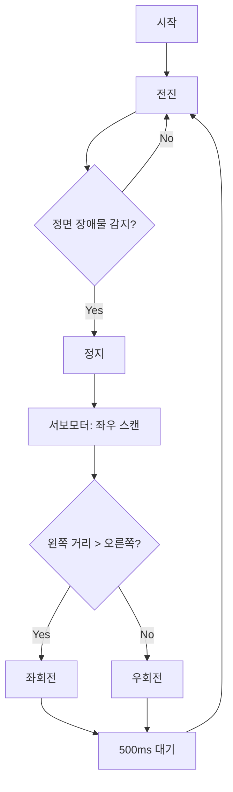

#### 핵심 코드

```arduino
void avoidObstacle() {
    int frontDist = measureDistance();
    
    if (frontDist > 0 && frontDist < 20) {  // 20cm 이내 장애물
        Stop();
        tone(PIEZO, 1000, 200);  // 경고음
        
        // 좌우 스캔
        myservo.write(45);   // 오른쪽 확인
        delay(300);
        int rightDist = measureDistance();
        
        myservo.write(135);  // 왼쪽 확인
        delay(300);
        int leftDist = measureDistance();
        
        myservo.write(90);   // 정면 복귀
        
        // 방향 결정
        if (leftDist > rightDist) {
            Left();
            delay(500);
        } else {
            Right();
            delay(500);
        }
    } else {
        Forward();
    }
}
```

---

### 📌 10교시: 라인 트레이싱 (AutoPlot) (1시간 30분)

**학습 목표**: IR 센서로 검정 라인 따라가기 구현

#### 라인 센서 동작 원리

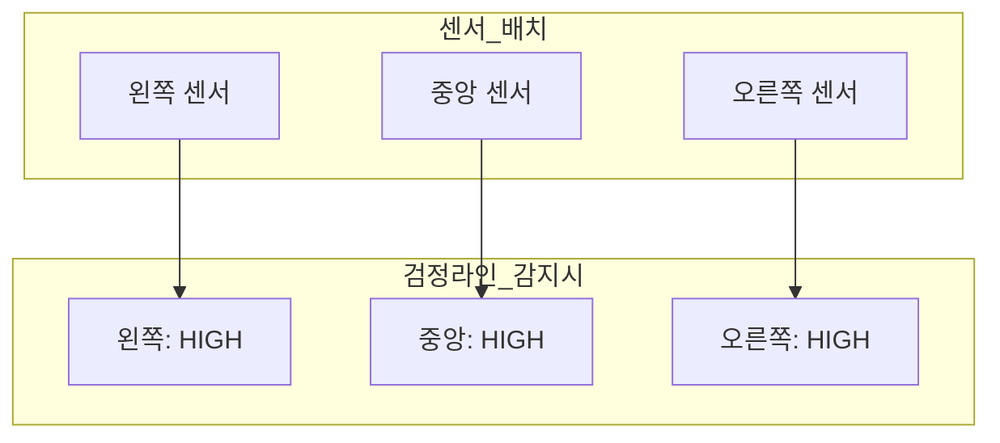

#### 라인 트레이싱 의사결정 테이블

| 왼쪽 | 중앙 | 오른쪽 | 동작 | 설명 |
|:----:|:----:|:------:|------|------|
| ○ | ● | ○ | 전진 | 라인 위 정상 주행 |
| ● | ○ | ○ | 좌회전 | 라인이 왼쪽에 있음 |
| ○ | ○ | ● | 우회전 | 라인이 오른쪽에 있음 |
| ● | ● | ○ | 좌회전 | 곡선 구간 |
| ○ | ● | ● | 우회전 | 곡선 구간 |
| ● | ● | ● | 정지 | 종료 지점 또는 교차점 |
| ○ | ○ | ○ | 정지 | 라인 이탈 |

> ● = 검정(라인 감지), ○ = 흰색(감지 안됨)

#### 라인 트레이싱 순서도

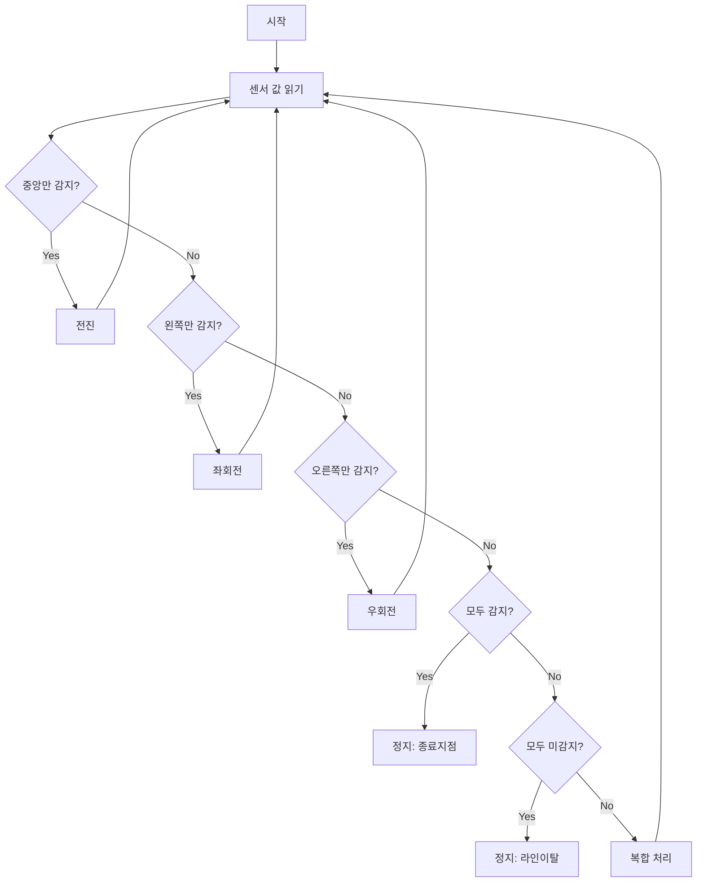

#### 핵심 코드

```arduino
#define LINE_THRESHOLD 850  // 라인 감지 임계값

void lineTracing() {
    int leftVal = analogRead(LEFT);
    int centerVal = analogRead(CENTER);
    int rightVal = analogRead(RIGHT);
    
    bool leftDetect = (leftVal > LINE_THRESHOLD);
    bool centerDetect = (centerVal > LINE_THRESHOLD);
    bool rightDetect = (rightVal > LINE_THRESHOLD);
    
    // 모든 센서 감지 = 종료 지점
    if (leftDetect && centerDetect && rightDetect) {
        Stop();
        return;
    }
    
    // 중앙 감지 = 직진
    if (centerDetect) {
        Forward();
    }
    // 왼쪽만 감지 = 좌회전
    else if (leftDetect && !rightDetect) {
        Leftward();
    }
    // 오른쪽만 감지 = 우회전
    else if (rightDetect && !leftDetect) {
        Rightward();
    }
    // 모두 미감지 = 라인 이탈
    else if (!leftDetect && !centerDetect && !rightDetect) {
        Stop();
    }
}
```

---

### 📌 11교시: 통합 자율주행 시스템 (1시간)

**학습 목표**: 모든 기능 통합 및 모드 전환 시스템 구현

#### 통합 시스템 상태 다이어그램

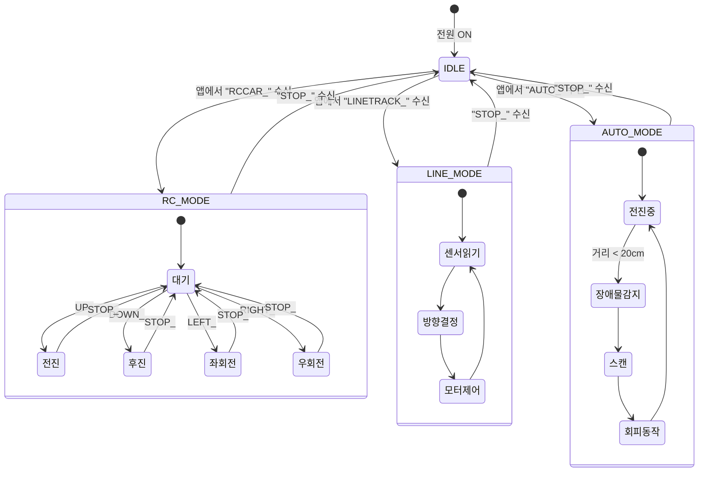

#### 모드 전환 코드 구조

```arduino
enum DriveMode {
    IDLE,
    RC_MODE,
    LINE_MODE,
    AUTO_MODE
};

DriveMode currentMode = IDLE;

void loop() {
    // 블루투스 명령 처리
    processBluetoothCommand();
    
    // 현재 모드에 따른 동작
    switch (currentMode) {
        case RC_MODE:
            // 앱 명령 대기
            break;
            
        case LINE_MODE:
            lineTracing();
            break;
            
        case AUTO_MODE:
            avoidObstacle();
            break;
            
        case IDLE:
        default:
            Stop();
            break;
    }
}
```

---

### 📌 12교시: 프로젝트 발표 및 평가 (1시간)

**학습 목표**: 개발 프로세스 이해도 점검 및 창작 프로젝트 발표

#### 평가 체크리스트

| 평가 항목 | 배점 | 자기평가 | 상호평가 |
|-----------|------|----------|----------|
| 하드웨어 조립 완성도 | 20 | | |
| 블루투스 RC카 동작 | 20 | | |
| 라인 트레이싱 정확도 | 20 | | |
| 장애물 회피 성공률 | 20 | | |
| 코드 이해 및 설명 | 20 | | |
| **총점** | **100** | | |

#### 팀 프로젝트 아이디어

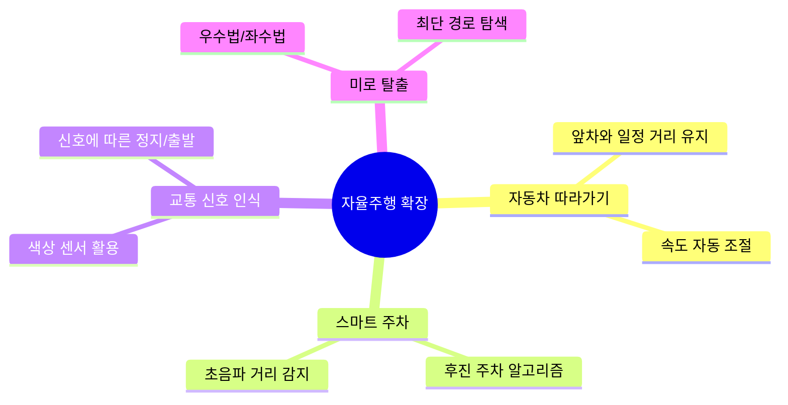

---

## 📚 부록

### A. 핀 연결표

| 부품 | 아두이노 핀 | 설명 |
|------|-------------|------|
| 오른쪽 모터 (+) | D5 (PWM) | 전진 시 HIGH |
| 오른쪽 모터 (-) | D6 (PWM) | 후진 시 HIGH |
| 왼쪽 모터 (+) | D11 (PWM) | 전진 시 HIGH |
| 왼쪽 모터 (-) | D12 | 후진 시 HIGH |
| 초음파 TRIG | D7 | 초음파 발사 |
| 초음파 ECHO | A5 | 반사파 수신 |
| 서보모터 | D13 | 각도 제어 |
| 블루투스 TX | D3 | 데이터 수신 |
| 블루투스 RX | D4 | 데이터 송신 |
| 피에조 부저 | D8 | 경고음 |
| 라인센서 왼쪽 | A0 | 아날로그 입력 |
| 라인센서 중앙 | A1 | 아날로그 입력 |
| 라인센서 오른쪽 | A2 | 아날로그 입력 |

### B. 개발 프로세스 이해도 체크리스트

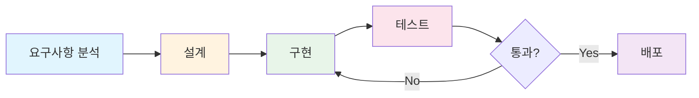

| 단계 | 실습 내용 | 체크 |
|------|-----------|:----:|
| 요구사항 분석 | 기능 명세서 작성 | ☐ |
| 설계 | 순서도/상태도 그리기 | ☐ |
| 구현 | 코드 작성 및 업로드 | ☐ |
| 테스트 | 테스트 케이스 실행 | ☐ |
| 디버깅 | 오류 원인 분석 및 수정 | ☐ |

### C. 용어 정리

| 용어 | 설명 |
|------|------|
| PWM | Pulse Width Modulation, 펄스 폭 변조로 아날로그 출력 구현 |
| IDE | Integrated Development Environment, 통합 개발 환경 |
| TX/RX | Transmit/Receive, 송신/수신 |
| PRIMM | Predict, Run, Investigate, Modify, Make |
| AutoPlot | 자동 경로 추적 (라인 트레이싱) |

---

## 🔗 참고 자료

- [에듀이노 4휠 스마트카 키트](https://www.eduino.kr/product/detail.html?product_no=80&cate_no=181&display_group=1)
- [App Inventor](http://ai2.appinventor.mit.edu/)
- [Arduino 공식 문서](https://www.arduino.cc/reference/en/)

---

*© 2025 Arduino AutoPlot 메이커 교육*


