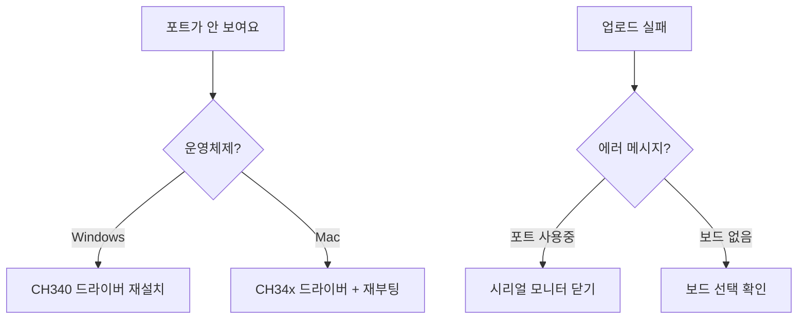
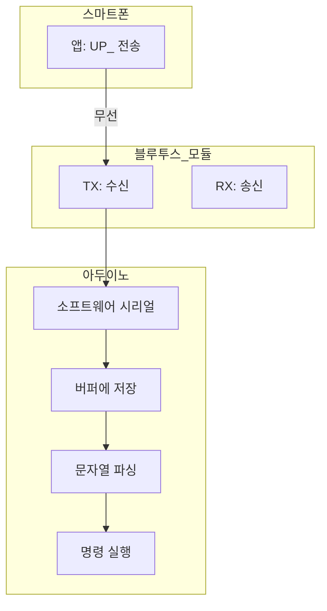
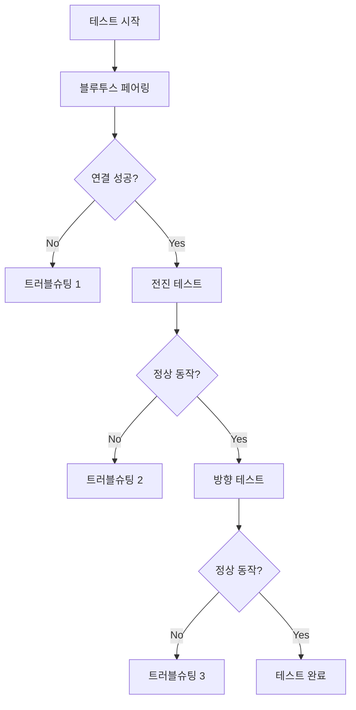
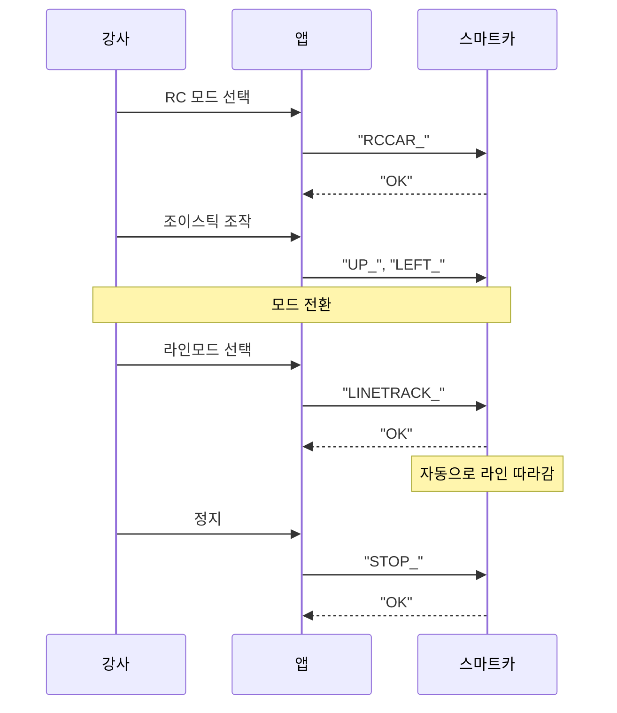

# 👨‍🏫 강사용 수업 진행 가이드

> **교육명**: 자율주행 스마트카 메이커 교육  
> **교육 시간**: 2일 (총 12시간)  
> **준비물**: 에듀이노 4휠 스마트카 키트, 노트북, 안드로이드 스마트폰

---

## 📅 시간표 요약

### Day 1 (6시간)

| 교시 | 시간 | 주제 | 핵심 활동 |
|:----:|------|------|-----------|
| 1 | 1:00 | 교구재 조립 | 하드웨어 이해 + 조립 |
| 2 | 0:30 | 환경 설정 | Arduino IDE + 드라이버 |
| 3 | 1:00 | DC 모터 제어 | PRIMM: 속도/방향 제어 |
| 4 | 1:00 | 블루투스 통신 | 시리얼 통신 원리 |
| 5 | 1:30 | App Inventor | 앱 제작 실습 |
| 6 | 1:00 | 통합 테스트 | 디버깅 실습 |

### Day 2 (6시간)

| 교시 | 시간 | 주제 | 핵심 활동 |
|:----:|------|------|-----------|
| 7 | 1:00 | 초음파 센서 | 거리 측정 원리 |
| 8 | 1:00 | 서보모터 | 방향 스캔 구현 |
| 9 | 1:30 | 장애물 회피 | 자율주행 알고리즘 |
| 10 | 1:30 | 라인 트레이싱 | AutoPlot 구현 |
| 11 | 1:00 | 통합 시스템 | 모드 전환 구현 |
| 12 | 1:00 | 발표 및 평가 | 프로젝트 완성 |

---

## 🎯 교시별 상세 진행 가이드

### Day 1 - 1교시: 교구재 조립 (1시간)

#### 진행 순서



```mermaid
gantt
    title 1교시 조립 타임라인
    dateFormat mm
    axisFormat %M분
    
    section 도입
    키트 개봉 및 구성품 확인: 00, 10m
    
    section 전개
    섀시 조립: 10, 15m
    모터 장착: 25, 15m
    아두이노 장착: 40, 10m
    
    section 정리
    완성품 점검: 50, 10m
```

#### 강사 체크포인트

| 시점 | 확인 사항 | 대응 방법 |
|------|-----------|-----------|
| 5분 | 모든 구성품 확인 완료? | 누락 키트 교체 |
| 20분 | 모터 방향 맞는가? | +/- 표시 확인 유도 |
| 35분 | 바퀴 회전 원활? | 조립 상태 점검 |
| 50분 | 전원 연결 가능? | 배터리 연결 테스트 |

#### 예상 질문 및 답변

> **Q: 모터 방향이 반대로 돌아요**  
> A: 모터 드라이버의 +/- 연결을 바꿔주세요

> **Q: 바퀴가 한쪽으로 쏠려요**  
> A: 속도값 조정이 필요합니다 (코딩 시간에 해결)

---

### Day 1 - 2교시: 환경 설정 (30분)

#### 진행 순서


#### 트러블슈팅 가이드



---

### Day 1 - 3교시: DC 모터 제어 (1시간)

#### PRIMM 진행 스크립트

**🔮 Predict (10분)**
```
강사: "화면의 코드를 보세요. analogWrite(MOTOR_1, 150)을 실행하면 
      자동차가 어떻게 움직일까요? 종이에 예측을 적어보세요."

[학생들이 예측 작성]

강사: "자, 예측한 분들 손들어볼까요? 왜 그렇게 생각했나요?"
```

**▶️ Run (5분)**
```
강사: "이제 코드를 업로드하고 실제로 어떻게 동작하는지 확인해봅시다."

[업로드 및 동작 확인]

강사: "예측과 같았나요? 다른 점이 있었나요?"
```

**🔍 Investigate (15분)**
```
강사: "코드를 한 줄씩 분석해봅시다."

[코드 설명]
- analogWrite: PWM 신호 출력 (0~255)
- HIGH/LOW: 디지털 신호 (전진/후진 방향)
- delay: 동작 시간 제어
```

**✏️ Modify (15분)**
```
강사: "이제 값을 바꿔보면서 실험해봅시다."

실험 1: 속도를 100으로 바꾸면?
실험 2: 속도를 200으로 바꾸면?
실험 3: delay를 1000으로 바꾸면?
```

**🎨 Make (15분)**
```
강사: "8자 모양으로 주행하는 코드를 만들어보세요."

힌트:
- Forward() → Left() → Forward() → Right() 순서로
- delay 시간 조절로 회전 각도 결정
```

---

### Day 1 - 4교시: 블루투스 통신 (1시간)

#### 핵심 개념 설명용 다이어그램



#### 코드 라이브코딩 순서

```
1단계: 블루투스 수신 테스트
- BTSerial.available() 확인
- 수신 문자 시리얼 모니터 출력

2단계: 문자열 누적
- inputBTString += 문자
- 구분자 '_' 확인

3단계: 명령어 매칭
- if-else 분기 처리
- equals() 함수 사용

4단계: 응답 전송
- BTSerial.print("OK")
```

---

### Day 1 - 5교시: App Inventor (1시간 30분)

#### 화면 설계 템플릿

```
┌─────────────────────────┐
│  [블루투스 연결 버튼]    │
├─────────────────────────┤
│         ▲ UP           │
│    ┌───┴───┐           │
│ ◄─ │ STOP │ ─►         │
│    └───┬───┘           │
│         ▼ DOWN         │
├─────────────────────────┤
│  [서보UP]  [서보DOWN]   │
├─────────────────────────┤
│  상태: 연결됨           │
└─────────────────────────┘
```

#### 블록 코딩 단계

**1단계: 블루투스 연결**
```
ListPicker.BeforePicking
  → ListPicker.Elements = BluetoothClient.AddressesAndNames

ListPicker.AfterPicking
  → BluetoothClient.Connect(ListPicker.Selection)
  → Label.Text = "연결됨"
```

**2단계: 버튼 동작**
```
Button_UP.Click
  → if BluetoothClient.IsConnected
    → BluetoothClient.SendText("UP_")

Button_DOWN.Click
  → BluetoothClient.SendText("DOWN_")
```

**3단계: 응답 처리 (선택)**
```
Clock.Timer
  → if BluetoothClient.BytesAvailableToReceive > 0
    → response = BluetoothClient.ReceiveText(10)
    → Label.Text = response
```

---

### Day 1 - 6교시: 통합 테스트 (1시간)

#### 테스트 시나리오



#### 트러블슈팅 표

| 증상 | 원인 | 해결책 |
|------|------|--------|
| 연결 안됨 | 페어링 문제 | 핀코드 1234 확인 |
| 명령 무반응 | TX/RX 뒤바뀜 | 선 교체 |
| 한쪽만 동작 | 핀 연결 오류 | 배선 확인 |
| 반대로 동작 | 모터 극성 | +/- 교체 |

---

### Day 2 - 7교시: 초음파 센서 (1시간)

#### 실험 설계

```
실험 1: 거리별 측정값 확인
- 10cm, 20cm, 30cm, 50cm 물체 배치
- 시리얼 모니터 출력값 기록

실험 2: 측정 한계 확인
- 최소 거리 (약 2cm)
- 최대 거리 (약 400cm)

실험 3: 측정 오차 원인
- 물체 각도
- 물체 재질 (부드러운 천 vs 단단한 벽)
```

#### 코드 작성 단계

```arduino
// 1단계: 기본 거리 측정
long measureDistance() {
    digitalWrite(TRIG, LOW);
    delayMicroseconds(2);
    digitalWrite(TRIG, HIGH);
    delayMicroseconds(10);
    digitalWrite(TRIG, LOW);
    
    return pulseIn(ECHO, HIGH) * 0.034 / 2;
}

// 2단계: 평균값 필터링 (노이즈 제거)
long measureDistanceFiltered() {
    long sum = 0;
    for (int i = 0; i < 5; i++) {
        sum += measureDistance();
        delay(10);
    }
    return sum / 5;
}
```

---

### Day 2 - 8교시: 서보모터 (1시간)

#### 실습 내용


#### 주의사항

> ⚠️ **서보모터 전류 주의**
> - 서보모터는 순간 전류가 높습니다
> - 여러 개 동시 사용 시 별도 전원 권장
> - myservo.detach()로 불필요 시 분리

---

### Day 2 - 9교시: 장애물 회피 (1시간 30분)

#### 코스 설계

```
┌─────────────────────────────┐
│  S                          │
│  │                          │
│  └──┐    ┌───┐             │
│     │    │   │  장애물      │
│     └────┤   │             │
│          │   │             │
│     ┌────┘   └───┐         │
│     │            │          │
│     └────────────┴── G      │
│                             │
└─────────────────────────────┘
S: 시작점, G: 목표점
```

#### 단계별 구현

```
1단계: 정면 감지 시 정지
2단계: 정지 후 경고음
3단계: 후진 추가
4단계: 좌우 스캔 추가
5단계: 방향 결정 후 회전
6단계: 막다른 길 처리 (180도 회전)
```

---

### Day 2 - 10교시: 라인 트레이싱 (1시간 30분)

#### 트랙 설계

```
기본 트랙 (직선 + 곡선)
┌─────────────────┐
│    ╭───────╮    │
│    │       │    │
│ S──┘       └──G │
│                 │
└─────────────────┘

심화 트랙 (교차점 + 급커브)
┌─────────────────┐
│  ╭───╮   ╭───╮  │
│  │   │   │   │  │
│ S┼───┼───┼───┼G │
│  │   │   │   │  │
│  ╰───╯   ╰───╯  │
└─────────────────┘
```

#### 센서 캘리브레이션

```
1. 흰색 바닥에서 센서값 측정 → WHITE_VALUE
2. 검정 라인에서 센서값 측정 → BLACK_VALUE
3. 임계값 = (WHITE_VALUE + BLACK_VALUE) / 2

예시:
- 흰색: 200
- 검정: 900
- 임계값: 550
```

---

### Day 2 - 11교시: 통합 시스템 (1시간)

#### 모드 전환 시연



---

### Day 2 - 12교시: 발표 및 평가 (1시간)

#### 발표 형식

```
1. 팀 소개 (1분)
2. 기능 시연 (3분)
   - RC 모드
   - 라인 트레이싱
   - 장애물 회피
3. 코드 설명 (2분)
4. 어려웠던 점 / 해결 방법 (2분)
5. Q&A (2분)
```

#### 평가 루브릭

| 항목 | 상 (5점) | 중 (3점) | 하 (1점) |
|------|----------|----------|----------|
| 하드웨어 | 완벽한 조립 | 약간의 결함 | 동작 불가 |
| RC 제어 | 모든 방향 정상 | 일부 방향 문제 | 동작 안됨 |
| 라인 트레이싱 | 완주 성공 | 일부 구간 실패 | 시작 불가 |
| 장애물 회피 | 자연스러운 회피 | 회피하나 불안정 | 회피 못함 |
| 발표 | 명확한 설명 | 이해 가능 | 설명 부족 |

---

## 📦 준비물 체크리스트

### 강사 준비물

- [ ] 시연용 완성 키트 1대
- [ ] 여분 부품 (모터, 센서)
- [ ] 라인 트레이싱 트랙 (검정 테이프)
- [ ] 장애물 (박스)
- [ ] 멀티탭
- [ ] 빔프로젝터/모니터

### 학생 준비물

- [ ] 노트북 (Arduino IDE 설치 가능)
- [ ] 안드로이드 스마트폰
- [ ] USB 케이블 (A to B)
- [ ] 필기도구

---

## ⚠️ 안전 수칙

1. **배터리 주의**: 쇼트 방지, 과충전 금지
2. **날카로운 부품**: 나사, 기어 등 주의
3. **테스트 시**: 손가락이 바퀴에 끼지 않도록
4. **충전 시**: 환기되는 곳에서 진행

---

## 📞 비상 연락처

- 기술 지원: lab@robodyne.co.kr
- 제품 문의: 1670-9626

---

*본 가이드는 PRIMM 교수법 기반으로 작성되었습니다.*


